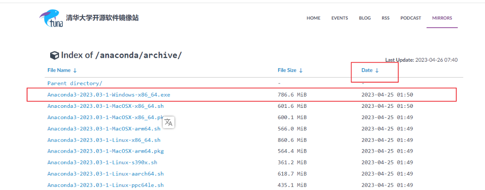
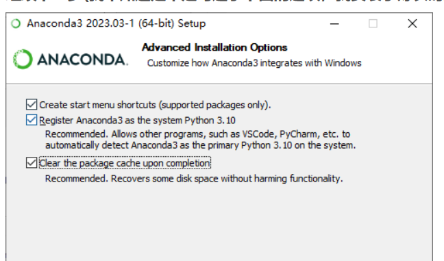
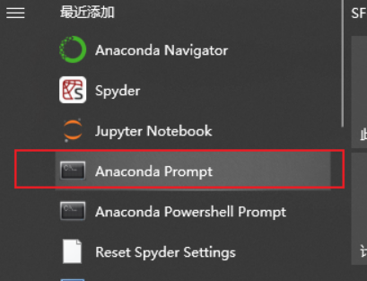
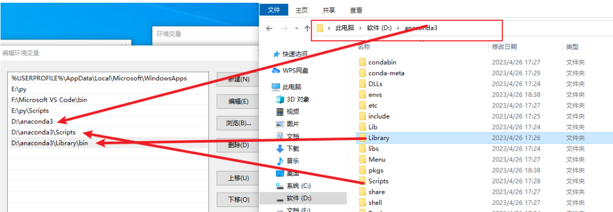
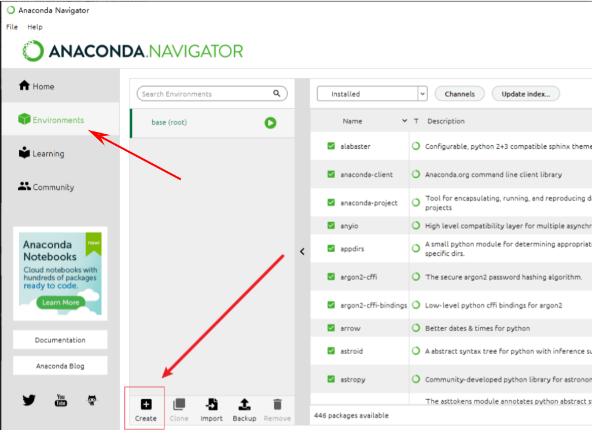
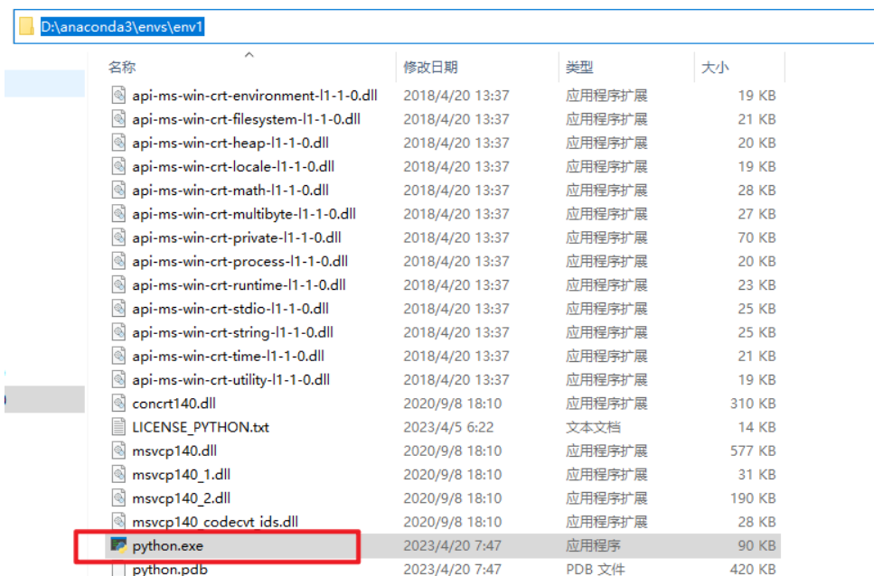
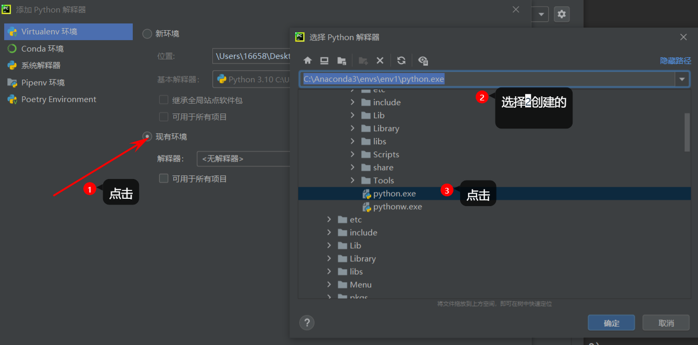
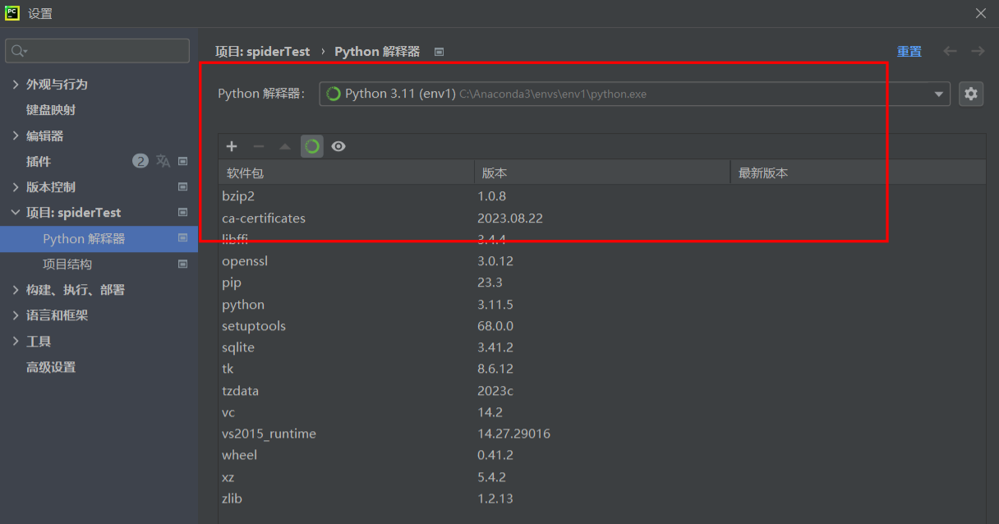

[python3.10里没看到pip_mob649e815c3b9e的技术博客_51CTO博客](https://blog.51cto.com/u_16175466/7392579)

[开发工具 之四 Python 中的 pip 安装 及 使用详解-CSDN博客](https://blog.csdn.net/ZCShouCSDN/article/details/85002647)

# Anaconda介绍

 Anaconda，中文大蟒蛇，是一个开源的Python发行版本，其包含了conda、Python等180多个科学包及其依赖项。其中，conda是一个开源的包、环境管理器，可以用于在同一个机器上安装不同版本的软件包及其依赖，并能够在不同的环境之间切换。

+ Anaconda对于python初学者而言及其友好，相比单独安装python主程序，选择Anaconda可以帮助省去很多麻烦，Anaconda里添加了许多常用的功能包，如果单独安装python，这些功能包则需要一条一条自行安装，在Anaconda中则不需要考虑这些，同时Anaconda还附带捆绑了两个非常好用的交互式代码编辑器（Spyder、Jupyternotebook）。

+ 如果我们不安装Anaconda的话，我们安装第三方库就必须要用pip install xxx去安装，当我们安装的库多了，就会形成文件紊乱和繁杂问题。而且pip install方法会默认把库安装在同一个路径中，假如当你去做项目时，别人给你的程序用的库是低版本的，而你自己通过pip安装的是高版本的库，由于存在兼容问题，你的库不能运行该程序，而你也不可能为了这个而删去你的高版本的库去下载这个符合环境的低版本库吧，所以这及其繁琐和不方便。

+ 这时Anaconda的作用就出来了！！！它能够创建一个虚拟环境，这个虚拟环境和你的主环境是分开的，就好像宿舍楼一样，一栋大宿舍楼有很多宿舍房间组成，每个房间都住着人，但是他们都是独立分开的，互不影响。如果你不想住宿，你随时可以退宿。也就是说，如果你创建的虚拟环境你不想要了，占内存了，你随时可以移走删除。

安装: [Anaconda3的安装配置及使用教程](https://blog.csdn.net/m0_59598029/article/details/132238463)

## 安装

### 第一步：下载

清华大学镜像网站下载最新版Anaconda：[点我下载](https://mirrors.tuna.tsinghua.edu.cn/anaconda/archive/?C=M&O=D)

#### 点击按日期排序，下载最新版






其他选择默认

### 第二步，配置下载源

 **点击：Anaconda Prompt**



```cmd
conda config --add channels https://mirrors.tuna.tsinghua.edu.cn/anaconda/pkgs/free/
conda config --add channels https://mirrors.tuna.tsinghua.edu.cn/anaconda/pkgs/main/
conda config --set show_channel_urls yes
```

**注意:  可以科学上网就不要设置**

### 第三步：配置环境变量



### 第四步： 验证

 `conda --version`,如出现版本号，就是成功了~

Q3.png)

## 使用

### 启动Anaconda，创建一个虚拟环境：



### 虚拟环境名称&语言选择&版本选择


**创建的虚拟环境路径** 都是保存到anconda目录下的envs中



## pycharm接入虚拟环境



效果



到此就可以在这里就行编码啦，如果想换一个python版本，可选择其他版本自行创建，不想用的虚拟环境可以删除

# pip安装及使用详解

## 概要

pip 是 [Python](https://so.csdn.net/so/search?q=Python&spm=1001.2101.3001.7020) 的包安装程序。是 Python 标准库（The Python Standard Library）中的一个包，只是这个包比较特殊，用它可以来管理 Python 标准库（The Python Standard Library）中其他的包。

pip 支持从 [PyPI](https://pypi.org/)，版本控制，本地项目以及直接从分发文件进行安装。pip 是一个命令行程序。 安装 pip 后，会向系统添加一个 pip 命令，该命令可以从命令提示符运行。

## 安装

从 Python 2 版本 >=2.7.9 或 Python 3 版本 >=3.4 开始，官网的安装包中已经自带了 pip，在安装时用户可以直接选择安装。或者如果使用由 `virtualenv` 或者 `pyvenv` 创建的 Virtual Environment，那么 pip 也是被默认安装的。

如果没有在安装的时候，选择上安装pip，那么也可以从本地安装。例如，直接使用 `get-pip.py` 进行安装。首先从官网下载 `get-pip.py`，然后直接运行 `python get-pip.py` 即可。

更详细的安装，可以直接去官网参看[安装说明](https://pip.pypa.io/en/stable/installing/)

## 使用

安装后，在命令行中键入：`pip`+ 回车，就会出现如下使用说明：

```
Usage:
  pip <command> [options]

Commands:
  install                     Install packages.
  download                    Download packages.
  uninstall                   Uninstall packages.
  freeze                      查看已经安装的包及版本信息
  list                        列出当前虚拟环境已经安装的包.
  show                        显示pip包所在目录及信息
  check                       Verify installed packages have compatible dependencies.
  config                      Manage local and global configuration.
  search                      搜索包
  wheel                       Build wheels from your requirements.
  hash                        Compute hashes of package archives.
  completion                  A helper command used for command completion.
  help                        Show help for commands.

General Options:
  -h, --help                  Show help.
  --isolated                  Run pip in an isolated mode, ignoring environment variables and user configuration.
  -v, --verbose               Give more output. Option is additive, and can be used up to 3 times.
  -V, --version               Show version and exit.
  -q, --quiet                 Give less output. Option is additive, and can be used up to 3 times (corresponding to
                              WARNING, ERROR, and CRITICAL logging levels).
  --log <path>                Path to a verbose appending log.
  --proxy <proxy>             Specify a proxy in the form [user:passwd@]proxy.server:port.
  --retries <retries>         Maximum number of retries each connection should attempt (default 5 times).
  --timeout <sec>             Set the socket timeout (default 15 seconds).
  --exists-action <action>    Default action when a path already exists: (s)witch, (i)gnore, (w)ipe, (b)ackup,
                              (a)bort).
  --trusted-host <hostname>   Mark this host as trusted, even though it does not have valid or any HTTPS.
  --cert <path>               Path to alternate CA bundle.
  --client-cert <path>        Path to SSL client certificate, a single file containing the private key and the
                              certificate in PEM format.
  --cache-dir <dir>           Store the cache data in <dir>.
  --no-cache-dir              Disable the cache.
  --disable-pip-version-check
                              Don't periodically check PyPI to determine whether a new version of pip is available for
                              download. Implied with --no-index.
  --no-color                  Suppress colored output
```


查看已安装的模块

```
pip list
```

查看待更新的模块

```
pip list-o
```

更新模块

```
pip install --U pip
```

查看pip版本

```
pip --version
```

显示已安装模块所在的目录

```
pip show -f package
```

## **通道链接**

 

| 豆瓣             | http://pypi.douban.com/simple            |
| ---------------- | ---------------------------------------- |
| 华中理工大学     | http://pypi.hustunique.com/simple        |
| 山东理工大学     | http://pypi.sdutlinux.org/simple         |
| 中国科学技术大学 | http://pypi.mirrors.ustc.edu.cn/simple   |
| 清华大学         | https://pypi.tuna.tsinghua.edu.cn/simple |

使用通道

```
pip install requests -i http://pypi.douban.com/simple
```

