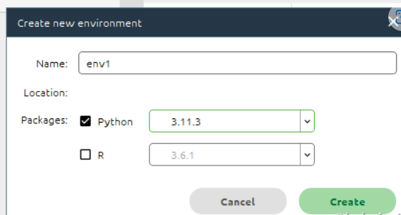

[python3.10里没看到pip_mob649e815c3b9e的技术博客_51CTO博客](https://blog.51cto.com/u_16175466/7392579)


[开发工具 之四 Python 中的 pip 安装 及 使用详解-CSDN博客](https://blog.csdn.net/ZCShouCSDN/article/details/85002647)


# Anaconda介绍

 Anaconda，中文大蟒蛇，是一个开源的Python发行版本，其包含了conda、Python等180多个科学包及其依赖项。其中，conda是一个开源的包、环境管理器，可以用于在同一个机器上安装不同版本的软件包及其依赖，并能够在不同的环境之间切换。

+ Anaconda对于python初学者而言及其友好，相比单独安装python主程序，选择Anaconda可以帮助省去很多麻烦，Anaconda里添加了许多常用的功能包，如果单独安装python，这些功能包则需要一条一条自行安装，在Anaconda中则不需要考虑这些，同时Anaconda还附带捆绑了两个非常好用的交互式代码编辑器（Spyder、Jupyternotebook）。

+ 如果我们不安装Anaconda的话，我们安装第三方库就必须要用pip install xxx去安装，当我们安装的库多了，就会形成文件紊乱和繁杂问题。而且pip install方法会默认把库安装在同一个路径中，假如当你去做项目时，别人给你的程序用的库是低版本的，而你自己通过pip安装的是高版本的库，由于存在兼容问题，你的库不能运行该程序，而你也不可能为了这个而删去你的高版本的库去下载这个符合环境的低版本库吧，所以这及其繁琐和不方便。

+ 这时Anaconda的作用就出来了！！！它能够创建一个虚拟环境，这个虚拟环境和你的主环境是分开的，就好像宿舍楼一样，一栋大宿舍楼有很多宿舍房间组成，每个房间都住着人，但是他们都是独立分开的，互不影响。如果你不想住宿，你随时可以退宿。也就是说，如果你创建的虚拟环境你不想要了，占内存了，你随时可以移走删除。

安装: [Anaconda3的安装配置及使用教程](https://blog.csdn.net/m0_59598029/article/details/132238463)


### 第一步：清华大学镜像网站下载最新版Anaconda：[点我下载](https://mirrors.tuna.tsinghua.edu.cn/anaconda/archive/?C=M&O=D)

##### https://mirrors.tuna.tsinghua.edu.cn/anaconda/archive/?C=M&O=D

### 点击按日期排序，下载最新版


其他默认


### 第二步，配置清华镜像源作为下载源(当然也可以换成阿里的、豆瓣的等)

 **点击：Anaconda Prompt**


```cmd
conda config --add channels https://mirrors.tuna.tsinghua.edu.cn/anaconda/pkgs/free/
conda config --add channels https://mirrors.tuna.tsinghua.edu.cn/anaconda/pkgs/main/
conda config --set show_channel_urls yes
```

注意:  可以科学上网就不要设置

### 第三步：配置环境变量


### 验证是否成功：

##### `conda --version`,如出现版本号，就是成功了~

Q3.png)


## 启动Anaconda，创建一个虚拟环境：


### 虚拟环境名称&语言选择&版本选择





 创建成功(py3.11.3)


**刚刚创建的虚拟环境路径**

保存到anconda目录下的envs中


### pycharm接入刚刚的虚拟环境


效果


就可以在这里就行编码啦，如果想换一个python版本，可选择其他版本自行创建，不想用的虚拟环境可以删除