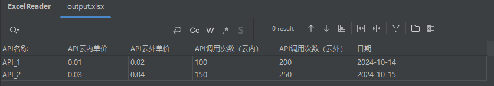
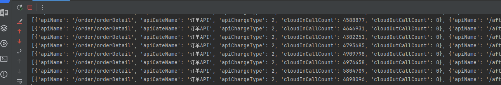
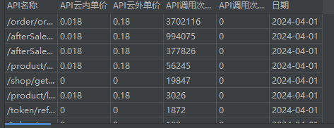

# 工具类

判断参数/字典的键或值是否为空

```Python
def is_empty(value):
    if value is False:
        return True
    if value in (0, 0.0, 0j):  # 包含整数、浮点数和复数的零
        return True
    if value == "":
        return True
    if value is None:
        return True
    if isinstance(value, (list, tuple, set)):
        return len(value) == 0
    if isinstance(value, dict):
        return len(value) == 0
    if isinstance(value, float) and (value != value):  # 检查 NaN
        return True
    return False

def is_not_empty(value):
    return not is_empty(value)

def key_exists_in_dict(d, key):
    """ 检查字典中是否存在指定的键 """
    return key in d

def key_value_is_empty(d, key):
    """ 检查字典中指定键的值是否为空 """
    if key_exists_in_dict(d, key):
        return is_empty(d[key])
    return True  # 如果键不存在，返回 True（认为其值为空）
```

示例:

```python
my_dict = {
    "name": "Alice",
    "age": 30,
    "city": "",
    "is_active": None,
    "data": {
        "apiCallInfos": [
            {}
        ]
    }
}

def check_api_call_infos(d):
    """ 检查 apiCallInfos 是否存在且非空 """
    if key_exists_in_dict(d, "data"):
        if key_exists_in_dict(d["data"], "apiCallInfos"):
            return is_not_empty(d["data"]["apiCallInfos"])
    return False  # 如果不存在或为空，返回 False
```

时间戳

```python
from datetime import datetime, timedelta

def generate_timestamps(start_date, end_date):
    """
    生成给定日期范围内的所有日期的时间戳列表。

    参数:
    - start_date (str): 开始日期，格式为 'YYYY-MM-DD'。
    - end_date (str): 结束日期，格式为 'YYYY-MM-DD'。

    返回:
    - list: 包含从开始日期到结束日期（包括结束日期）的所有日期的时间戳列表。
    """
    # 将字符串转换为日期对象
    start = datetime.strptime(start_date, '%Y-%m-%d')
    end = datetime.strptime(end_date, '%Y-%m-%d')

    # 初始化一个空列表来存储时间戳
    timestamps = []

    # 当前日期初始化为开始日期
    current_date = start

    # 循环直到当前日期大于等于结束日期
    while current_date <= end:
        # 将当前日期添加到列表中
        timestamps.append(int(current_date.timestamp()))
        # 增加一天
        current_date += timedelta(days=1)

    return timestamps

def timestamp_to_date_string(timestamp, date_format='%Y-%m-%d'):
    """
    将时间戳转换为指定格式的日期字符串。

    :param timestamp: 时间戳（秒）
    :param date_format: 目标日期格式字符串，默认为 'YYYY-MM-DD'
    :return: 格式化后的日期字符串
    """
    # 将时间戳转换为 datetime 对象
    dt_object = datetime.fromtimestamp(timestamp)

    # 返回格式化后的日期字符串
    return dt_object.strftime(date_format)
```

示例:

```python
start_date = '2024-01-01'
end_date = '2024-10-14'
timestamps = generate_timestamps(start_date, end_date) // [1728909911,172890900, ...]

ts = '1728909911'
formatted_date = timestamp_to_date_string(ts)  // 2024-10-14
```


# 文件处理

## 保存

### 使用文件读取

```python
import openpyxl
import os

# api名称 API云内单价 API云外单价 API调用次数（云内） API调用测数（云外） 日期（具体到天）
import openpyxl

def save_to_excel(all_data, filename='api_data2.xlsx'):
    """
    将提取的数据保存到 Excel 文件中。

    :param all_data: 包含要保存到 Excel 的数据的列表 [[], [], []]
    :param filename: 保存的 Excel 文件名，默认是 'api_data2.xlsx'
    """
    # 创建 Excel 工作簿
    wb = openpyxl.Workbook()
    ws = wb.active

    # 写入表头
    headers = ['API名称', 'API云内单价', 'API云外单价', 'API调用次数（云内）', 'API调用次数（云外）', '日期']
    ws.append(headers)

    # 追加数据
    for row in all_data:
        ws.append(row)
    
    # 检查并创建目录
    directory = os.path.dirname(filename)
    if directory and not os.path.exists(directory):
        os.makedirs(directory)

    # 保存为 .xlsx 文件
    try:
        wb.save(filename)
        print(f"数据已成功保存到 {filename}")
    except Exception as e:
        print(f"保存文件时出错: {e}")

# 示例数据
data = [
    ["API_1", 0.01, 0.02, 100, 200, "2024-10-14"],
    ["API_2", 0.03, 0.04, 150, 250, "2024-10-15"]
]

# 调用函数
save_to_excel2(data)

```

### 使用数据框架:crossed_swords:

使用 `pandas` 处理数据

参考:

+ [pandas用法](https://blog.csdn.net/Strive_For_Future/article/details/126710810#t3)

```python
import pandas as pd

if __name__ == '__main__':
   
	# 保存到 Excel 的数据的列表
	all_data = [
        ["API_1", 0.01, 0.02, 100, 200, "2024-10-14"],
        ["API_2", 0.03, 0.04, 150, 250, "2024-10-15"]
    ]

    # 利用 pandas 创建 DataFrame
    columns = ['API名称', 'API云内单价', 'API云外单价', 'API调用次数（云内）', 'API调用次数（云外）', '日期']
    df = pd.DataFrame(all_data, columns=columns)
    df.to_excel('output.xlsx', index=False)  # 一次性保存
```



### 案例

```python
import pandas as pd
from datetime import datetime, timedelta
from is_empty import is_empty, is_not_empty, key_exists_in_dict, key_value_is_empty
import requests

# # 定义计费标准（元/百次）
billing_rates = {
    2: [0.018, 0.18], # 基础
    3: [0.05, 0.5], #增值
    1: [0, 0] # 免费
}

def generate_timestamps(start_date, end_date):
    """
    生成给定日期范围内的所有日期的时间戳列表。

    参数:
    - start_date (str): 开始日期，格式为 'YYYY-MM-DD'。
    - end_date (str): 结束日期，格式为 'YYYY-MM-DD'。

    返回:
    - list: 包含从开始日期到结束日期（包括结束日期）的所有日期的时间戳列表。
    """
    # 将字符串转换为日期对象
    start = datetime.strptime(start_date, '%Y-%m-%d')
    end = datetime.strptime(end_date, '%Y-%m-%d')

    # 初始化一个空列表来存储时间戳
    timestamps = []

    # 当前日期初始化为开始日期
    current_date = start

    # 循环直到当前日期大于等于结束日期
    while current_date <= end:
        # 将当前日期添加到列表中
        timestamps.append(int(current_date.timestamp()))
        # 增加一天
        current_date += timedelta(days=1)

    return timestamps


def timestamp_to_date_string(timestamp, date_format='%Y-%m-%d'):
    """
    将时间戳转换为指定格式的日期字符串。

    :param timestamp: 时间戳（秒）
    :param date_format: 目标日期格式字符串，默认为 'YYYY-MM-DD'
    :return: 格式化后的日期字符串
    """
    # 将时间戳转换为 datetime 对象
    dt_object = datetime.fromtimestamp(timestamp)

    # 返回格式化后的日期字符串
    return dt_object.strftime(date_format)


def check_api_call_infos(d):
    """ 检查 apiCallInfos 是否存在且非空 """
    if key_exists_in_dict(d, "data"):
        if key_exists_in_dict(d["data"], "apiCallInfos"):
            return is_not_empty(d["data"]["apiCallInfos"])
    return False  # 如果不存在或为空，返回 False


if __name__ == '__main__':
    url = "https://op.jinritemai.com/captain/charge/getApiCallRecord?"

    # 自定义请求头
    headers = {
        'User-Agent': 'Mozilla/5.0 (Windows NT 10.0; Win64; x64) AppleWebKit/537.36 (KHTML, like Gecko) Chrome/88.0.4324.150 Safari/537.36',
        'Cookie': "csrf_session_id=25c252bbaaaf6be05d2ebb5fbd96cf74; x-jupiter-uuid=17288744533943404; passport_csrf_token=4f15ec9feb9725794ea85606ecaf174b; passport_csrf_token_default=4f15ec9feb9725794ea85606ecaf174b; s_v_web_id=verify_m28fazxf_6291d2bd_6cf3_772e_a46b_605de816f7a6; odin_tt=d9eb11558aefa5e72ff006f0620377c0af373000670fa0d8cc024ad2ffda2d107857526fca6f7280c2f4686b5341f163e3e002d72bb854f9099dc30b1e95494a; uid_tt_op=c8005ad7edae12e217b4599f128d728d; uid_tt_ss_op=c8005ad7edae12e217b4599f128d728d; sid_tt_op=68fda269a22072e2202266088a2cac6a; sessionid_op=68fda269a22072e2202266088a2cac6a; sessionid_ss_op=68fda269a22072e2202266088a2cac6a; is_staff_user_op=false; store-region=cn-sc; store-region-src=uid; need_choose_shop=0; op_session=a5ec510219b8a61fcf498da0058863c2:7274478cf99a21f4e8d1c8efdf9bcb701631f313a7dd4908f488f1819977dda6; ttwid=1%7C98va07-1WyGGKSM4VLD1f-BbHPFwcX-4CQJox48LzGo%7C1728887380%7Ccf163e028e309d1cd6aaef93ae8e7217950ed442cfeb682d16acc5d2772018f1; ucas_c0_op=CkEKBTEuMC4wEIqIiOD2ya6GZxjBPiC7oIDk44xaKL8-ML704Kjy9PUEQNT0srgGSNSo77oGUIS8kaKkue-xYViHARIUx8zLfJSyNsaxUtLDdOSJUelezW4; ucas_c0_ss_op=CkEKBTEuMC4wEIqIiOD2ya6GZxjBPiC7oIDk44xaKL8-ML704Kjy9PUEQNT0srgGSNSo77oGUIS8kaKkue-xYViHARIUx8zLfJSyNsaxUtLDdOSJUelezW4; sid_guard_op=68fda269a22072e2202266088a2cac6a%7C1728887380%7C5184000%7CFri%2C+13-Dec-2024+06%3A29%3A40+GMT; sid_ucp_v1_op=1.0.0-KDQyNTM3YjllNDBlNTQ1MTFjOTZmZTdhMjAzOTY3MWEwYzQ2MzZmNDAKGQi-9OCo8vT1BBDU9LK4BhiwISAMOAFA6wcaAmxmIiA2OGZkYTI2OWEyMjA3MmUyMjAyMjY2MDg4YTJjYWM2YQ; ssid_ucp_v1_op=1.0.0-KDQyNTM3YjllNDBlNTQ1MTFjOTZmZTdhMjAzOTY3MWEwYzQ2MzZmNDAKGQi-9OCo8vT1BBDU9LK4BhiwISAMOAFA6wcaAmxmIiA2OGZkYTI2OWEyMjA3MmUyMjAyMjY2MDg4YTJjYWM2YQ"
    }
    start_date = '2024-01-01'
    end_date = '2024-10-14'
    timestamps = generate_timestamps(start_date, end_date)

    all_data = []  # 在循环外部初始化 all_data 列表
    for ts in timestamps:
        # print(ts)
        # 请求数据
        data = {"date": ts, "pageNo": 1, "pageSize": 10, "appId": "6891458366200186375"}

        # 发送 POST 请求
        response = requests.post(url, headers=headers, data=data)

        res = response.json()
        if check_api_call_infos(res):
            apiCallInfos = res['data']['apiCallInfos']
            # 或者打印具体的 data 部分
            print(apiCallInfos)
            # all_data = []
            for infos in apiCallInfos:
                row_data = []
                row_data.append(infos['apiName'])
                if infos['apiChargeType'] in billing_rates:
                    cloud_in_rate, cloud_out_rate = billing_rates[infos['apiChargeType']]
                    row_data.append(cloud_in_rate)
                    row_data.append(cloud_out_rate)
                row_data.append(infos['cloudInCallCount'])
                row_data.append(infos['cloudOutCallCount'])
                formatted_date = timestamp_to_date_string(ts)
                row_data.append(formatted_date)
                #
                all_data.append(row_data)
        else:
            print(res)
    # 利用 pandas 创建 DataFrame
    columns = ['API名称', 'API云内单价', 'API云外单价', 'API调用次数（云内）', 'API调用次数（云外）', '日期']
    df = pd.DataFrame(all_data, columns= columns)
    df.to_excel('api_data.xlsx', index=False)  # 索引不写入

```

工具

```python
def is_empty(value):
    if value is False:
        return True
    if value in (0, 0.0, 0j):  # 包含整数、浮点数和复数的零
        return True
    if value == "":
        return True
    if value is None:
        return True
    if isinstance(value, (list, tuple, set)):
        return len(value) == 0
    if isinstance(value, dict):
        return len(value) == 0
    if isinstance(value, float) and (value != value):  # 检查 NaN
        return True
    return False

def is_not_empty(value):
    return not is_empty(value)

def key_exists_in_dict(d, key):
    """ 检查字典中是否存在指定的键 """
    return key in d

def key_value_is_empty(d, key):
    """ 检查字典中指定键的值是否为空 """
    if key_exists_in_dict(d, key):
        return is_empty(d[key])
    return True 
```





# 模块

导入

```python
import 模块名1/包名
import 模块名1/包名 as 模块别名
from 模块名1/包名 import 函数名
```


> 变量
> 工具类
> 判断参数是否为空
> 数据类型检测
> 数組去重
> 函数
> 模块
> 面向对象：TODO
> 运算符（.）
> 解构赋值