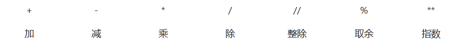
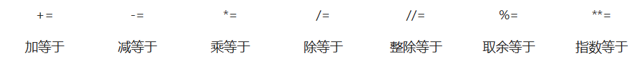
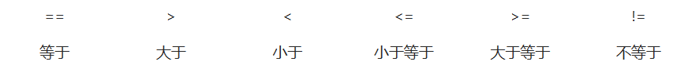
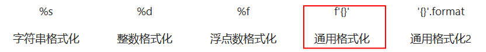
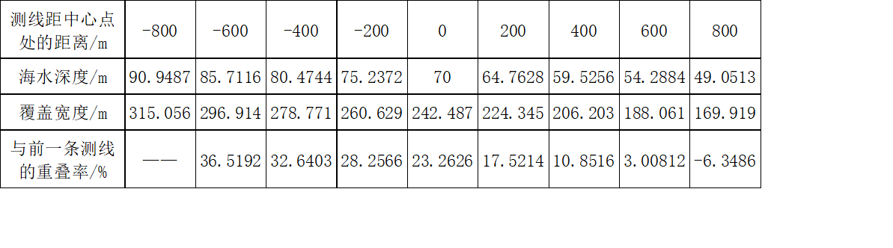

# 基础

在线测试网站:  https://godbolt.org/

## 注释

**单行注释**

```python
# 我是一个注释
print('Hello world')
```

**多行注释**

```python
"""
在三引号中的注释被称之为多行注释
可以写很多行的功能说明
"""
```

## 变量

命名规则

+ 大驼峰：ClassName
+ 小驼峰：myNameValue 
+ 蛇形：name_value (python代码里个人推荐)

```python
name = 'wuhaopeng' 
wechat = 'weicreates' 
print(name)  # wuhaopeng
print(wechat)  # weicreates
```

## **运算符**

### **算数运算符**



### **赋值运算符**



### **比较运算符**



### **逻辑运算符**


### **成员运算符**

#### **in**

+ 某值或元素是否在指定字符串、序列中

```python
String = '123456'
print('123' in String)  # True
```

#### **not in**

+ 某值或元素是否不在指定字符串、序列中

```python
String = '123456'
print('321' not in String)  # True
```

### **身份运算符**

#### is

+ 判断两个标识符是不是引用自一个对象
+ 相当于 id(x) == id(y)

```python
a = 1
b = 1
print(a is b)  # True
```

#### **is not**

+ 判断两个标识符是不是引用自不同对象

```python
a = 1
b = 2
print(a is not b)  # True
```

### **三元运算符:crossed_swords:**

#### 基本语法

```python
[结果为真的值] if [条件] else [结果为假的值]
```

嵌套三元运算符的语法为

```python
[结果1] if [条件1] else ([结果2] if [条件2] else [结果3])。
```

在C语言中，三元运算符的语法为

```python
[条件] ? [结果为真的值] : [结果为假的值]。
```

####  **条件赋值**

三元运算符可以用于条件赋值，即根据条件的真假来决定变量的值。下面是一个使用三元运算符进行条件赋值的示例：

```python
# 传统的if-else语句
if x > 0:
    y = "正数"
else:
    y = "零或负数"

# 使用三元运算符
y = "正数" if x > 0 else "零或负数"
```

#### 列表推导式

列表推导式其实就是用的三元运算符

```python
# 传统的if-else语句
result = []
for x in range(10):
    if x % 2 == 0:
        result.append(x)

# 使用三元运算符
result = [x for x in range(10) if x % 2 == 0]
```

#### **字典中的条件赋值**

三元运算符可以用于字典中的条件赋值，即根据条件的真假来决定字典键值对的值。下面是一个使用三元运算符进行条件赋值的示例：

```python
# 传统的if-else语句
result = {}
x = 10
if x > 0:
    result["status"] = "正数"
else:
    result["status"] = "零或负数"

# 使用三元运算符
result = {"status": "正数" if x > 0 else "零或负数"}
```

##  if、elif、else 条件判断

```python
name = '阿'
wechat = 'weieates'
if name == '阿':
    if wechat == 'weieates':
        print('wechat True')  # wechat True
    else:
        print('wechat False')
    print('name True')  # name True
else:
    print('name False')
```

## **for循环、while循环**

### for循环

#### **range 范围限制**

+ range(开始值, 结束值, 步长)
+ step可不写，默认值为1

```python
for y in range(1, 10):
    for x in range(1, y + 1):
        z = x * y
        print(str(x) + '*' + str(y) + '=' + str(z), end=' ')
    print()
```

#### 遍历字符串

```python
String = 'Hello world'
for i in String:
	print(i)  # H e l l o  w o r l d
```

#### 遍历列表

```python
# name_list = ["zhangsan", "lisi", "wangwu"]
# for 循环内部使用的变量 in 列表
for name in name_list:
    循环内部针对列表元素进行操作
    print(name)

# for 循环内部使用的变量 in 列表
for name not in name_list:
   循环内部针对列表元素进行操作
	print(name)
    
```

####  遍历字典

```python
Dict = {1: 1, 2: 2, 3: 3}
for i in Dict:
	print(Dict[i])  # 1 2 3
```

#### **遍历字典的键值**

```python
Dict = {1: 'first', 2: 'second', 3: 'third'}
for k, v in Dict.items():
	print(k, v)
# 1 first
# 2 second
# 3 third
```

### **while 循环**

####  **无限循环**

```python
while True:
	print('Hello world')
```

#### **while 判断语句**

```python
n = 0
while n < 10:
	n = n + 1
	print(n)  # 1 2 3 4 5 6 7 8 9 10
```

### **break 语句**

退出循环

```python
for i in range(5):
	print(i)
	if i == 3:
		break
# 0 1 2 3
```

### **continue 语句**

跳过本次循环

```python
n = 0
while n < 15:
    n = n + 1
    if n % 2 == 0:
        continue
    print(n)  # 1 3 5 7 9 11 13 15
```

### **pass 语句**

不执行任何操作

```python
for i in range(5):
    if i == 4:
        print(i)
    else:
        pass
# 4
```

### **else 语句**

循环判断条件为False后执行(没啥用)

break 影响else语句的执行，continue 不影响else语句的执行

```python
n = 0
while n < 10:
	n += 1
	print(n)
else:
	print('n>=10')

# 1 2 3 4 5 6 7 8 9 10 n>=10

for i in range(5):
	number = int(input('输入数字0：'))
	if number == 0:
		print('输入了0')
		break
else:
	print('错误5次！')
```

# 输入输出

## **格式化输出**:crossed_swords:



**格式字符的使用**

```python
String = 'world'
print('字符串：hello %s' % String)  # 字符串：hello world
print('字符串前三位：hello %.3s' % String)  # 字符串前三位：hello wor
print('字符串三到五位：hello %3.5s' % String)  # 字符串三到五位：hello world

Int = 1
print('整数：%d' % Int)  # 整数：1

Float = 0.0123
print('浮点数：%f' % Float)  # 浮点数：0.012300
print('浮点数前两位小数：%.2f' % Float)  # 浮点数前两位小数：0.01
print('浮点数前二到四位小数：%2.4f' % Float)  # 浮点数前二到四位小数：0.0123

print(f'{String},{Int},{Float}')  # world,1,0.0123
print('{0},{1},{2}'.format(String, Int, Float))  # world,1,0.0123
```

<font color=red>注意:  推荐使用f'{}'</font>

## **print 函数**

```python
print("格式化字符串 %s %s" % (变量1, 变量2...))
print("格式化字符串 %s %s " % (变量1, 变量2...),  end="")   #不换行输出
print("{}\r\n".format("电影名, 详情页, 豆瓣评分, 封面图片"))
print(f'格式化字符串{变量1} {变量2}!')  #推荐!!!!
```

print("格式化字符串 %s %s" % (变量1, 变量2...))需要用到以下格式化字符

| 格式化字符 | 含义                                                         |
| ---------- | ------------------------------------------------------------ |
| %s         | 字符串                                                       |
| %d         | 有符号十进制整数，`%06d` 表示输出的整数显示位数，不足的地方使用 `0` 补全 |
| %f         | 浮点数，`%.2f` 表示小数点后只显示两位                        |
| %%         | 输出 `%`                                                     |

 补充:

**pprint 模块**

pprint(object)  数据结构较为复杂的可以使用pprint优化输出

```python
from pprint import pprint
pprint("""Hello
world""") 
# 'hello \nworld'
```

## Input 函数

默认返回字符串类型, 可在外部转换为其它数据类型

```python 
name = input('请输入姓名：')            #
age = int(input('请输入年龄：'))        #
money = float(input('请输入财富：'))    #

print('你的姓名是：%s' % name)
print('你的年龄是：%d' % age)
print('你的财富是：%f' % money)
```

# 数据类型

| 类型      | 例子                     |
| --------- | ------------------------ |
| 整数      | `-100`                   |
| 浮点数    | `3.1416`                 |
| 字符串    | `'hello'`                |
| 列表      | `[1, 1.2, 'hello']`      |
| 字典      | `{'dogs': 5, 'pigs': 3}` |
| Numpy数组 | `array([1, 2, 3])`       |

| 类型       | 例子                      |
| ---------- | ------------------------- |
| 长整型     | `1000000000000L`          |
| 布尔型     | `True, False`             |
| 元组       | `('ring', 1000)`          |
| 集合       | `{1, 2, 3}`               |
| Pandas类型 | `DataFrame, Series`       |
| 自定义     | `Object Oriented Classes` |

## 字符串操作

> ''和""都能表示字符串但是python中推荐使用''

### 字符串拼接

**使用运算符：`+`**  不用

```
Copy codestr1 = "Hello"
str2 = "World"
result = str1 + " " + str2
print(result)  # Output: Hello World
```

**通过F-strings拼接**

==F-strings效率最高==

```python
s1 = 'Hello'
s2 = 'World'
print(f'{s1} {s2}!')

#运行结果
'Hello World!'
```

在F-strings中我们也可以执行函数：

```python
def power(x):
    return x*x
 
x = 5
print(f'{x} * {x} = {power(x)}')
 
#运行结果
'5 * 5 = 25'
```

**通过str.join()方法拼接**

==高效列表==

```python
list1 = ["1","2","3"]
str1 = "".join(list1)
 # 注意：使用join的时候,列表里面的每一项都必须是str类型
# 否则会出错
# 比如:
list2  = ["1",2]
str2 = "".join(list2)

#例子:              
str_list = ["Hello", "World"]
result = " ".join(str_list)
print(result)  # Output: Hello World
```

 使用略微复杂，但对于多个字符串进行拼接时，效率很高，只会有一次内存的申请。所以很擅长对列表的处理。

### **字符串的切片**

一种能够从数据中取出一部分数据的操作

+ 字符串[开始索引:结束索引:步长]
+ 左闭右开
+ 

```python
num_str = "0123456789"

# 1. 截取从 2 ~ 5 位置 的字符串
print(num_str[2:6])

# 2. 截取从 2 ~ `末尾` 的字符串
print(num_str[2:])

# 3. 截取从 `开始` ~ 5 位置 的字符串
print(num_str[:6])

# 4. 截取完整的字符串
print(num_str[:])

# 5. 从开始位置，每隔一个字符截取字符串
print(num_str[::2])

# 6. 从索引 1 开始，每隔一个取一个
print(num_str[1::2])

# 倒序切片
# -1 表示倒数第一个字符
print(num_str[-1])

# 7. 截取从 2 ~ `末尾 - 1` 的字符串
print(num_str[2:-1])

# 8. 截取字符串末尾两个字符
print(num_str[-2:])

# 9. 字符串的逆序（面试题）
print(num_str[::-1])
```

### 常用方法

#### 1) 判断类型

| 方法               | 说明                                                         |
| ------------------ | ------------------------------------------------------------ |
| string.isspace()   | 如果 string 中只包含空格，则返回 True                        |
| string.isalnum()   | 如果 string 至少有一个字符并且所有字符都是字母或数字则返回 True |
| string.isalpha()   | 如果 string 至少有一个字符并且所有字符都是字母则返回 True    |
| string.isdecimal() | 如果 string 只包含数字则返回 True，`全角数字`                |
| string.isdigit()   | 如果 string 只包含数字则返回 True，`全角数字`、`⑴`、`\u00b2` |
| string.isnumeric() | 如果 string 只包含数字则返回 True，`全角数字`，`汉字数字`    |
| string.istitle()   | 如果 string 是标题化的 (每个单词的首字母大写) 则返回 True    |
| string.islower()   | 如果 string 中包含至少一个区分大小写的字符，并且所有这些 (区分大小写的) 字符都是小写，则返回 True |
| string.isupper()   | 如果 string 中包含至少一个区分大小写的字符，并且所有这些 (区分大小写的) 字符都是大写，则返回 True |

#### 2) 查找和替换

| 方法                                                    | 说明                                                         |
| ------------------------------------------------------- | ------------------------------------------------------------ |
| string.startswith(str)                                  | 检查字符串是否是以 str 开头，是则返回 True                   |
| string.endswith(str)                                    | 检查字符串是否是以 str 结束，是则返回 True                   |
| string.find(str, start=0, end=len(string))              | 检测 str 是否包含在 string 中，如果 start 和 end 指定范围，则检查是否包含在指定范围内，如果是返回开始的索引值，否则返回 `-1` |
| string.rfind(str, start=0, end=len(string))             | 类似于 find ()，不过是从右边开始查找,不过如果 str 不在 string 会返回-1 |
| string.index(str, start=0, end=len(string))             | 跟 find () 方法类似，不过如果 str 不在 string 会报错         |
| string.rindex(str, start=0, end=len(string))            | 类似于 index ()，不过是从右边开始                            |
| string.replace(old_str, new_str, num=string.count(old)) | 把 string 中的 old_str 替换成 new_str，如果 num 指定，则替换不超过 num 次,返回一个新的字符串 |

#### 3) 大小写转换

| 方法                | 说明                             |
| ------------------- | -------------------------------- |
| string.capitalize() | 把字符串的第一个字符大写         |
| string.title()      | 把字符串的每个单词首字母大写     |
| string.lower()      | 转换 string 中所有大写字符为小写 |
| string.upper()      | 转换 string 中的小写字母为大写   |
| string.swapcase()   | 翻转 string 中的大小写           |

#### 4) 文本对齐

| 方法                 | 说明                                                         |
| -------------------- | ------------------------------------------------------------ |
| string.ljust(width)  | 返回一个原字符串左对齐，并使用空格填充至长度 width 的新字符串 |
| string.rjust(width)  | 返回一个原字符串右对齐，并使用空格填充至长度 width 的新字符串 |
| string.center(width) | 返回一个原字符串居中，并使用空格填充至长度 width 的新字符串  |

#### 5) 去除空白字符

| 方法            | 说明                               |
| --------------- | ---------------------------------- |
| string.lstrip() | 截掉 string 左边（开始）的空白字符 |
| string.rstrip() | 截掉 string 右边（末尾）的空白字符 |
| string.strip()  | 截掉 string 左右两边的空白字符     |

#### 6) 拆分和连接

| 方法                      | 说明                                                         |
| ------------------------- | ------------------------------------------------------------ |
| string.partition(str)     | 把字符串 string 分成一个 3 元素的元组 (str 前面，str, str 后面) |
| string.rpartition(str)    | 类似于 partition () 方法，不过是从右边开始查找               |
| string.split(str="", num) | 以 str 为分隔符拆分 string，如果 num 有指定值，则仅分隔 num + 1 个子字符串，str 默认包含 'r', 't', 'n' 和空格, 返回列表 |
| string.splitlines()       | 分隔 ['r', 'n', 'rn'] ，构造出一个新的字符串                 |
| string.join(seq)          | 以 string 作为分隔符，将 seq 中所有的元素（的字符串表示）合并为一个新的字符串 |

split 方法

+ str.split(sep,maxsplit)

+ 以sep为分隔符切片为列表，如果maxsplit有指定值，则仅分割 maxsplit 个字符串

+ ```python
  Str = '1,2,3,4,5,6,7,8,9'
  List = Str.split(',', 7)
  print(List)  # ['1', '2', '3', '4', '5', '6', '7', '8,9']
  ```

 splitlines 方法

+ str.splitlines()

+ 按照行分隔，返回一个包括各行作为元素的列表

+ ```python
  Str = '''123
  456
  789
  '''
  List = Str.splitlines()
  print(List)  # ['123', '456', '789']
  ```

 join 方法

+ sep.join(sequence)

+ 分隔 ['r', 'n', 'rn'] ，构造出一个新的字符串

+ ```python
  List = ['甲', '乙', '丙', '丁', 'World']
  Str = ' '.join(List)
  print(Str)  # 甲 乙 丙 丁 World
  ```

## 列表

> 使用 **最频繁** 的数据类型，在其他语言中通常叫做 **数组**

### **列表的使用**

+ list = [val,val...]

```python
List = [1, '2', {3: 2}, 4]
print(List)  # [1, '2', {3: 2}, 4]
```

### 列表的切片

一种能够从数据中取出一部分数据的操作

+ 列表[开始索引:结束索引:步长]
+ 左闭右开

```python 
List = [1, 2, 3, 4, 5]

#取全部元素
print(List[:]) # [1, 2, 3, 4, 5]

#取第二个元素
print(List[1]) # 2

#取第二元素到最后一个
print(List[1:]) # [2, 3, 4, 5]

#取到最后第二个元素
print(List[:-1]) # [1, 2, 3, 4]

#反向取全部元素
print(List[::-1]) # [5, 4, 3, 2, 1]
```

### 常用方法

**增加**

| 方法                     | 说明                      |
| ------------------------ | ------------------------- |
| 列表.insert (索引，数据) | 在指定位置插入数据        |
| 列表.append (数据)       | 在末尾追加数据            |
| 列表.extend (列表 2)     | 将列表 2 的数据追加到列表 |

  **删除**

| 方法               | 说明                     |
| ------------------ | ------------------------ |
| 列表.remove [数据] | 删除第一个出现的指定数据 |
| 列表.pop           | 删除末尾数据             |
| 列表.pop (索引)    | 删除指定索引数据         |
| del 列表 [索引]    | 删除指定索引的数据       |
| 列表.clear         | 清空列表                 |

del 方法(不推荐)

+ 删除列表除最后一个元素

+ ```python
  List = [1, 2, 3, 4]
  del List[:-1]  # i < len -1 ---> 0,1,2,3
  print(List)  # [4]
  ```

**修改**

| 方法               | 说明               |
| ------------------ | ------------------ |
| 列表 [索引] = 数据 | 修改指定索引的数据 |

**统计**

| 方法               | 说明                     |
| ------------------ | ------------------------ |
| 列表. index(value) | 获取元素在列表中的索引值 |
| 列表.count (数据)  | 数据在列表中出现的次数   |

**排序**

| 方法                     | 说明     |
| ------------------------ | -------- |
| 列表.sort (reverse=True) | 降序排序 |
| 列表.reverse ()          | 反转     |

sort 方法

+ 二维列表

+ ```python
  # 根据整数排序
  List = [2, 1, 3, 5, 4]
  List.sort(key=int, reverse=False)
  print(List)  # [1, 2, 3, 4, 5]
  
  #根据二维列表的内列表索引排序
  List = [
      [1,2],
      [3,1],
      [2,3],
      [4,2]
  ]
  List.sort(key=lambda x:x[0], reverse=False)
  print(List)  # [[1, 2], [2, 3], [3, 1], [4, 2]]
  
  #根据二维列表嵌套字典的指定键排序
  List = [
      {"index":1,"value":2},
      {"index":3,"value":1},
      {"index":2,"value":3},
      {"index":4,"value":2}
  ]
  List.sort(key=lambda x:x["index"], reverse=False)
  print(List)
  
  # [
  # {'index': 1, 'value': 2},
  # {'index': 2, 'value': 3}, 
  # {'index': 3, 'value': 1}, 
  # {'index': 4, 'value': 2}
  # ]
  ```

## 元组

> 元组是储存不能被修改的多个数据的一种方式

### 元组的使用

+ tuple = (val,val...)
+ 当元组的元素只有一个时，需加逗号

```python
tuple = ("zhangsan", 18, 1.75) #
tuple = ()  # 创建空元组
tuple = (50, ) #只包含一个元素添加逗号
```

### 元组的切片

一种能够从数据中取出一部分数据的操作

+ 列表[开始索引:结束索引:步长]
+ 左闭右开

```python
tuple = (1, 2, 3, 4, 5)
#取全部元素
print(tuple[:]) # (1, 2, 3, 4, 5)

#取第二个元素
print (tuple[1]) # 2

#取第二元素到最后一个
print(tuple[1:]) # (2, 3, 4, 5)

#取到最后第二个元素
print(tuple[:-1]) # (1, 2, 3, 4)

#反向取全部元素
print(tuple[::-1]) # (5, 4, 3, 2, 1)

#每隔一个元素取
print(tuple[::2]) # (1, 3, 5)
```

### count 方法

+ tuple.count(value)
+ 查询元素在元组中的个数

```python
Tuple = (1, 1, 2, 3, 4, 5)
count = Tuple.count(1)
print(count)  # 2
```

### index方法

+ tuple.index(value)

+ 获取元素在元组中的索引值

```python
Tuple = (1, '2', 3, 4)
index = Tuple.index('2')
print(index)  # 1
```

##  字典

> 字典是储存能被修改的多个数据的一种方式

### **字典的使用**

dict={key:val,key:val...}

+ 字典只要储存一个数据，就必须要有键值对

```python
Dict = {1: 1, 2: 2, 3: '3', '4': 4}
print(Dict)   # {1: 1, 2: 2, 3: '3', '4': 4}
```

### **数据获取**

#### 获取字典的值

##### **键名获取**

+ 通过键名获取字典中key对应的值

```python
Dict = {1: 1, 2: 2, 3: 3, 4: 4}
value = Dict[1]
print(value) # 1
```

##### get方法

+ dict.get(key,default)

```python
Dict = {1: 1, 2: 2, 3: 3, 4: 4}
value = Dict.get(5, 4)
print(value) # 4
```

#### keys 方法

+ dict.keys() 通过keys方法获取字典的键名，返回可迭代对象

```python
Dict = {1: 1, 2: 2, 3: 3, 4: 4}
keys = Dict.keys()
for key in keys:
print(key) # 1 2 3 4
```

#### values 方法

+ dict.values() 通过keys方法获取字典的所有值，返回可迭代对象

```python
Dict = {1: 1, 2: 2, 3: 3, 4: 4}
values = Dict.values()
for value in values:
print(value) # 1 2 3 4
```

#### items 方法

+ dict.items() 通过keys方法获取字典的键值对,返回元组型的可迭代对象

```python
Ddict = {1: 1, 2: 2, 3: 3, 4: 4}
items = Dict.items()
for key,value in items:
    print(key,value)

# 1 1
# 2 2
# 3 3
# 4 4
```

###  数据增加

#### 键名添加

+ dict[key]=value 通过键名向字典添加数据

```python
Dict = {1: 1, 2: '2'}
print(Dict)  # {1: 1, 2: '2'}
Dict[3] = '3'
Dict['4'] = 4
print(Dict)  # {1: 1, 2: '2', 3: '3', '4': 4}
```

####  **setdefault 方法**

+ dict.setdefault(key,default)如果key键名不存在，则向字典添加键并设置默认值default

```python
Dict = {1: 1, 2: '2'}
print(Dict)  # {1: 1, 2: '2'}
Dict.setdefault('3',3)
print(Dict)  # {1: 1, 2: '2', '3': 3}
```

#### update 方法

+ dict.update(dict) 通过update方法将另一个字典添加到字典中

```python
Dict = {1: 1, 2: 2}
Dict.update({3: 3, 4: 4})
print(Dict)  # {1: 1, 2: 2, 3: 3, 4: 4}
```

###  数据删除

#### del 方法

+ del dict[key] 通过del方法删除字典对应的键值对

```python
Dict = {1: 1, 2: '2'}
print(Dict)  # {1: 1, 2: '2'}
del Dict[2]
print(Dict)  # {1: 1}
```

```python
Dict = {1: 1, 2: '2'}
print(Dict)  # {1: 1, 2: '2'}
del Dict
print(Dict)  # 报错
```

#### popitem 方法

+ dict.popitem() 删除并取出最后一个键值对，返回元组类型

```python
Dict = {1: 1, 2: 2, 3: 3, 4: 4}
item = Dict.popitem()
print(item)  # (4, 4)
```

#### clear 方法

+ dict.clear() 通过clear方法清空字典所有的键值对

```python
Dict = {1: 1, 2: 2, 3: 3, 4: 4}
Dict.clear()
print(Dict)  # {}
```

###  copy 方法

+ dict.copy() 浅拷贝字典

```python
Dict = {1: 1, 2: 2, 3: 3, 4: 4}
newDict = Dict.copy()
print(newDict)  # {1: 1, 2: 2, 3: 3, 4: 4}
```


## 集合

### **集合的使用**

+ set = {val,val...}
+ 集合是一种能够储存多个数据的方式
+ 集合的特性：数据不能重复，集合是无序的
+ 通过set()方法创建空集

```python
Set = {1, 2, 3, 4, 5}
print(Set)  # {1,2,3,4,5}

Set = set()  
print(Set)  # {}
```

### 数据获取

交集

+ set.intersection(set)
+ set & set
+ 获取两个集合中共有的元素

```
Set = {1, 2, 3, 4, 5}
Set2 = {1, 2, 4}
print(Set.intersection(Set2))
print(Set & Set2)
```

并集

+ set.union(set)
+ set | set
+ 获取两个集合中所有的元素

```
Set = {1, 2, 3, 4, 5}
Set2 = {1, 2, 4}
print(Set.union(Set))
print(Set | Set2)
```

差集

+ set.difference(set)
+ set1 - set2
+ 获取源集合有而目标集合没有的元素

```
Set1 = {1, 2, 3, 4, 5}
Set2 = {1, 2, 4}
print(Set.difference(Set2))
print(Set - Set2)
```

亦或集

+ 用法：set ^ set
+ 获取两个集合中非共有的元素

```
Set = {1, 2, 3}
Set2 = {1, 2, 3, 4, 5}
print(Set ^ Set2)
```

###  数据判断

判断子集

+ 用法：set.issubset(set)

+ 源集合是否为目标集合的子集

```
Set = {1, 2, 3}
Set2 = {1, 2, 3, 4, 5}
print(Set.issubset(Set2))
```

 判断超集

+ 用法：set.issuperset(set)
+ 源集合是否为目标集合的超集

```
Set = {1, 2, 3}
Set2 = {1, 2, 3, 4, 5}
print(Set2.issuperset(Set))
```

### **数据增加**

####  add 方法

+ set.add(value)
+ 通过add方法可以向集合添加元素

```
Set = {1, 2, 3, 4, 5}
Set.add(6)
print(Set)  # {1,2,3,4,5}
```

#### update 方法

+ set.update(set)
+ 通过update方法可以将另一个集合合并到该集合

```
set = {1, 2, 3, 4, 5}
set.update({6, 7, 8})
print(Set)  # {1,2,3,4,5,6,7,8}
```

### 数据删除

#### remove 方法

+ set.remove(value)
+ 通过元素的值进行删除

```
Set = {1, 2, 3, 4, 5}
Set.remove(1)
print(Set)  # {1,2,3,4}
```

#### pop 方法

+ set.pop()
+ 删除并取出最后一个元素

```
Set = {1, 2, 3, 4, 5}
value =Set.pop()
print(value)  # 5
```

## 转换:crossed_swords:

### 字符串和数字之间的转换

```python
# 字符串转换为数字
num_str = "1234"
num = int(num_str)  #!!!
print("Converted number:", num)
print("Type of converted number:", type(num))

# 数字转换为字符串
num = 5678
num_str = str(num)  #!!!
print("Converted string:", num_str)
print("Type of converted string:", type(num_str))
```

```
Converted number: 1234
Type of converted number: <class 'int'>
Converted string: 5678
Type of converted string: <class 'str'>
```

注意:  

```python
num = 000000
num_str = str(num)
print(num_str)
print("Type of converted string:", type(num_str))
```

```python
0
Type of converted string: <class 'str'>
```

### 元组和列表之间的转换

- 使用 `list` 函数可以把元组转换成列表

```python
list(元组) 
```

- 使用 `tuple` 函数可以把列表转换成元组

```python
tuple(列表)
```

### 字典和列表之间的转换

 **list 方法**

+ list(dict)
+ 通过list方法将字典的键名转换为列表

```python
Dict = {1: 1, 2: 2, 3: 3}
List = list(Dict)
print(List) # [1, 2, 3]
```

**sorted 方法**

+ sorted(dict)
+ 通过sorted方法将字典的键名转换为有序列表

```python
Dict = {1: 1, 3: 3, 2: 2}
List = sorted(Dict)
print(List) # [1, 2, 3]
```

### 其它类型转换成集合

+ set(object) 通过set()方法将其它类型转换成集合类型

```python
{'2', '3', '1', '4'} {1, 2} {1, 2}Str = '1234'
List = [1, 2]
Dict = {1: 11, 2: 22}
Set1 = set(Str)
Set2 = set(List)
Set3 = set(Dict)
print(Set1,Set2, Set3)
#{'2', '3', '1', '4'} {1, 2} {1, 2}
```

# **推导式、拆包:crossed_swords:**

## 推导式

> 推导式就是一种能够快速生产数据的方式

**列表推导式**

```python
List = [i for i in range(10) if i % 2 == 0]
print(List)  # [0, 2, 4, 6, 8]
```

**嵌套列表推导式**

```python
List = [[i, y] for i in range(3) for y in range(3, 6)]
print(List)
# [[0, 3], [0, 4], [0, 5], [1, 3], [1, 4], [1, 5], [2, 3], [2, 4], [2, 5]]
```

 **字典推导式**

```python
List = [0, 1, 2, 3, 4, 5]
Dict = {key: str(key) for key in List}
print(Dict)  # {0: '1', 1: '2', 2: '3', 3: '4', 4: '5', 5: '6'} 
```

**生成器推导式**

```python
generator = (i for i in range(10) if i % 2 == 0)
for item in generator:
    print(item)  # 0 2 4 6 8
```

## 拆包

> 拆包是一种快速提取数据的方式

**元组拆包**

```python
x, y, z = (1, 2, 3)
print(x, y, z)
```

**列表拆包**

```python
List = [3, 2, 1]
a, b, c = List
print(a, b, c)
```

**集合拆包**

```python
Set = {2, 3}
a, b = Set
print(a, b)
```

**字典拆包**

字典拆包获取的是字典的键名

```python
Dict = {'1': 1, '2': 2, '3': 3}
k1, k2, k3 = Dict
```

交换两个变量的值

```python
a= 1
b=2
print(a, b)
a, b = b, a
print(a, b)
```

# **函数**

> **定义、参数、返回值、拆包、作用域、引用**

##  定义函数

使用def关键字定义函数

```python
def test():
	print('Hello world')
```

## 函数的调用

```python
def test():
	print('Hello world')

test()  # Hello world
```

## **函数参数**

+ 形参：定义函数时()中定义的变量
+ 实参：调用函数时()中传递的数据

### 不可变类型和可变类型:crossed_swords:

- **不可变类型**，内存中的数据不允许被修改： **——— 按"值"传递**

  - 数字类型 `int`, `bool`, `float`, `complex`, `long(2.x)`
  - 字符串 `str`
  - 元组 `tuple`

- **可变类型**，内存中的数据可以被修改：   **——— 按引用传递**

  - 列表 `list`

  - 字典 `dict`

  - ```python
    def saveResult(res, result):
        # 识 成功
        if res["code"] == 100:
            index = 1
            for line in res["data"]:
                result.append(f"{index}-置信度：{round(line['score'], 2)}，文本：{line['text']}\n")
                index += 1
        elif res["code"] == 200:
            print("图片中未识别出文字。")
    
    result = []  # 用于保存结果的列表
    saveResult(res, result)
    
    final_result = "".join(result)  # 将列表转换为字符串
    print(final_result)
    ```

### **传递实参**

```python
def add(num1, num2):
    print(num1 + num2)

add(1, 2)  # 3
```

### 缺省参数(默认值)

+ 当调用函数时，有些参数不必传递，而是用默认值，则用缺省参数
+ 调用函数时缺省参数可以传递新值
+ 缺省参数必须在形参后面定义，否则会报错

```python
def info(name, age = 20):
    print(name,age)

info('小')  # 小 20
info('小', 21)  # 小 21
```

### 命名参数

+ 命名参数能够在调用函数的时候，不受位置的影响

```python
def test(num1, num2):
    print(num1, num2)

test(num2=21, num1=11)  # 11 21
```

###  不定长参数

+ *args：表示调用函数时多余的未命名参数以元组的方式存储到args中
+ **kwargs：表示调用函数时多余的命名参数以键值对的方式存储到kwargs中

#### **可变参数**

```python
def text(person, *others):
	print('person:' + person)
	for other in others:
		print('other:' + other)

text('甲', '乙', '丙', '丁')

# person:甲
# other:乙
# other:丙
# other:丁
```

#### **关键字可变参数**

```python
def test(person, **others):
	print('person:' + person)
	for other in others:
		print(other + ':' + others[other])

test('甲', others1='乙', others2='丙', others3='丁')

# person:甲
#others1:乙
#others2:丙
#others3:丁
```

## 函数返回值

### 返回单个值

```python
def age(value):
	print(f'你是{value}岁！')
	if value < 12:
		return '儿童'
	elif value < 25:
		return '成人'
	else:
		return '步入社会'

print(age(21))

# 儿童
# 成人
```

### 返回多个值

+ return关键字以==元组类型==返回多个值

```python
def test(a,b,c):
    return a,b,c

test(1,2,3)  # (1 2 3)
```

可以用返回值拆包的方式接受返回的多个值

## **函数拆包**

### 返回值拆包

+ 通过函数返回值拆包，可以快速的将具体的数据用变量进行存储，这样对数据的处理会更加方便

```python
def test():
    return 1, 2, 3

a, b, c = test()
print(a, b, c)  # 1 2 3
```

### 参数拆包

#### 元组拆包

通过*tuple对元组拆包，返回等长的参数

+ 元组的元素个数和函数参数一一对应

```python
def test(a, b, c):
	print(a, b, c)

Tuple = (1, 2, 3)
test(*Tuple)  # 1 2 3


#
def test(*args):
	print(args)

Tuple = (1, 2, 3)
test(*Tuple)  # (1, 2, 3)
```

#### 字典拆包

通过**dict对字典拆包，返回key=value形式的参数

+ 字典的key和函数参数一一对应

```python
def test1(a,b,c):
    print(f"传递a是 {a},  传递b是 {b}, 传递c是 {c}")
    
Dict = {'a': 'first', 'b': 'second', 'c': 'third'}
test1(**Dict)
#传递a是 first,  传递b是 second, 传递c是 third


#
def test(**kwargs):
	print(kwargs)

Dict = {'a': 'first', 'b': 'second', 'c': 'third'}
test(**Dict)  # {'a': 'first', 'b': 'second', 'c': 'third'}
```

## **作用域**

+ 局部变量：函数中定义的变量，包括形参变量也是局部变量，只能在定义它的函数中使用

+ 全局变量：在当前文件都生效的变量

### global 关键字

+ 可在函数内部修改全局变量(默认是不能修改的,这个和c++不一样)

```python
content = 123
print(content)  # 123

def test():
	global content #
	content = 321
	print(content)  # 321

test()
print(content)  # 321
```

### nonlocal 关键字

+ 可在内部函数中修改外部函数的变量

```python
def test():
	a = 10
	print(a)  # 10
	def func():
      nonlocal a
      a = 20
      print(a)  # 20

  func()
  print(a)  # 20
  
test()
```

###  locals 关键字

+ 返回当前作用域的命名空间，返回字典类型

```
def test():
	a = 1
	namespace = locals()
	print(namespace)  # {'a': 1}

test()
```

## **引用**

+ 引用就是地址，地址是存放数据的空间在内存中的编号
+ Python中的变量并不是真正存储数据，而是存储的数据所在内存中的地址，称为引用。

引用

```python
a = 100
b = a
print(id(a))  # 2008501062992
print(id(b))  # 2008501062992
print(a is b)  # True
```

**引用当做实参**

```python
def test(n):
	print(n)
num = 100
test(num) # 100 引用num当做实参
```

**引用函数名**

```python
def test1(n):
    print(n)

test2 = test1  # 将test1函数引用给test2
```

 **函数做容器类元素**

+ 函数可以当做容器类元素被存储与传递

```python
def test1():
	print(1)

def test2():
	print(2)

List = [test1, test2]
for test in List:
	test()  # 1 2
```

## **高阶函数(类似函数指针)**

+ 将另一个函数作为参数传递给函数

```python
def test(f, num):
	return f() + num

def test2():
	return 100

print(test(test2, 100))  # 200
```

## 匿名函数

+ 没有名字的函数，用lambda定义
+ 可以用一行代码完成简单的函数定义
+ 可以当做实参快速传递到函数中去

### **lambda**

```python
add = lambda x, y: x + y
print(add(2, 3))  # 5
print((lambda x, y: x * y)(2, 2))  # 4
```

### **sort + lambda**

```python
List = [
    {'name': 'n1', 'age':10},
    {'name': 'n2', 'age':30},
    {'name': 'n3', 'age':20},
    {'name': 'n4', 'age':15}
]

print(List)
List.sort(key = lambda x: x['age'])  # 根据age排序
print(List)

#  [
# {'name': 'n1', 'age': 10}, 
# {'name': 'n2', 'age': 30}, 
# {'name': 'n3', 'age': 20}, 
# {'name': 'n4', 'age': 15}
# ]

#  [
# {'name': 'n1', 'age': 10}, 
# {'name': 'n4', 'age': 15}, 
# {'name': 'n3', 'age': 20}, 
# {'name': 'n2', 'age': 30}
# ]
```

## 递归函数

+ 一个函数在函数体内调用了自己，这样的函数叫做递归函数

阶乘函数

+ 阶乘：3! = 3*2*1 = 6

```python
def test(n):
	if n == 1:
		return 1
	return n * test(n - 1)

print(test(int(input('请输入一个数字n，返回n的阶乘：'))))
```

幂函数

+ 幂函数：2 ^2^=8

```python
def test(n, m):
	if m == 1:
		return n
	return n * test(n, m - 1)

print(test(int(input('底数：')), int(input('指数：'))))
```

回文函数

+ 递归判断首尾是否相同，是则返回True，否则返回False

```python
def test(s):
	if len(s) < 2:
		return True
	elif s[0] != s[-1]:
		return False
	return test(s[1:-1])

print(test('abcdcba'))  # True
```

## 迭代器:crossed_swords:

### 迭代

+ 迭代是访问序列类型元素的一种方式

```python
List = [1, 2, 3]
for item in List:  # 迭代
    print(item)  # 1 2 3
```

### 可迭代对象

+ python中能够被for循环遍历的数据类型称为可迭代对象及字符串、列表、元组、字典都是可迭代对象
+ 整数型和浮点数不属于可迭代对象

```python
from collections.abc import Iterable

Str = '123'
List = [3, 2, 1]
Tuple = (4, 5, 6)

# isinstance 判断前一个变量是否是后面变量的实例对象
print(isinstance(Str, Iterable))  # True
print(isinstance(List, Iterable))  # True
print(isinstance(Tuple, Iterable))  # True
```

### 迭代器

> 迭代器是一种可以记住遍历的位置的对象。

#### **iter**

+ 通过iter函数获取可迭代对象的迭代器

```python
List = [1, 2, 3, 4, 5, 6]
Iter = iter(List)
print(Iter)  # <list_iterator object at 0x000001A122AE7790>
```

#### **next**

+ 通过next函数获取下一条数据
+ 如果获取的元素超出当前迭代器的元素范围则会报错

```python
List = [1, 2, 3, 4, 5, 6]
Iter = iter(List)

first = next(Iter)
second = next(Iter)
third = next(Iter)
print(first, second, third)  # 1 2 3
```

**判断迭代器**

+ 通过isinstance函数判断对象是否为迭代器

```python
from collections.abc import Iterator

List = [1, 2, 3, 4, 5,6]
Iter = iter(List)
print(isinstance(Iter, Iterator))  # True
```

## 生成器:crossed_swords:

> 生成器通过生成器函数产生，生成器函数可以通过def语句定义，函数内使用yield一次返回一个结果

### **yield 关键字**

```python 
def test(x):
    while True:
        if x < 10:
            x += 1
            yield x
        else:
            break


for i in test(1):
    print(i)  # 2 3 4 5 6 7 8 9 10
```

### send 方法

+ send方法与next方法相同，可以获取生成器下一条数据
+ send方法传入非None值前，生成器必须处于挂起状态，否则会抛出一次
+ 第一次调用生成器时，要使用next方法或send(None)

```python
def test(n):
    i = 0
    while i < n:
        result = yield i
        if result == 1:  # 判断send接收的值
            print('test true')
        i += 1


t = test(10)
print(t.send(None))  # 0
print(t.send(1)) 
# test true 
#1
print(t.send(6))  # 2
```

注意: 推荐用next

### close 方法

+ 通过close方法关闭生成器，关闭后调用next方法和send方法时会抛出异常

```python
def test(n):
    i = 0
    while i < n:
        result = yield i
        i += 1


t = test(10)
print(next(t))  # 0
t.close()
print(next(t))  # 报错
```

### 生成器转列表

```python
def test(x):
	while True:
		if x < 10:
			x += 1
		    yield x
	    else:
		    break
        
print(list(test(2)))  # [3, 4, 5, 6, 7, 8, 9, 10]
```


### 生成器推导式

生成器推导式返回的是生成器对象，使用next方法或for循环遍历获取生成器中的值，每次只在内存中占用一个空间

```python
g = (i for i in range(10)) #生成器推导式
print(next(g))  # 0
print(next(g))  # 1

for i in g:
    print(i)  # 2 3 4 5 6 7 8 9
```

## **装饰器**:crossed_swords:

装饰器本质上是个Pythop函数， 它可以让其他函数在不需 要做任何代码变动的前提下增加额外功能， 装饰器的返回值也是一个函数对象。

它经常用于有切面需求的场景，比如:插入日志、性能测试、事务处理、缓存、权限校验等场景。装饰器是解决这类问题的绝佳设计，有了装饰器，我们就可以抽离出大量与函数功能本身无关的雷同代码并继续重用。

**装饰器的使用**

```python
# 定义装饰器的使用
def test(func):
    def wrapper(*args, **kwargs):
        print('开始计算...')
        result = func(*args, **kwargs)
        return result

    return wrapper


@test   #装饰器的使用  # 相当于add=test(add) 返回作用域含有func的wrapper函数
def add(a, b):
    return a + b


print(add(1, 2))

# 开始计算...
# 3
```

**带有参数的装饰器**

```python
info = '加法计算'


def print_info(info):  # 接收装饰器本身的参数
    def wrapper(func):  # 接收被装饰的函数的引用
        def inner_wrapper(*args, **kwargs):  # 接收被装饰的函数的参数
            print(f'{info}：开始计算...')
            result = func(*args, **kwargs)
            return result
        return inner_wrapper
    return wrapper


@print_info(info)  # 相当于add=print_info(info)(add)
def add(a, b):
    return a + b

print(add(1, 2))

# 加法计算：开始计算...
# 3
```


## 补充说明

### 函数注释 —文档字符串

+ help(object)  用于简要解释函数的作用

```python
def test():
"""这是一个函数"""

help(test)    #

# Help on function test in module main

# test()
#	这是一个函数
```

### pass 关键字

+ pass关键字占用位置

```python
def test()
	pass
```

### **内置函数**

#### **数学运算**


#### 执行字符串代码


#### 序列操作


#### 字符串操作


#### 进制转换


#### 其他补充


# 类:crossed_swords:


## 类的定义

+ 类名使用大驼峰命名法

```python
class MyClass:
    def __init__(self, param1=None, param2=None, param3=None):
        self.param1 = param1
        self.param2 = param2
        self.param3 = param3

    def method1(self):
        pass

    def method2(self):
        pass

    def other_method(self):
        pass
```

## 类的调用(实例化)

+ 通过 变量名=类名() 实现类的实例化

+ 可以创建多个实例对象，每创建一个对象，内存中就占用一个，对象与对象之间互不干扰

```python
class Test:
    pass

t = Test()  # 类的实例化
t2 = Test()  # 类的实例化
```

## python类中的self

+ self的作用就是当通过实例对象调用实例方法和实例属性的时候self能够自动指向实例对象

```python
class Test:
    def print_self(self):
        print(id(self))

test=Test()
print(id(Test))  # 1802009959856
print(id(test))  # 1802008737104
test.print_self()  # 1802008737104
```

## __ init __函数(构造)

> 构造函数, python中一个class只能有一个__ int __函数

+ 通过__init__方法定义实例属性

```python
class Test:
    def __init__(self):
        self.val = 100

test = Test()
print(test.val)  # 100
```

+ 可以在实例化的同时传递实参，实例化后会自动将实参传递给__init__方法

```python
class Test:
    def __init__(self,val):
        self.val = val

test = Test(200)  # 传递实参实例化
print(test.val)  # 200
```

## __ del __函数(析构)

> 析构函数, python中一个class只能有一个__ del __函数

```python
class Test:
    def __init__(self):
        self.val = 100
    def __del__(self):
        pass

test = Test()
print(test.val)  # 100
```

## 属性

### 实例属性(self)

#### **公有属性**

+ **可以通过动态绑定属性**

```python
class Test:
    def set_info(self):
        self.info = 'Hello world'    # 设置实例属性

test = Test()
test.val = 100   # 设置实例属性  #动态绑定属性
test.set_info()  # 设置实例属性
print(test.val)  # 100
print(test.info)  # Hello world
```

#### **私有属性**

```python
class Test:
    def __init__(self):
        self.__name = '是'      #
        self.__gender = '啥'

    def get_name(self):
        print(self.__name)


test = Test()
test.get_name()  # 是
print(test._Test__gender)  # 啥
```

#### **保护属性**

```python
class Test:
    def __init__(self):
        self._name = '金刀'     #
        self._age = '21'

    def get_name(self):
        print(self._name)


test = Test()
test.get_name()  # 金刀
```

### 类属性(静态属性)

+ **相当于c++中的staic关键字定义的静态属性**
+ **类的静态方法和变量表示共享**

#### **公有属性**

```python
class Test:
    val = 10  # 定义类属性
    tool_num = 0  # 定义类属性

    def __init__(self):
        Test.tool_num += 1   # 每次实例化会调用1次  #类属性使用

    @classmethod
    def set_val(cls):
        Test.val = Test.val*10; #使用
   
    @classmethod
    def print_info(cls):
        print(Test.tool_num)    

test1 = Test()
print(test1.val)  # 10   #调用
test1.set_val()

test2 = Test()
print(test2.val)  # 100
test2.print_info()  #2
```

#### **私有属性**

```python
class Test:
    __val = 10  # 定义私有类属性
    
    @classmethod
    def set_val(cls):
        Test.__val = Test.__val*10; #使用

test1 = Test()
print(test1._Test__val)  # 10  #调用
test1.set_val()

test2 = Test()
print(test2._Test__val)  # 100
```

#### **保护属性**

```python
class Test:
    _val = 10  # 定义保护类属性
    
    @classmethod
    def set_val(cls):
        Test._val = Test._val*10; #使用

test1 = Test()
print(test1._val)  # 10   #调用
test1.set_val()

test2 = Test()
print(test2._val)  # 100
```

## 自定义方法

### 实例方法

<font color=red>实例方法:   改变实例属性</font>

```python
class Test:
    def print_info(self,info):
        print('Hello ' + info)

t = Test()
t.print_info('world')  # Hello world
```

### 类方法

<font color=red>类方法:   改变类属性</font>

+ **类方法不能调用实例方法**

```python
class Test:
    val = 2

    @classmethod
    def test(cls):
       print(cls.val)

Test.test()  # 2
```

### 静态方法

<font color=red>静态方法:  不需要访问实例属性和类属性</font>

+ 和c++中的静态方法和java中的方法都不同

```python
class Dog(object):
    # 狗对象计数
    dog_count = 0
    def __init__(self, name):
        self.name = name
    
    @staticmethod
    def run():
        # 不需要访问实例属性也不需要访问类属性的方法
        print("狗在跑...")


dog=Dog('ss')
dog.run()   #狗在跑... 
```

### 综合代码

```python
class MyClass(object):
    # 实例方法
    def instance_method(self):
        print('instance method called', self)
    
    # 类方法
    @classmethod
    def class_method(cls):
        print('class method called', cls)
    
    # 静态方法
    @staticmethod
    def static_method():
        print('static method called')
        
        
my_class = MyClass()        # 实例化

my_class.instance_method()  # 实例方法
my_class.class_method()     # 类方法
my_class.static_method()    # 静态方法


class Hero:
    def __init__(self, name):
        self.name = name
        self.weapon = None

    def attack(self):
        if self.weapon:
            print(f'{self.name} 使用 {self.weapon.name} 发起攻击，造成 {self.weapon.atk} 伤害！')
        else:
            print(f'{self.name}，你还没装备任何武器！')

    def use_weapons(self, value):
        self.weapon = value
        print(f'{self.name}，你装备了{self.weapon.name}！')


class Weapon:
    def __init__(self, name, atk):
        self.name = name
        self.atk = atk


hero = Hero('阿浩')
hero.attack()  # 阿浩，你还没装备任何武器！

weapon = Weapon('AK47', 100)
hero.use_weapons(weapon)  # 阿浩，你装备了AK47！  # 将weapon对象引用到hero对象的属性中
hero.attack()  # 阿浩 使用 AK47 发起攻击，造成 100 伤害！
```

### **魔术方法**

#### `__class__`方法

●在创建的实例对象中存在__class__方法
●通过__class__方法获取到这个类的地址
●通过地址找到对应的方法与属性
●通过__class__方法查看实例对象所在的类

```python
class Test:
    num = 100

    @classmethod
    def info(cls):
        return cls.num


test = Test()
print(Test.__class__)  # <class 'type'>
print(test.__class__)  # <class '__main__.Test'>
print(test.__class__.num)  # 100
print(test.__class__.info())  # 100
```

#### `__new__`方法

●__new__方法是一个由 object 基类提供的内置的静态方法
●帮助类在内存中去开辟一个空间
●返回对象的引用给 Python 解释器

```python
class Test(object):
    def __new__(cls, *args, **kwargs):
        print(f'cls的内存地址为：{id(cls)}')  # cls的内存地址为：2326608437808
        print('分配内存地址中...')  # 分配内存地址中...
    
        instance = super().__new__(cls)
        return instance
    
    def __init__(self):
        print(f'self的内存地址为：{id(self)}')
    
    
print(f'object基类的内存地址为：{id(object)}')  # object基类的内存地址为：140713816242048
print(f'Test类的内存地址为：{id(Test)}')  # Test类的内存地址为：2326608437808
test = Test()  # self的内存地址为：2326607124784
print(f'test实例的内存地址为：{id(test)}')  # test实例的内存地址为：2326607124784
```

#### `__str__`函数

> 类似java中的to_string函数

```python
class Test:
    def __init__(self):
        print('__init__方法被调用')
    
    def __str__(self):
        return '__str__方法被调用'
    
    def __repr__(self):
        return '__repr__方法被调用'
    
test = Test()  # __init__方法被调用
print(test)  # __str__方法被调用
print(str(test))  # __str__方法被调用
print(repr(test))  # __repr__方法被调用
```

#### `__dict__`方法

●获取类对象或实例对象中的所有属性与方法
●实例对象使用__dict__方法只能获取到实例属性的名称与值

```python
class Test:
    def __init__(self, name, age):
        self.name = name
        self.age = age

    def info(self):
        return self.name, self.age


test = Test('111', 20)
print(Test.__dict__)
print(test.__dict__)

# {'__module__': '__main__', '__init__': <function Test.__init__ at 0x0000020227CD6710>, 'info': <function Test.info at 0x0000020227CD67A0>, '__dict__': <attribute '__dict__' of 'Test' objects>, '__weakref__': <attribute '__weakref__' of 'Test' objects>, '__doc__': None}
# {'name': '111', 'age': 20}
```

#### `__doc__`类文档

●它用于简要解释类的作用

```python
class Test:
    """这是一个测试类"""
    pass


test = Test()
print(Test.__doc__)  # 这是一个测试类
print(test.__class__.__doc__)  # 这是一个测试类
```

#### `__mro__`方法

●为了方便且快速地看清继承关系和顺序，可以用__mro__方法来获取这个类的调用顺序

```python
class A:
    pass
    
    
class B(A):
    pass
    
    
class C(B):
    pass
    
    
print(C.__mro__)

# (<class '__main__.C'>, <class '__main__.B'>, <class '__main__.A'>, <class 'object'>)
```

#### `__call__`方法

●使得类实例对象可以像普通函数那样被调用

```python
class Test:
    def __init__(self, name, age):
        self.name = name
        self.age = age
        self.sex = None

    def __call__(self, *args, **kwargs):
        self.sex = args[0]
        return self.name, self.age, self.sex


test = Test('111', 20)
print(test('男'))  # ('111', 20, '男')
```

#### ` __getattribute__ `属性拦截器

●实例对象获取实例属性需要通过__getattribute__进行获取

```python
class Test:
    def __init__(self, name, age):
        self.name = name
        self.age = age

    def __getattribute__(self, item):  # item 用于获取属性名称
        if item == 'name':
            print('正在获取name的值：')
            return None
        else:
            return object.__getattribute__(self, item)


test = Test('111', 20)
print(test.name)  # 正在获取name的值：None
print(test.age)  # 20
```

#### `__getitem__、__setitem__、__delitem__`

●用于字典操作，分别表示获取、设置、删除数据

```python

class Test:
    def __getitem__(self, item):
        print('__getitem__ 被调用', item)

    def __setitem__(self, key, value):
        print('__setitem__ 被调用', key, value)

    def __delitem__(self, item):
        print('__delitem__ 被调用', item)


test = Test()
test['name'] = '111'  # __setitem__ 被调用 name 111
res = test['name']  # __getitem__ 被调用 name
del test['name']  # __delitem__ 被调用 name
```

### **其它魔术方法**

```python
基本的魔法方法
__name__
获取类的名称
__base__
类的第一个父类
__bases__
类所有父类构成的元组
__module__
类定义所在的模块
__len__
定义当被 len() 调用时的行为
__bytes__
定义当被 bytes() 调用时的行为
__hash__
定义当被 hash() 调用时的行为
__bool__
定义当被 bool() 调用时的行为
__format__
定义当被 format() 调用时的行为

# 有关属性
__dir__
定义当 dir() 被调用时的行为
__get__
定义当描述符的值被取得时的行为
__set__
定义当描述符的值被改变时的行为
_delete__
定义当描述符的值被删除时的行为

# 比较运算符
__lt__
定义小于号的行为：x < y 调用 x.__lt__(y)
__le__
定义小于等于号的行为：x <= y 调用 x.__le__(y)
__eq__
定义等于号的行为：x == y 调用 x.__eq__(y)
__ne__
定义不等号的行为：x != y 调用 x.__ne__(y)
__gt__
定义大于号的行为：x > y 调用 x.__gt__(y)
__ge__
定义大于等于号的行为：x >= y 调用 x.__ge__(y)

# 算数运算符
__add_
定义加法的行为：+
__sub_
定义减法的行为：-
__mul__
定义乘法的行为：*
__truediv__
定义真除法的行为：/
__floordiv__
定义整数除法的行为：//
__mod__
定义取模算法的行为：%
__divmod__
定义当被 divmod() 调用时的行为
__pow__
定义当被 power() 调用或 ** 运算时的行为
__lshift__
定义按位左移位的行为：<<
__rshift__
定义按位右移位的行为：>>
__and__
定义按位与操作的行为：&
__xor__
定义按位异或操作的行为：^
__or__
定义按位或操作的行为：|

# 赋值运算符
__iadd__
定义赋值加法的行为：+=
__isub__
定义赋值减法的行为：-=
__imul__
定义赋值乘法的行为：*=
__itruediv__
定义赋值真除法的行为：/=
__ifloordiv__
定义赋值整数除法的行为：//=
__imod__
定义赋值取模算法的行为：%=
__ipow__
定义赋值幂运算的行为：**=
__ilshift__
定义赋值按位左移位的行为：<<=
__irshift__
定义赋值按位右移位的行为：>>=
__iand__
定义赋值按位与操作的行为：&=
__ixor__
定义赋值按位异或操作的行为：^=
__ior__
定义赋值按位或操作的行为：|=

 #类型转换
__complex__
定义当被 complex() 调用时的行为
__int__
定义当被 int() 调用时的行为
__float__
定义当被 float() 调用时的行为
__round__
定义当被 round() 调用时的行为
__index__
当对象是被应用在切片表达式中时，实现整形强制转换
```

## 类的动态绑定

### 动态绑定属性

#### 基本方法

在类中创建类属性，类属性是共享的，实例对象可以获取类属性

```python
class Test:
    def __init__(self, name, age):
        self.name = name
        self.age = age

    def info(self):
        print(self.name, self.age)


test = Test('金刀', 20)

Test.sex = None # 动态绑定属性
test.sex = '男' # 动态绑定属性
print(test.sex)  # 男
```

#### ` __slots__`限制

定义一个特殊的_slots_属性，**来限制该类可以添加的动态属性**

```python
class Test:
    __slots__ = ('name', 'age')
    pass


test = Test()
test.name = '金刀'
test.age = 20
print(test.name, test.age)  # 金刀 20
test.sex = '男'  # 报错
```

### 动态绑定方法

#### 绑定实例方法

+ 实例方法使用types.MethodType动态绑定

```python
import types


class Test:
    def __init__(self, name, age):
        self.name = name
        self.age = age

        
def info(self):
	print(f'名称：{self.name},年龄：{self.age}')

test = Test('金刀', 20)
test.info = types.MethodType(info, test)  # 动态绑定方法
test.info()  # 名称：111,年龄：20
```

#### 绑定类方法

```python
class Test:
    def __init__(self, name, age):
        self.name = name
        self.age = age


@classmethod
def info(cls):
    print(cls.sex)


test = Test('金刀', 20)
Test.sex = '男'
Test.info = info
test.info()  # 男
```

#### 绑定静态方法

```python
class Test:
    def __init__(self, name, age):
        self.name = name
        self.age = age


@staticmethod
def info():
    print(sex)


test = Test('金刀', 20)
sex = '男'
Test.info = info
test.info()  # 男
```

## **类的封装**

> 将属性和方法封装到一个抽象的类中，将不需要对外提供的内容都隐藏起来

```python
class Test:
    def __init__(self, name, age):
        self._name = name
        self._age = age

    def get_name(self):
        return self._name

    def set_name(self, name):
        self._name = name


test = Test('阿浩', 21)
print(test.get_name())  # 阿浩
test.set_name('阿柒')
print(test.get_name())  # 阿柒
```

### **property**

+ 将方法转换为属性

```python
class Test:
    def __init__(self, name, age):
        self._name = name
        self._age = age

    @property
    def name(self):    #将方法转换为属性
        return self._name


test = Test('金刀', 21)
print(test.name)  # 金刀
```

**property 类属性方式**

可以使用类属性的方式来创建property属性，参数如下：
●第一个参数调用 对象.属性 时自动触发执行方法
●第二个参数调用 对象.属性 ＝ XXX 时自动触发执行方法
●第三个参数调用 del 对象.属性 时自动触发执行方法
●第四个参数调用 对象.属性.__doc__ ，此参数是该属性的描述信息

```python
class Test:
    def __init__(self, name):
        self._name = name

    def get_name(self):
        return self._name

    def set_name(self, name):
        if isinstance(name, str):
            self._name = name
        else:
            print('设置失败')

    def del_name(self):
        del self._name

    name = property(get_name, set_name, del_name,'姓名操作')


print(Test.name.__doc__)  # 姓名操作
test = Test('阿柒')
print(test.name)  # 阿柒
test.name = '1111'
print(test.name)  # 1111
del test.name
```

### setter

+ 将方法转换为可设置的属性

```python
class Test:
    def __init__(self, name, age):
        self._name = name
        self._age = age

    @property
    def name(self):
        return self._name

    @name.setter
    def name(self, name_value):
        if isinstance(name_value, str):
            self._name = name_value
        else:
            print('设置失败')


test = Test('111', 21)
test.name = '阿柒'  # 使用setter装饰的name方法，传递参数设置属性值
print(test.name)  # 阿柒
```

### deleter

+ 将方法转换为可设置可删除的属性

```python
class Test:
    def __init__(self, name, age):
        self._name = name
        self._age = age

    @property
    def name(self):
        return self._name

    @name.setter
    def name(self, name_value):
        if isinstance(name_value, str):
            self._name = name_value
        else:
            print('设置失败')

    @name.deleter
    def name(self):
        del self._name


test = Test('金刀', 21)
del test.name   # 使用deleter装饰的name方法，删除属性
print(test.name)  #error
```

## **类的继承**

+ 子类拥有父类的所有属性、方法，提高了代码的可扩展性和复用性

### 单继承

+ 通过单继承的方式调用父类的方法

```python
class A:
    def __init__(self):
        self.val = 10

    def test(self,n):
        return self.val + n


class B(A):
    pass


a = A()
b = B()
print(a.test(10))  # 20
print(b.test(20))  # 30
print(b.val)  # 10
```

### 多继承

+ 通过多继承的方式调用多个父类的方法

```python

class Game:
    def play_game(self):
        print('正在打游戏...')


class WeChat:
    def use_wechat(self):
        print('正在微信聊天...')


class MobilePhone(Game, WeChat):
    def call(self):
        print('正在打电话...')

    def send_msg(self):
        print('正在发短信...')


p = MobilePhone()

p.call()  # 正在打电话...
p.send_msg()  # 正在发短信...
p.use_wechat()  # 正在微信聊天...
p.play_game()  # 正在打游戏...
```

### 重写

+ 在子类继承父类时，子类会拥有父类的所有属性和方法
+ 但当父类的方法实现不满足子类需要时，子类可以对该方法进行重写

```python
class A:
    def __init__(self):
        self.val = 10

    def test(self,n):
        return self.val + n


class B(A):
    def __init__(self):
        self.val = 20

    def test(self):
        return self.val


a = A()
b = B()
print(a.test(10))  # 20
print(b.test())  # 20
print(b.val)  # 20
```

### super

+ 这个方式几乎和java中的super()一样

+ 当子类重写了父类方法时，又想调用父类的同名方法时，就需要用到 super()

#### **单继承super**

```python
class A:
    def __init__(self, x, y):
        self.val = x + y


class B(A):
    def __init__(self, x, y, z):
        super().__init__(x, y)
        self.new_val = z


a = A(1, 2)
b = B(2, 3, 4)
print(a.val)  # 3
print(b.val)  # 5
print(b.new_val)  # 4
```

#### 多继承super

+ 多继承时，必须把参数全部传递，这点跟c++的继承很像

```python

class Parent(object):
    def __init__(self, name, *args, **kwargs):  # 为避免多继承报错，使用不定长参数，接受参数
        print('parent的init开始被调用')
        self.name = name
        print('parent的init结束被调用')


class Son1(Parent):
    def __init__(self, name, age, *args, **kwargs):  # 为避免多继承报错，使用不定长参数，接受参数
        print('Son1的init开始被调用')
        self.age = age
        super().__init__(name, *args, **kwargs)  # 为避免多继承报错，使用不定长参数，接受参数
        print('Son1的init结束被调用')


class Son2(Parent):
    def __init__(self, name, gender, *args, **kwargs):  # 为避免多继承报错，使用不定长参数，接受参数
        print('Son2的init开始被调用')
        self.gender = gender
        super().__init__(name, *args, **kwargs)  # 为避免多继承报错，使用不定长参数，接受参数
        print('Son2的init结束被调用')


class Grandson(Son1, Son2):
    def __init__(self, name, age, gender):
        print('Grandson的init开始被调用')
        # 多继承时，相对于使用类名.__init__方法，要把每个父类全部写一遍
        # 而super只用一句话，执行了全部父类的方法，这也是为何多继承需要全部传参的一个原因
        # super(Grandson, self).__init__(name, age, gender)
        super().__init__(name, age, gender)
        print('Grandson的init结束被调用')


print(Grandson.__mro__)

gs = Grandson('金刀', 20, '男')
print('姓名：', gs.name)
print('年龄：', gs.age)
print('性别：', gs.gender)


# (<class '__main__.Grandson'>, <class '__main__.Son1'>, <class '__main__.Son2'>, <class '__main__.Parent'>, <class 'object'>)
# Grandson的init开始被调用
# Son1的init开始被调用
# Son2的init开始被调用
# parent的init开始被调用
# parent的init结束被调用
# Son2的init结束被调用
# Son1的init结束被调用
# Grandson的init结束被调用
# 姓名： 金刀
# 年龄： 20
# 性别： 男
```

### **通过父类名调用父类(了解)**

+ 等价于使用super()

```python
class Parent(object):
    def __init__(self, name):
        print('parent的init开始被调用')
        self.name = name
        print('parent的init结束被调用')


class Son1(Parent):
    def __init__(self, name, age):
        print('Son1的init开始被调用')
        self.age = age
        Parent.__init__(self, name)
        print('Son1的init结束被调用')


class Son2(Parent):
    def __init__(self, name, gender):
        print('Son2的init开始被调用')
        self.gender = gender
        Parent.__init__(self, name)
        print('Son2的init结束被调用')


class Grandson(Son1, Son2):
    def __init__(self, name, age, gender):
        print('Grandson的init开始被调用')
        Son1.__init__(self, name, age)  # 单独调用父类的初始化方法
        Son2.__init__(self, name, gender)
        print('Grandson的init结束被调用')


gs = Grandson('金刀', 20, '男')
print('姓名：', gs.name)
print('年龄：', gs.age)
print('性别：', gs.gender)

# Grandson的init开始被调用
# Son1的init开始被调用
# parent的init开始被调用
# parent的init结束被调用
# Son1的init结束被调用
# Son2的init开始被调用
# parent的init开始被调用
# parent的init结束被调用
# Son2的init结束被调用
# Grandson的init结束被调用
# 姓名： 金刀
# 年龄： 20
# 性别： 男
```

## 类的多态

+ 重写了父类的方法称为多态

```python
class Animal:
    def __init__(self, name):
        self.name = name

    def bark(self):
        print('动物在叫...')


class Cat(Animal):
    def bark(self):
        print(f'{self.name}在喵喵叫...')


class Dog(Animal):
    def bark(self):
        print(f'{self.name}在汪汪叫...')


class Person:
    def __init__(self, name):
        self.name = name

    def at_home(self, animal):
        print(f'{self.name}家里有只{animal.name}')
        animal.bark()


cat = Cat('橘猫')
dog = Dog('哈士奇')
person = Person('刘洁')
person.at_home(cat)  # 刘洁家里有只橘猫 橘猫在喵喵叫...
person.at_home(dog)  # 刘洁家里有只哈士奇 哈士奇在汪汪叫...
```

## 自定义类迭代器:crossed_swords:

一个类，只要有_iter_方法，那么这个类创建出来的对象就是可以迭代对象

在使用next()函数的时候，调用的就是迭代器对象的__next__方法

```python
from collections.abc import Iterable,Iterator

class Mylist:
    def __init__(self):
        self.items = []

    def add(self, item):
        self.items.append(item)

    # 声明该类为可迭代对象
    def __iter__(self):
        return AIterator(self)  # 对象关联，传入实例对象，返回实例对象的迭代器


class AIterator:
    def __init__(self, obj):
        self.index = 0  # 计数器
        self.obj = obj  # 实例对象

    def __iter__(self):
        return self

    # 声明该类为迭代器
    def __next__(self):
        if self.index < len(self.obj.items):  # 如果 计数器 小于 列表 的总数
            result = self.obj.items[self.index]  # 取 列表[计数器] 的值
            self.index += 1  # 计数器递增
            return result
        raise StopIteration  # 取完则抛出StopIteration异常停止


my_list = Mylist()
print('my_list 是否为可迭代对象:', isinstance(my_list, Iterable))
print('my_list 是否为迭代器:', isinstance(my_list, Iterator))
# my_list 是否为可迭代对象: True
# my_list 是否为迭代器: False
my_list.add(1)
my_list.add(2)
my_list.add(3)

iter_obj = iter(my_list)  # 调用 my_list 实例对象的 __iter__
print(iter_obj)  # <__main__.AIterator object at 0x000002379EFBFCD0>
print(next(iter_obj))  # 1
print(next(iter_obj))  # 2

for item in my_list:
    print(item)  # 1 2 3
```

##  自定义类装饰器:crossed_swords:

### **装饰器的使用**

如果需要通过类形式实现装饰器，通过类把函数保存起来。然后在重载 __call__方法是即可返回一个函数

```python
class Logging:
    def __init__(self, func):
        self.func = func

    # 参数    
    def __call__(self, *args, **kwargs):
        print('开始计算...')
        return self.func(*args, **kwargs)


@Logging     # 相当于add=Logging(add) 返回作用域含有func的__call__函数
def add(a, b):
    return a + b


print(add(1, 2))

# 开始计算...
# 3
```

### 带有参数的类装饰器

如果需要通过类形式实现带参数的装饰器，在构造函数里接收的就不是一个函数，而是传入的参数。通过类把这些参数保存起来。然后在重载 __call__方法是就需要接收一个函数并返回一个函数

```python
class Logging:
    def __init__(self, info):
        self.info = info

    def __call__(self, func):
        def wrapper(*args, **kwargs):
            print(f'{self.info}：开始计算...')
            return func(*args, **kwargs)
        return wrapper


@Logging(info='加法计算')  # 相当于add=Logging(info='加法计算'), 然后 add = Logging.__call__(add)
def add(a, b):
    return a + b


print(add(1, 2))

# 加法计算：开始计算...
# 3
```

## 补充说明

### isinstance

+ 判断前一个对象是否为后一个对象的实例

```python
class Test:
    def func(self):
        pass


test = Test()

print(isinstance(test, Test))  # True
```

### insubclass

+ 判断前一个对象是否为后一个对象的子类

```python
class Test:
    def func(self):
        pass


class Test2(Test):
    def func(self):
        pass


print(issubclass(Test2, Test))  # True
```

# **单例模式**

## 创建单例

```python
class Singleton(object):
    __instance = None

    def __new__(cls, age, name):
        if not cls.__instance:
            cls.__instance = object.__new__(cls)
        return cls.__instance

a = Singleton(18, "dongGe")
b = Singleton(8, "dongGe")

print(id(a))  # 2208281089248
print(id(b))  # 2208281089248

a.age = 19
print(b.age)  # 19

```

## 只执行1次__init__方法

```python
class Singleton(object):
    __instance = None
    __first_init = False

    def __new__(cls, age, name):
        if not cls.__instance:
            cls.__instance = object.__new__(cls)
        return cls.__instance

    def __init__(self, age, name):
        if not self.__first_init:
            self.age = age
            self.name = name
            Singleton.__first_init = True


a = Singleton(18, "dongGe")
b = Singleton(8, "dongGe")

print(id(a))  # 2208281090400
print(id(b))  # 2208281090400


print(a.age)  # 18
print(b.age)  # 18

a.age = 19
print(b.age)  # 19
```


# **反射**

反射就是通过字符串的形式去对象（模块）中操作（查找/获取/删除/添加）成员，一种基于字符串的事件驱动

面向对象中的反射

## hasattr

●判断类对象或实例对象中是否有相应的属性

```python
class Test:
    a = 1

    def func(self):
        pass


test = Test()

print(hasattr(test, 'a'))  # True
print(hasattr(test, 'func'))  # True
```

##  getattr

●获取类对象或实例对象的属性，有则返回，没有时有传入第三参数就返回第三参数

```python

class Test:
    a = 1

    def func(self):
        print(self.a)


test = Test()

func = getattr(test, 'func')
func()  # 1
```

## setattr

●设置类对象或实例对象的属性

```python
class Test:
    a = 1

    def func(self):
        print(self.a)


test = Test()

setattr(test, 'b', 2)
setattr(test, 'add', lambda self, x: print(self.b + x))
test.add(test, 5)  # 7
```

## delattr

●删除类对象或实例对象的属性

```python

class Test:
    def __init__(self):
        self.a = 1

    def func(self):
        print(self.a)


test = Test()

delattr(test, 'a')
print(test.__dict__)  # {}
```

# 异常

> **异常、异常捕获、抛出异常、自定义异常**

## 常见内置异常

| AssertionError      | assert断言失败时引发                             |
| ------------------- | ------------------------------------------------ |
| AttributeError      | 属性引用失败或赋值失败                           |
| ImportError         | 加载模块失败时引发                               |
| ModuleNotFoundError | 当一个模块找不到时引发                           |
| IndexError          | 取序列索引超出范围                               |
| KeyError            | 在字典中找不到指定的Key                          |
| TypeError           | 当一个操作或函数应用于类型不适当的对象时将被引发 |
| ValueError          | 当传入的参数类型正确，但值不正确时引发           |
| UnicodeEncodeError  | 编码错误                                         |
| UnicodeDecodeError  | 解码错误                                         |
| OSError             | 调用操作系统函数时报错引发该异常，一般是I/O操作  |

## OS 异常

| FileExistsError    | 文件已存在         |
| ------------------ | ------------------ |
| FileNotFoundError  | 文件找不到         |
| PermissionError    | 没有权限操作文件   |
| IsADirectoryError  | 对目录进行文件操作 |
| NotADirectoryError | 对文件进行目录操作 |

## 异常捕获

### try

用try语句来捕获异常，如果try后的语句发生异常，程序就会调回try并执行except子句，异常处理完毕后，控制流就可以通过整个代码了

```python
try:
    print(2 / 0)
except ZeroDivisionError:
    print('除数为0，报错')  # 除数为0，报错
except Exception as e:
    print(e)
```

### else

如果try子句执行没有发生异常，则执行else语句后的代码

```python
try:
    print(2 / 1)  # 2.0
except Exception as e:
    print(e)
else:
    print('程序顺利通过！')  # 程序顺利通过！
```

### finally

无论有没有异常，都会执行finally语句后的代码

```python
try:
    print(2 / 0)
except Exception as e:
    print(e)  # division by zero
else:
    print('程序顺利通过！')  # 程序顺利通过！
finally:
    print('程序结束！')  # 程序结束！
```

## 抛出异常raise

raise语句会抛出一个指定异常

```python
def input_digit():
    num = input("输入一个数：")
    if num.isdigit():
        return num
    raise Exception("请输入数字！")

def run():
    try:
        input_digit()
    except Exception as e:
        print(e)

run()
```

## **自定义异常**

通过继承Exception类来自定义异常类

```python
class NewError(Exception):
    def __init__(self):
        pass

    def __str__(self):
        return '自定义异常...'


def test():
    try:
        raise NewError()
    except NewError as e:
        print(e)


test()  # 自定义异常...
```


# 文件读取

## 当前项目文件路径

```python
import os

current_directory = os.getcwd()
print("Current projectfile path:", current_directory)
```

## 读取数据

pi_digits.txt的文本文件，里面的数据如下：

```txt
3.1415926535
8979323846
2643383279
```

**读取方式**

+ r：以文本格式打开文件，用于只读
+ rb：以二进制格式打开文件，用于只读
+ r+：以文本格式打开文件，用于读写

### 读取整个文件

```python
with open('pi_digits.txt', 'r', encoding='utf-8') as f: # 默认模式为‘r’，只读模式
    contents = f.read() # 读取文件全部内容
    print(contents) # 输出时在最后会多出一行（read()函数到达文件末会返回一个空字符，显示出空字符就是一个空行）
    print('------------')
    print(contents.rstrip()) # rstrip()函数用于删除字符串末的空白
```

```
3.1415926535
8979323846
2643383279

------------
3.1415926535
8979323846
2643383279
```

### 逐行读取

#### 使用rstrip()

```python 
with open('pi_digits.txt') as f:
    for line1 in f:
        print line1    # 每行末尾会有一个换行符
    print '------------'

with open('pi_digits.txt') as f: # 需要重新打开文本进行读取
    for line2 in f:
        print line2.rstrip() # 删除字符串末尾的空白
```

```
3.1415926535

8979323846

2643383279

------------
3.1415926535
8979323846
2643383279
```

#### **使用readline()函数**

```python
with open('pi_digits.txt') as f:
    while True:
        # 读取一行内容
        text = f.readline()
        # 判断是否读到内容
        if not text:
            break
        # 每读取一行的末尾已经有了一个 `\n`
        print(text, end="")
```

```
3.1415926535
8979323846
2643383279
```

#### **使用readlines()函数**

```python
with open('pi_digits.txt') as f:
    lines = f.readlines() # 读取文本中所有内容，并保存在一个列表中，列表中每一个元素对应一行数据
    
print(lines) # 每一行数据都包含了换行符

print('------------')
for line in lines:
    print(line.rstrip())

print('------------')
pi_str = ''  # 初始化为空字符
for line in lines:
    pi_str += line.rstrip() #字符串连接
    print(pi_str)
```

```
['3.1415926535\n', '8979323846\n', '2643383279\n']
------------
3.1415926535
8979323846
2643383279
------------
3.141592653589793238462643383279
```

## 写数据

<font color=red>核心使用 newStr = f"{Parma1},{Parma2},{Parma3},…,{ParmaN}"  自定义写入格式</font>

 写入方式

+ w：以文本格式打开文件，用于只写
+ wb：以二进制格式打开文件，用于只写
+ w+：对文件进行读写双重操作

**基础**

```python
filename = 'write_data.txt'
with open(filename,'w', newline='' ,encoding='utf-8') as f: # 如果filename不存在会自动创建， 'w'表示写数据，写之前会清空文件中的原有数据！
    f.write("I am Meringue.\n")
    NJTECH='NJTECH'
    f.write(f"I am now studying in {NJTECH}.\n")
```

注意:

+ `newline=''`: 通过将`newline`参数设置为空字符串，您可以确保不进行特定的行尾字符转换，以兼容不同操作系统。例如在Windows上通常使用"\r\n"（回车换行），而在Linux和macOS上使用"\n"（换行符）。
+ `encoding='utf-8'`: 这是用于指定文件的编码方式。

创建一个write_data.txt的文本文件，里面的数据如下：

```
I am Meringue.
I am now studying in NJTECH.
```

**追加**

+ ```python
  with open(filename,'a') as f: # 'a'表示append,即在原来文件内容后继续写数据（不清楚原有数据）
      f.write("I major in Machine learning and Computer vision.\n")
  ```

**writelines()方法**

+ 通过序列写入每行数据

+ ```python
  List = ['w', 'o', 'r', 'l', 'd']
  file = open('文本.txt', 'w')
  file.write('Hello ')
  file.writelines(List)
  file.close()
  ```

## 综合代码

```python
from os import path as osp

save_folder = "xxx/目录名"

# 创建目录
if not osp.exists(save_folder):
    os.mkdir(save_folder)


save_folder = save_folder if save_folder is not None else 'download'  #保存目录
#创建子文档,参数:父级目录,子目录名称
save_folder = osp.join(save_folder, chapter_title)
if not osp.exists(save_folder):
    os.mkdir(save_folder)
   
#写
with open(save_path, 'wb') as fp:
     fp.write(content)
except Exception as et:
   	logging.error(et, exc_info=True)
```

## 补充

###  **操作多个文件**

```python
with open('文本.txt', 'r', encoding='utf-8') as f, \
        open('文本2.txt', 'w', encoding='utf-8') as f2:
    content = f.read()
    f2.write(content)
```

### **读取大文件**

+ 通过readline方法分段读取文件内容

```python
with open('excel.xlsx', 'rb') as f:
    content = bytes()
    while True:
        reader = f.readline()
        content += reader
        if not reader:
            break
    print(content)
```

### 文件指针

#### seek()方法

+ 移动文件读取指针到指定位置
+ file.seek(offset，whence)
+ offset参数为开始的偏移量，whence参数表示要从哪个位置开始偏移
+ 0代表从文件开头开始算起，1代表从当前位置开始算起，2代表从文件末尾算起

```python
with open('文本.txt', 'a+', encoding='utf-8') as file:
    file.seek(0)
    content = file.read()
    print(content)
    file.write('\n')
```

#### tell()方法

+ 返回文件指针当前位置

```python
with open('文本.txt', 'a', encoding='utf-8') as f:
    print(f.tell())
```

# **模块、包、模块的安装**

## 模块

+ 模块是在函数和类的基础上，将一系列相关代码组织到一起的集合体
+ 每一个单独的py文件，本质上都是一个模块
+ 当模块添加了下划线开头_的变量时，只能在模块内部访问该变量

### 1）import

```python
import 模块名1
import 模块名2 
```

导入之后可以使用 模块提供的全部工具—— 全局变量**、**函数**、**类

### **2）import as**

如果模块的名字太长，可以使用 `as` 指定模块的名称，以方便在代码中的使用

```python
import 模块名1 as 模块别名
```

注意：模块别名 应该符合 **大驼峰命名法**

### 3）from  import

+ 通过from...import...  导入模块中的变量名/函数名/类名
+ 通过from...import  * 导入包中的所有模块

```python
# 从 模块 导入 某一个工具
from 模块名1 import 工具名
from time import sleep
from urllib import request

sleep(1)
print('sleep 1s')
```

导入之后可以使用 模块提供的指定工具—— 全局变量**、**函数**、**类

## 包

+ 包是由一系列模块组成的集合
+ **包必须含有一个init.py文件，它用于标识当前文件夹是一个包**
+ 包的作用是实现程序的重


导入方法为`包名.模块名`
调用方法为:`包名.模块名.函数名`

**例子**

```pyhon 
PkgA            # 顶层包
    __init__.py  # 初始化 PkgA
    PkgB                # 子包 PkgB
        __init__.py     # 初始化 PkgB
        module1.py
        module2.py
    PkgC                # 子包 PkgC
     __init__.py        # 初始化 PkgC
        module1.py
        module2.py
```

 PkgB 以下的 module1.py 文件内容例如以下：

```python
 def say():
  print(’hello')
```

```python
方式一：导入函数所在模块
>>import PkgA.PkgB.module1
>>PkgA.PkgB.module1.say()
hello

方式二:从包PkgA.PkgB 中导入函数所在模块
>>from PkgA.PkgB import module1
>> module1.say
hello

方式三：从模块中导入函数(推荐)
>> from PkgA.PkgB.module1 import say  #导入say函数
>> say()
hello
```

# random模块

[python 生成随机数模块random 常用方法总结 - 知乎 (zhihu.com)](https://zhuanlan.zhihu.com/p/34395664)

```
from openpyxl import Workbook

wb = Workbook()
ws = wb.active

# 输出测线距中心点处的距离
ws['A1'] = "测线距中心点处的距离/m"
for i, item in enumerate(data, start=2):
    ws.cell(row=i, column=1, value=item['distance_from_center'])

# 输出海水深度
ws['B1'] = "海水深度/m"
for i, item in enumerate(data, start=2):
    ws.cell(row=i, column=2, value=item['depth'])

# 输出覆盖宽度
ws['C1'] = "覆盖宽度/m"
for i, item in enumerate(data, start=2):
    ws.cell(row=i, column=3, value=item['coverage_width'])

# 输出与前一条测线的重叠率
ws['D1'] = "与前一条测线的重叠率/%"
for i, item in enumerate(data, start=2):
    ws.cell(row=i, column=4, value=item['overlap_percentage'])

wb.save("result1.xlsx")

```

```
from openpyxl import load_workbook

# 打开现有的工作簿
wb = load_workbook("result1.xlsx")

# 选择要写入的工作表
ws = wb.active

# 写入 'depth' 值
for i, item in enumerate(data, start=2):
    ws.cell(row=2, column=i, value=item['depth'])

# 写入 'coverage_width' 值
for i, item in enumerate(data, start=2):
    ws.cell(row=3, column=i, value=item['coverage_width'])

# 写入 'overlap_percentage' 值
for i, item in enumerate(data, start=2):
    if item['overlap_percentage'] == 0:
        # ws.cell(row=4, column=i, value='——')
        pass
    else:
        ws.cell(row=4, column=i, value=item['overlap_percentage'])

# 保存更改
wb.save("result1.xlsx")

```



```
import math
import numpy as np
import pandas as pd
import matplotlib.pyplot as plt
from openpyxl import load_workbook

# 定义参数
D_center = 70  # 海域中心点处的海水深度
theta = math.radians(120)  # 换能器开角转换为弧度
alpha = math.radians(1.5)  # 坡度转换为弧度
distances = np.array([-800, -600, -400, -200, 0, 200, 400, 600, 800])  # 测线距中心点处的距离

# 计算每个距离的海水深度、覆盖宽度
sea_depth = D_center - distances * np.tan(alpha)
coverage_width = 2 * sea_depth * np.tan(theta / 2)
# 计算重叠率
overlap_rate = np.zeros(len(distances))
overlap_rate[1:] = 100 * (coverage_width[:-1] - distances[1:] + distances[:-1]) / coverage_width[:-1]

# 存储结果
data = pd.DataFrame({
    'distance': distances,
    'sea_depth': sea_depth,
    'coverage_width': coverage_width,
    'overlap_rate': overlap_rate
})

# 打印结果
print(data)

# 保存到Excel文件
wb = load_workbook("result1.xlsx") # 打开现有的工作簿
# 选择要写入的工作表
ws = wb.active
# 写入 'depth' 值
for i, item in enumerate(data['depth'], start=2):
    # ws.cell(row=2, column=i, value=item['depth'])
    ws.cell(row=2, column=i, value=item)
# 写入 'coverage_width' 值
for i, item in enumerate(data['coverage_width'], start=2):
    # ws.cell(row=3, column=i, value=item['coverage_width'])
    ws.cell(row=3, column=i, value=item)
# 写入 'overlap_percentage' 值
for i, item in enumerate(data['overlap'], start=2):
    if item == 0:
        # ws.cell(row=4, column=i, value='——')
        pass
    else:
        ws.cell(row=4, column=i, value=item)
# 保存更改
wb.save("result1.xlsx")
```
