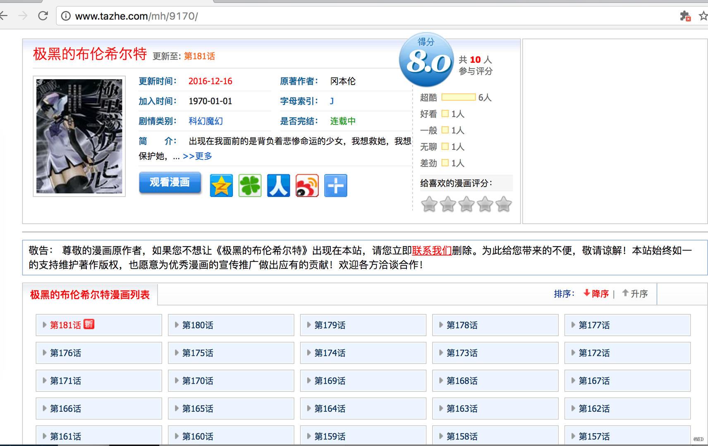
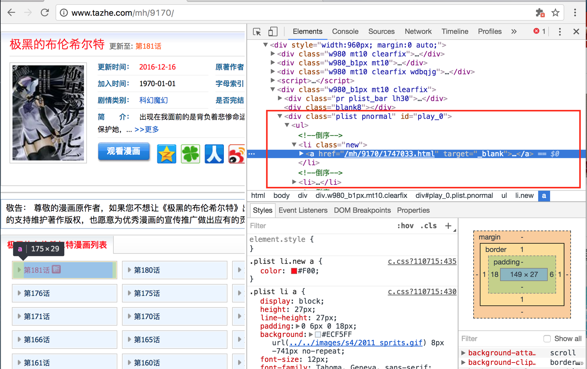
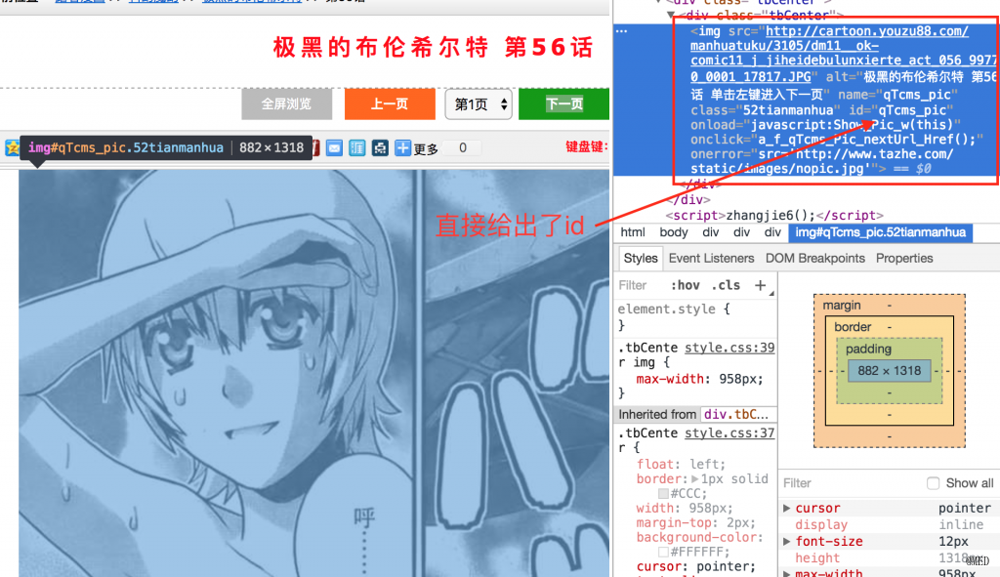
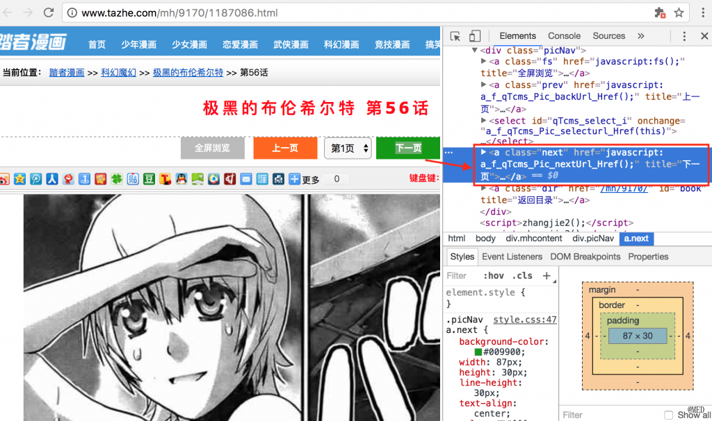
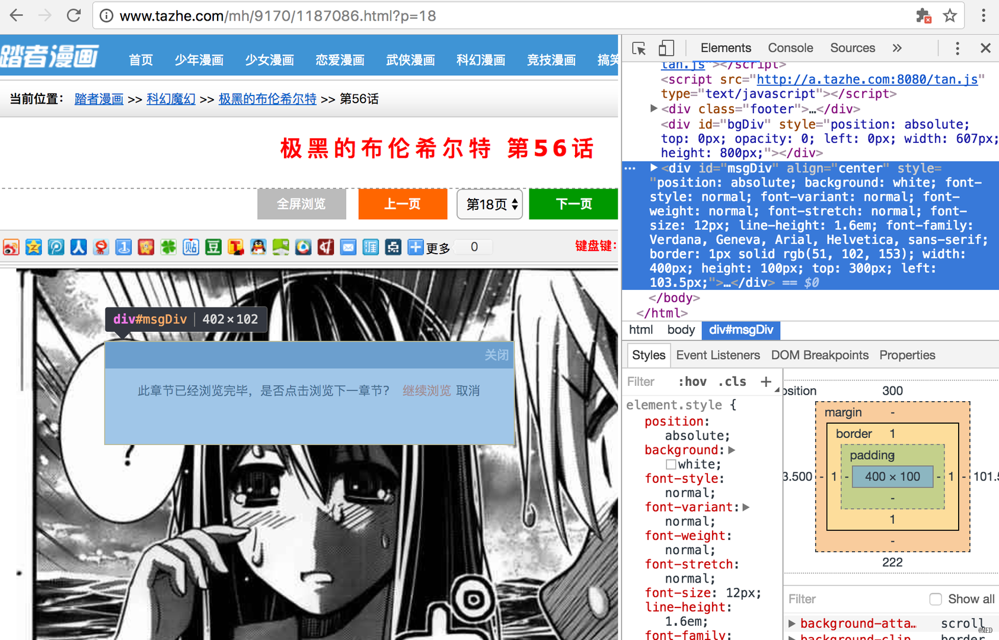
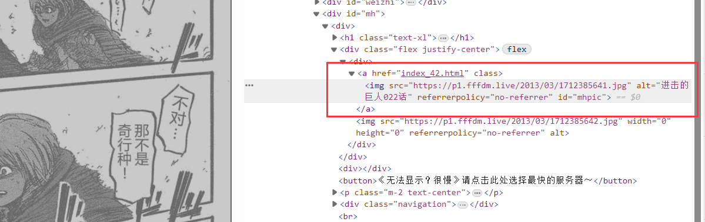
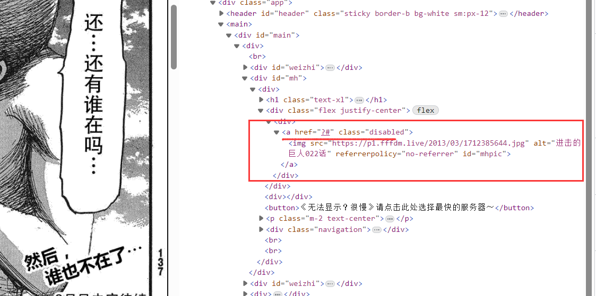

## 一、两个工具：

- [PhantomJs](http://phantomjs.org/)，可以理解是一个浏览器。不过它没有界面，我们可以通过js的代码模拟用户的行为。这就要求了解它的api并有js基础了。
- [Selenium](https://selenium-python.readthedocs.io/)，这是个浏览器自动化测试框架。它依赖于浏览器（这个浏览器也可以是PhantomJs），通过Selenium可以模拟用户的行为。而且有Python接口，所以相对简单一些。

## 二、寻觅-搜资源

每个网站的结构都不相同，因此都需要定制一套爬虫程序。

## 三、分析-资源解析

这里需要解析两个页面，一个是漫画的首页，比如前面的：http://www.tazhe.com/mh/9170/ 另一个就是具体章节的页面。

### 1，首页

首页大致是这个样子。



图1 漫画首页

各类信息十分的明了。我们关注的就是下面的漫画列表。通过Chrome强大的**审查元素**的功能，我们立刻就能定位到章节的位置。（**对着感兴趣的位置->右键->审查** 就能找到）



图2 章节的节点

可以看到，章节所在的区域的 `id` 是 `play_0`，学过前端的童鞋都应该知道，一个页面中 `id` 通常唯一标示一个节点。因此如果我们能够获取这个页面的话，查找 `id` 为 `play_0` 的节点就能一下子缩小搜索范围。 而每个章节的信息都是一个 `a` 标签，标签的 `href` 是对应章节的具体网址，标签的文本部分是章节名。这样相对关系就得出了：`div#play_0 > ul > li > a`。首页的分析就到此结束。

### 2、章节页面

我们随意打开一个具体章节的页面。比如：http://www.tazhe.com/mh/9170/1187086.html



这是一个 `img` 标签，对应的 `id` 是 `qTcms_pic`。这样找到这个 `id`，就能找到这个 `img` 标签，根据 `src` 就能找到图片的具体URI地址。

接下来是找到下一张图片的地址。这时候需要查看下一页这个按钮的内容。用相同的方法，很容易定位成功。



我们分析一下，选中的`a`标签的代码如下：

```html
<a class="next" href="javascript:a_f_qTcms_Pic_nextUrl_Href();" title="下一页"><span>下一页</span></a>
```

比较简单的网站，“下一页”可以用真的 `a` 标签和 `href` 属性来做。这样的好处是实现比较简单，坏处是一旦得到网页源码就能很容易的解析。而像 `scrapy` 这样的爬虫工具只能抓取静态的代码（动态的需要自己分析ajax，有点麻烦）。而显然这里的页面是动态的，使用了ajax来实现。所以光是得到网页源码并不能真的得到图片，而是必须让其中的js代码运行才可以。所以我们才需要使用浏览器或者PhantomJs这样的可以执行js代码的工具。

上面的 `a` 标签的代码告诉了我们很多信息。首先是告诉了我们，这个节点的位置，通过 `next` 这个类名可以方便的找到该节点（其实有两个类名为 `next` 的按钮，另一个在下面，但是功能都一样）。其次，当这个按钮被点击时会调用：`a_f_qTcms_Pic_nextUrl_Href()` 这个js函数。难道我们需要再研究这个函数？

不用。因为 `PhantomJs` 的角色就是一个浏览器。我们只需要向真正的用户一样点击一下这个 `next` 按钮，就会进入下一个页面。/* 感受到这个工具的强大了吗？*/

### 3、判断章节的末尾

最后一个问题就是，如何判断这个章节结束了？

我们跳到章节的最后一页，然后再次点击“下一页”，这时候会出现一个弹窗。



图5 最后一页

多次试验之后，我们会发现，只有在最后一页的时候才会弹出这个弹窗，这样的话，我们每抓取完一页，点击一次“下一页”，判断有无弹窗就知道是不是最后一页了。在右侧的开发者工具中我们能够看到，这个弹窗是一个 `id` 为 `msgDiv` 的 `div`（而且它的出现和消失是通过增减节点来实现的，另一种实现方法是将 `display` 设成 `none` 和 `block`，这种情况可以根据 `display` 的属性来判断）。所以我们判断这个节点存不存在就行了。

至此，两种页面的解析都完成了。下一步就开始我们的代码实现吧。


### 01 获取章节的链接信息

```python
在上面的解析页面的时候，我们知道了章节信息的位置：div#play_0 > ul > li > a。这样就可以解析出章节信息。browser支持一大堆的选择器。大大简化我们查找节点的工作。

from selenium import webdriver

if __name__ == "__main__":
    driver = "path/to/driver" # 驱动地址
    browser = webdriver.PhantomJS(driver) # 浏览器实例

    main_page = "http://www.tazhe.com/mh/9170/"
    browser.get(main_page) # 加载页面

    # 解析出章节的元素节点
    chapter_elem_list = browser.find_elements_by_css_selector('#play_0 ul li a') # 通过css选择器找出章节节点
    chapter_elem_list.reverse()  # 原本的章节是倒叙的

    chapter_list = []
    for chapter_elem in chapter_elem_list:
        # 元素的text和href属性分别就是章节的名称和地址
        chapter_list.append((chapter_elem.text, chapter_elem.get_attribute('href')))

    # chapter_list 就是章节的信息
```

## 02  给定一个章节的地址，章节中的图片

这一步涉及到节点的获取、模拟鼠标的点击以及资源的下载。`selenium` 的点击实现特别的人性化。只需要获取节点然后调用 `click()` 方法就搞定。资源的下载网上有许多教程，主要有两个方法，通过模拟 **右键另存为**，和 **获取url用其他工具下载**。考虑到这里的右键不一定可用，而且操作有一点点复杂。小喵选用了第二种方案。

```python
from selenium import webdriver
from selenium.common.exceptions import NoSuchElementException
import os
from os import path as osp
import urllib

# 一个简单的下载器
download(url, save_path):
    try:
        with open(save_path, 'wb') as fp:
            fp.write(urllib.urlopen(url).read())
    except Exception, et:
        print(et)


if __name__ == "__main__":
    
    driver = "path/to/driver" # 驱动地址
    browser = webdriver.PhantomJS(driver) # 浏览器实例

    chapter_url = "http://www.tazhe.com/mh/9170/1187061.html"
    save_folder = "./download"

    if not osp.exists(save_folder):
        os.mkdir(save_folder)

    image_idx = 1

    browser.get(chapter_url) # 加载第一个页面

    while True:
        # 根据前文的分析，找到图片的URI地址
        image_url = browser.find_element_by_css_selector('#qTcms_pic').get_attribute('src')
        save_image_name = osp.join(save_folder, ('%05d' % image_idx) + '.' + osp.basename(image_url).split('.')[-1])
        download(image_url, save_image_name) # 下载图片

        # 通过模拟点击加载下一页，注意如果是最后一页，会出现弹窗提示
        browser.find_element_by_css_selector('a.next').click()
        try:
            # 找寻弹窗，如果弹窗存在，说明这个章节下载完毕，这个大循环也就结束了
            browser.find_element_by_css_selector('#bgDiv')
            break
        except NoSuchElementException:
            # 没有结束弹窗，继续下载
            image_idx += 1
```


```

```


```

```




