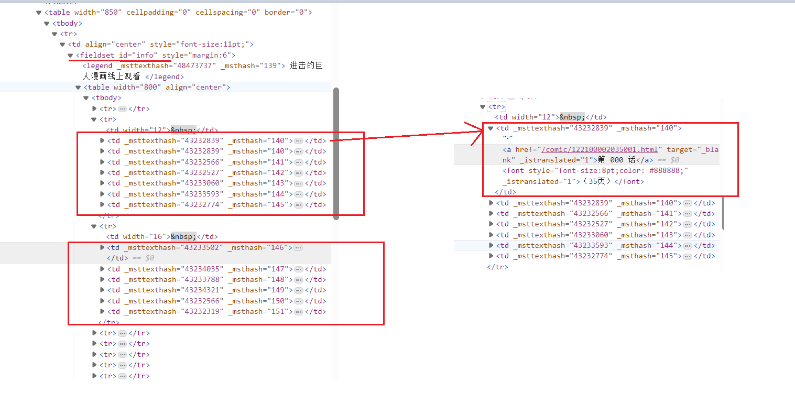
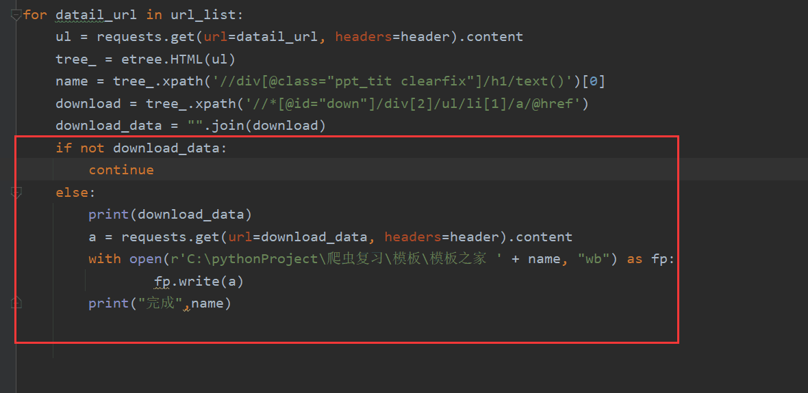

# 将文件保存到指定路径得方法

总结：

1. 储存路径写法:     +  **/**  + 部分名字  +  可变名字

2.  用单引号得情况： 1xpath时  2储存路径时

3. **./   表示在当前目录下创建**后面跟上名称,最好是要有对应的后缀(.txt/jpg/.png之类的). 不用./也行
4.  **open ()里面要写法:**     存放位置  + 什么方式写入 + 编码格式

```python
img_path = r'C:\Users\16658\Desktop\图片\o' + img_title
 with open(img_path, 'wb') as fp:
        fp.write(img_data)

 with open(filename, "w", encoding="utf-8") as fp:
        fp.write(dress_list)
```

```kotlin
#图片 用content -----> 对应 "wb",不用写编码格式
#文本 用text  --------> 对应 "w", 用编码格式 encoding="utf-8"
#json 用json() --------> 对应相应的数据类型(text还是content) . 不用with .. as..
```


+ **write**
  + **write(data + '\n')     表示数据换行写入**


**json数据**

总结
1，局部刷新的现象可以考虑ajax，定位到xhr中，一定要改变参数进行判断出正确的url2, url有参数就可以设置参数，一定不要忘记requests请求是参数也要写进去（设置了参数就要传入参数)
3,json的存储，要调用dump ()   里面放入json数据+fp=open (+ensure_ascii=False)

写法:

```python
list_data = requeste.post(url = '', data =.. , headers = .., ...);
fp = open( "豆瓣1.txt", "w", encoding= "utf-8"')
json.dump( list_data, fp=fp, ensure_ascii=False)
```


# request

作用:模拟浏览器发请求

## 使用要求：

1. 指定 url

2. **发起请求并获取响应数据  ----> 相当于在下载**

3.  持久化数据存储

后面跟get还是post看具体情况


# xpath使用


注意:  **取文本是取那个真正的文本内容，而xpath默认情况一定会返回一个列表.** 

+ ==后面加上一个[0] 转成一个文本==

+ 如果列表每个数据变成了字符串的方法:    **"" .join(列表)**

```python
 seq1 = ['hello','good','boy','doiido'] 
 print("".join(seq1) )
 hello good boy doiido
```

​          但是 对请求数据夹杂着空的情况，是不能直接取【0】以为空列表会报错

./表示局部在遍历是会用(指的是在遍历时，

依然在当前目录下找)就是得到【字符串】得格式

## **属性定位：**

**div[@class = ""] (通用写法：tag[@attrname= "attrvalue"])**

 如： //div 就表示直接定位到的div（有多少返回多少）

##   索引定位：

**div[@class = ""]/p[3]  **

[@id = "info"]

```python
download_url = download_page.xpath(".//div[@class='downbody']/div[@class='dian']/a[1]/@href")
```


**定位思路：先定位独一的，再思考定位不是单独的**

**查找的方法是：是根据定位全面查找（仅仅得到单一的）是可以用，但要得到页面对应的多个数据必须先找到大点的范围再用遍历拿到多个东西** **


## 取文本:

/text()    获取的是标签中直系的文本内容

//text()   标签中非直系的文本内容(所有的文本内容)

```python
download_page.xpath('.//div[@class="text_wrap"]/h2/a/text()')[0]   # [0]可以得到文本
```


## 取属性:

**/@attrName**    

+ attrName属性名

+ 表示：取对应标签的属性
+ 得到的是没“”的

但是可以和字符串拼接的到字符串（计算机可以自动定义成字符串 )  

```python
download_url = download_page.xpath(".//div[@class='downbody']/div[@class='dian']/a[1]/@href")
```


## 使用

tree = etree.HTML(requeste发起请求并获取响应数据的页面数据)

```python
# 解析模板总页面
tree = etree.HTML(page_list)
href_list = tree.xpath("//*[@id='container']//div/a/@href ")   // xpath解析
```


1. 字符串通过append（字符串数据）追加到列表中

2. 列表追加到列表用extend（列表）




```python
# 导入必要的库
from selenium import webdriver

# 启动浏览器
driver = webdriver.Chrome()

# 打开页面
driver.get('your_url_here')

# 使用 find_elements_by_xpath 获取所有的 <tr> 元素
tr_elements = driver.find_elements_by_xpath('//tr')

# 遍历 tr_elements
for tr in tr_elements:
    # 获取当前 tr 元素下的所有 td 元素
    td_elements = tr.find_elements_by_xpath('./td')
    
    # 遍历 td_elements
    for td in td_elements:
        # 查找 td 元素下的 <a> 元素
        a_element = td.find_element_by_xpath('./a')
        
        # 获取 <a> 元素的 href 属性和文本内容
        href = a_element.get_attribute('href')
        text = a_element.text
        
        # 打印 href 和文本内容
        print('href:', href)
        print('text:', text)
        print('------------')
        
# 关闭浏览器
driver.quit()

```


# Open()和with open()区别


**总结：** **有个循环储存得需求用with。  写入一个文件用open（）写在遍历外部，内部写入内容即可**

```
fp = open('59.txt','w',encoding='utf-8')
for li in li_List:
    title = li.xpath('./a/div[2]//h3/text()')[0]
    print(title)
    fp.write(title+'\n')
```


字符串和字符串之间能拼接，要进行转化， 用”“.join（列表）可以转换列表成字符串


# 解析数据中有空的情况

```python
if not date// 数据
	continue
else

	正常操作 .....
```





# 上述需要导入 模板

```
import requests
from lxml import etree
```


```python 
    def findSnapshot(self):
        # 创建子文档,参数:父级目录,子目录名称
        save_folder = osp.join(self.__save_folder, "chapter_title")
        if not osp.exists(save_folder):
            os.mkdir(save_folder)
        self.__browser.get("https://www.cartoonmad.com/comic/122100012051001.html")

        """
        < img
        src = "comicpic.asp?file=/1221/001/001&amp;rimg=1"
        border = "0"
        oncontextmenu = "return false"
        onload = "if(this.width>screen.width-176) {this.resized=true; this.width=screen.width*0.98-180;}" >
        不能直接下载
        """
        # 执行截屏
        self.__browser.save_screenshot('screenshot.png')

        # 使用Pillow库打开截图文件
        screenshot = Image.open('screenshot.png')

        # 获取图片元素位置和大小
        element = self.__browser.find_element_by_css_selector('img[src="comicpic.asp?file=/1221/001/001&rimg=1')  # 使用CSS选择器定位图片元素
        left = element.location['x']
        top = element.location['y']
        right = element.location['x'] + element.size['width']
        bottom = element.location['y'] + element.size['height']

        # 从截图中裁剪所需的图片部分
        image = screenshot.crop((left, top, right, bottom))  # 裁剪图片
        image.save('cropped_image.png')  # 保存裁剪后的图片

```


# python字符串用''和""都行建议用''
