引言

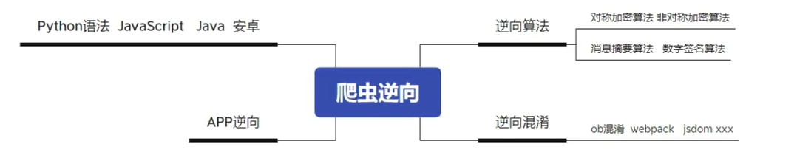

# 快速定位未知网页js代码中的函数

假设可以看到函数名称是：`execute_javascript()`。

```html
<button type="button" onclick="execute_javascript('online-run-code-1', this)">run</button>
```

那么，就可以在`js`代码中，查找`execute_javascript`关键词来定位，但是`.js`代码众多，很难查找。

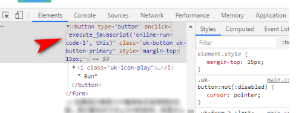

## 利用`console`输出

通过查看`dom`节点，一般来说，可以看到你的目标函数名称。但是，却无法通过点击等方式，快速跳转到函数定义。这个时候，可以在当前页面的开发者工具里面，输入如下代码（`execute_javascript`是目标函数名）：

```js
console.log(execute_javascript)
```

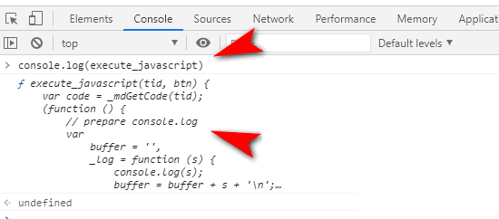

双击快速定位到函数定义

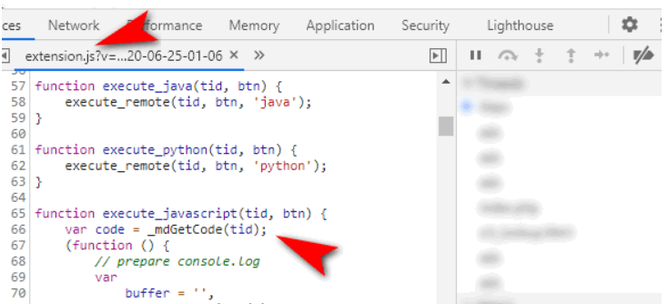

## 利用事件断点

如果所分析的代码，并没有明显地表述出函数名称。也就是说，通过`js`文件，动态绑定事件或者匿名函数的情况。可以选取合适的事件进行拦截。比如`click`事件。切换到`sources`标签，定义要拦截的事件吧。

如下图所示：

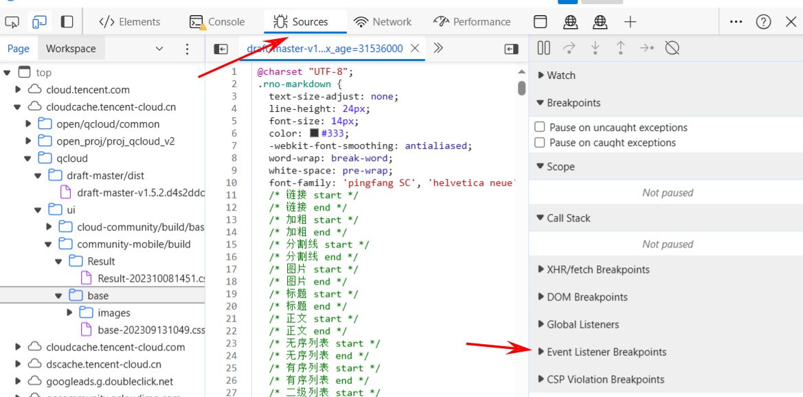

或者利用`xhr`的地址，设置断点。如下图所示：


定义好断点事件后，比如最常见的点击事件是`mouse > click`，再去手工触发你要观察的页面事件，然后就可以断点到对应的函数。当然，可能您看到的并不是您想要的，那么请使用步进等调试功能，进行代码查看。

[]()

同时，您还可以利用代码格式化功能，使得代码更加容易查看。

[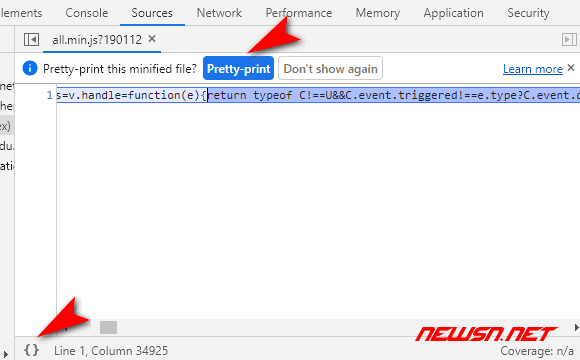]()

### 步进功能

主要有以下几个功能

- `f8` 恢复/暂停
- `f9` 单步执行
- `f10` 单步执行，遇到子函数并不进去，将子函数执行完并将其作为一个单步
- `f11` 单步执行，遇到子函数就进去继续单步执行
- `shift+f11` 直接跳出当前的函数，返回父级函数


## 利用`blackbox`排除代码

在步进的过程中， 您可能会发现进入一些没有啥意义的代码中，扰乱视线。这里，可以利用这个`blackbox`功能，可以排除特定的`js`文件，注意：这里的屏蔽单位是某个具体的`js`文件。

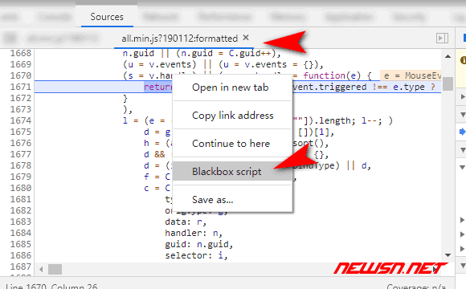

比如：大多数情况下，`jquery`就是个应该被`blackbox`的文件。否则，会强烈干扰视线。

## 解除已定义的`blackbox`

如果切换到被拦截的`.js`文件的时候，在界面顶部，有解除的按钮。右键菜单，也有`stop blackbox`的菜单。

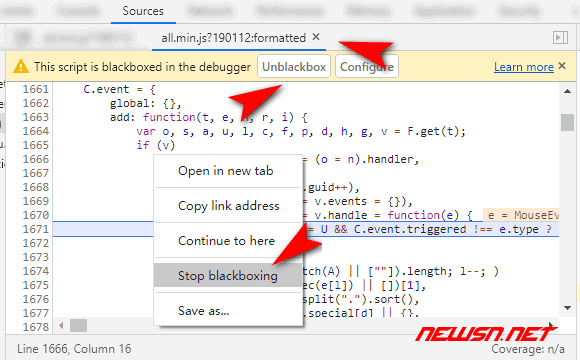

当然，也可以在设置菜单里面，查看到所有的`blackbox`信息，并删除对应的设置。


# Python中调用和执行js

在Python中调用JavaScript代码的一种常见方法是使用`PyExecJS`库。`PyExecJS`库提供了一个统一的API，可以在Python中调用多种JavaScript运行时引擎。下面是使用`PyExecJS`库调用JavaScript的基本步骤

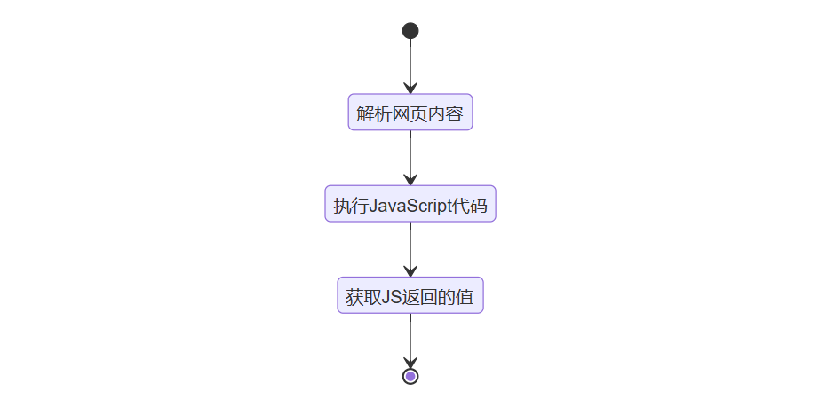

## 基本使用

1. 安装`PyExecJS`库：

   ```bash
   pip install PyExecJS
   1
   ```

2. 导入`PyExecJS`库：

   ```python
   import execjs
   
   # 从文件中读取JavaScript代码
   with open('jscode.js', 'r', encoding='utf-8') as f:
       js = f.read()
       
   # 使用execjs编译JavaScript代码
   ctx = execjs.compile(js)
   
   # 使用JavaScript代码
   resqult = ctx.call('函数名', 参数1 参数2 ...)
   resqult = ctx.call("变量")
   ```

## 使用js库和框架

在Python中调用和执行JavaScript不仅限于原生的JavaScript代码，还可以使用常见的JavaScript库和框架，如jQuery、React等。`PyExecJS`库支持加载和使用这些库和框架。下面是一个使用jQuery的示例代码：

```python
npm install jquery
```

```js
import execjs

ctx = execjs.compile('''
    var jQuery = require('jquery');
    var result = jQuery.trim('  Hello, JavaScript!  ');
    result;
''')

print(ctx.eval('result'))  # 输出：Hello, JavaScript!
```

##  Python和js之间传递数据(了解)

在Python和JavaScript之间传递数据是非常常见的需求。`PyExecJS`库提供了多种方法来实现数据的传递。下面是一些示例代码：

1. 通过参数传递数据：

   ```python
   import execjs
   
   ctx = execjs.compile('''
       function add(a, b) {
           return a + b;
       }
   ''')
   
   result = ctx.call('add', 2, 3)
   print(result)  # 输出：5
   ```

2. 通过全局变量传递数据：

   ```python
   import execjs
   
   ctx = execjs.compile('''
       function add() {
           return x + y;
       }
   ''')
   
   ctx['x'] = 2
   ctx['y'] = 3
   
   result = ctx.call('add')
   print(result)  # 输出：5
   ```

3. 通过JSON格式传递数据：

   ```python
   import execjs
   import json
   
   ctx = execjs.compile('''
       function add(data) {
           var obj = JSON.parse(data);
           return obj.x + obj.y;
       }
   ''')
   
   data = {'x': 2, 'y': 3}
   json_data = json.dumps(data)
   
   result = ctx.call('add', json_data)
   print(result)  # 输出：5
   ```

## 使用JavaScript进行Web自动化

除了在Python中调用和执行JavaScript，我们还可以使用Python和JavaScript进行Web自动化。通过结合Python的强大库和JavaScript的灵活性，我们可以编写自动化脚本来模拟用户在浏览器中的操作。下面是一个使用Python和JavaScript进行Web自动化的示例代码：

```python
import execjs
from selenium import webdriver

# 创建一个Selenium WebDriver实例
driver = webdriver.Chrome()

# 打开网页
driver.get('https://www.example.com')

# 使用JavaScript执行一些操作
ctx = execjs.compile('''
    var element = document.getElementById('myElement');
    element.innerText = 'Hello, JavaScript!';
''')

ctx.call('element.click')

# 关闭浏览器
driver.quit()
```

# 跟值技巧&常见加密

 **网页代码运行时间轴**

加载html -- 加载js --运行js初始化  --用户触发某个事件 --调用某段js -- 明文数据 -- 调用了某段js -- 明文数据 -- 加密函数  -- 加密后的数据 --给服务器发送信息(XHR-send) --接收到服务器数据 -- 解密函数  --刷新页面渲染

 **简单的网站的js测试**

- 能修改js运行当中的一些变量值,能输出
- 能下断点
- 智能的监听一些值

 **断点分类**

1. DOM断点
2. DOM事件断点
3. xhr断点
4. 代码行断点
5. 代码断点(debugger)
6. 全局事件断点
7. 异常断点

**xhr断点特性:断点永远会断在send处,send里面大概率会有data数据,如果没有则去寻找调用send方法的对象原型里面寻找**

## 跟值技巧1

在调用堆栈中,依次分析寻找明文数据与加密后的数据所在的位置,则加密函数的调用必然在这两位置之间.(注意当在某个栈进行断点分析完成后,往上一个方法栈分析时应该将之前的断点清掉,然后在目前方法重新下断再重新刷新开始调试,避免因为作用域导致的变量污染)

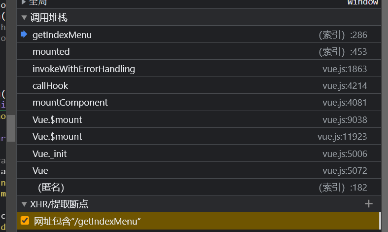

## 跟值技巧2

​     寻找当前断点最近的方法,按下ctrl会出现变量的智能提示,当 上下翻到没有智能提示的时候就是这个方法的开始

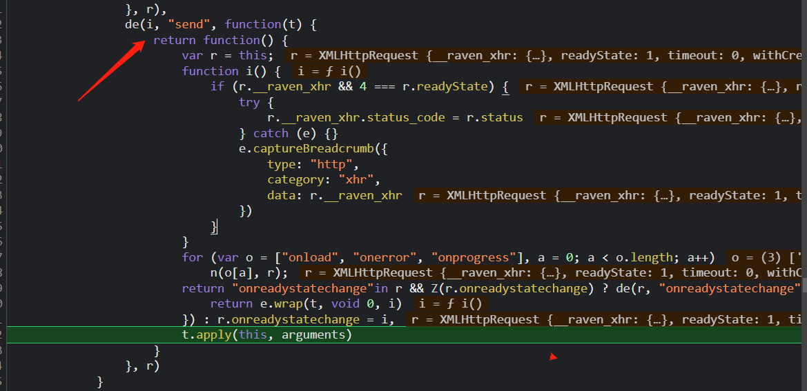

## 常见数据加密

数据加密分类

- 取盐校验(哈希)     不可逆

- - MD系列(MD2 ,MD4,MD5 带密码的MD5)

- - - 原生md5 默认key  0123456789abcdef

    - md5 16位  32位  40位   

      + 123456 -->  49ba59abbe56e057   (16位)    

      + 123456--> e10adc3949ba59abbe56e057f20f883e  (32位)    

- - sha系列(sha1 (密文为40位)   sha256(密文为64位)  sha512(密文为128位) )

- - - 123456-->7c4a8d09ca3762af61e59520943dc26494f8941b    (sha1 )
    - 123456-->8d969eef6ecad3c29a3a629280e686cf0c3f5d5a86aff3ca12020c923adc6c92 (sha256)
    - 123456--ba3253876aed6bc22d4a6ff53d8406c6ad864195ed144ab5c87621b6c233b548baeae6956df346ec8c17f5ea10f35ee3cbc514797ed7ddd3145464e2a0bab413    (sha512)

- 对称加密

- - AES     长度为8的倍数
  - DES     长度为8的倍数
  - 3DES 

- 非对称加密(同一个明文可以生成不同的密文,不同的密文可以还原同一个明文)

- - RSA  (私钥  公钥)  服务器两个都有,客户端只有公钥

​              rsa长度不固定

+ URL 编码/URL 解码

16进制 :发现最大的字母为f说明很有可能是16进制加密

base64:由A-Z  a-z 0-9 + _  /  =组成(其中末尾大概率是=符号)

### 某hu网案例(扣取js练习)

通过抓包登陆数据包,观察password加密(md5加密),ctrl+f全局搜索关键词password,这里如果找不到password也可以去找userid,appid之类的,一般同一个数据包的参数不会相隔太远

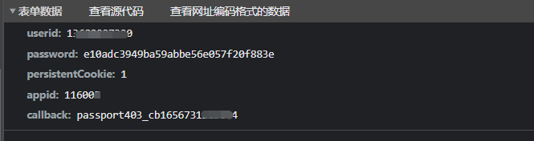

**方式1**

跟值找到明文数据与加密后数据直接可以定位到这里下断,继续跟进utils.md5进入password.js

(真实js文件名不是这个)

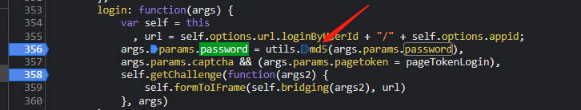

这里将password.js全部复制进notepad++,选择语言为javascript,选择视图-->折叠所有层次(方便扣全js),然后搜索加密函数特征函数来找到加密函数位置

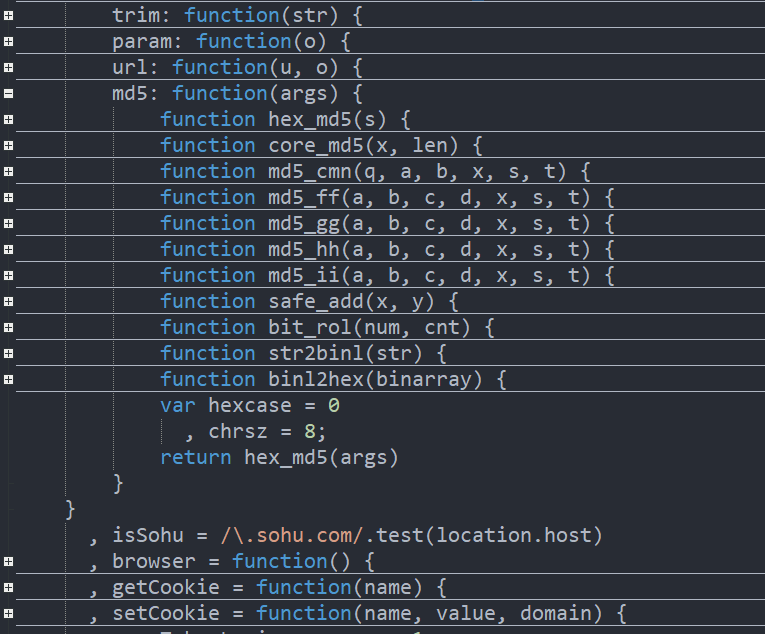

扣取出来放到浏览器的源代码下的代码段改写(扣js改的越少越好最好不改,要注意js的体积大小)

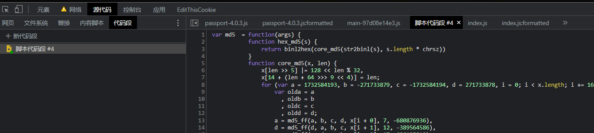

调试输出

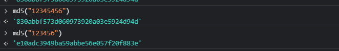

**方式2**

就是将this的指向也扣下来(扣js直到this为window),

回到案例里面,md5方法的this是utils,将utils对象完整搬下来

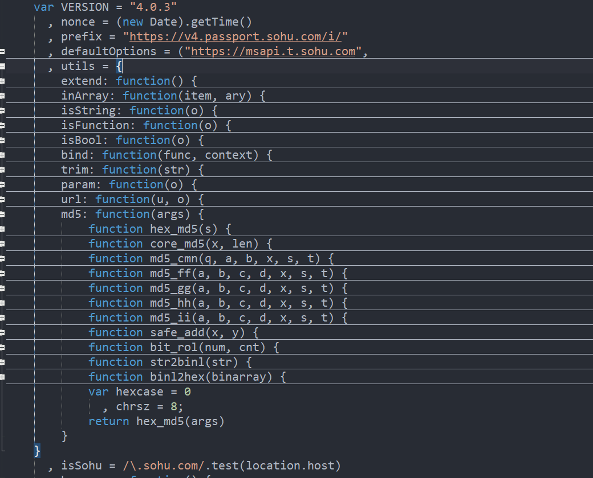


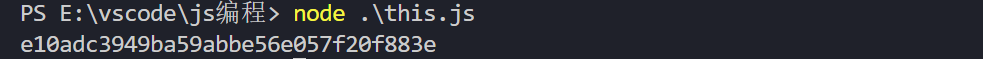


# 常见混淆

+ eval混淆
+ AA与jj混淆
+ JSFUCK

## 1.EVAL混淆

(eval() 说白了就是可以运行 js 代码的字符串)

```js
btoa("123456")  //将123456--> base64编码 (beautiful to  awful)  
eval(atob('ZnVuY3Rpb24geHgoKXtyZXR1cm4gJzEyMzQ1Nid9OyB4eCgp'))  //atob  --> base64解码
```

eval这个混淆有严重缺陷,可以直接在该eval处直接下断即可看到原来的数据

## 2.AA与jj混淆

JS默认支持unicode

原始数据

```
var a  = {
    name:"花花",
    i:function(){
        console.log(this,typeof this);
        function bb(){
            console.log(this)
        }
        bb();
    }
}
a.i()
```

aa混淆

```js
ﾟωﾟﾉ = /｀ｍ´）ﾉ ~┻━┻   //*´∇｀sojson.com*/
['_'];
o = (ﾟｰﾟ) = _ = 3;
c = (ﾟΘﾟ) = (ﾟｰﾟ) - (ﾟｰﾟ);
(ﾟДﾟ) = (ﾟΘﾟ) = (o ^ _ ^ o) / (o ^ _ ^ o);
(ﾟДﾟ) = {
    ﾟΘﾟ: '_',
    ﾟωﾟﾉ: ((ﾟωﾟﾉ == 3) + '_')[ﾟΘﾟ],
    ﾟｰﾟﾉ: (ﾟωﾟﾉ + '_')[o ^ _ ^ o - (ﾟΘﾟ)],
    ﾟДﾟﾉ: ((ﾟｰﾟ == 3) + '_')[ﾟｰﾟ]
};
....//截取部分代码展示
(ﾟДﾟ)[ﾟεﾟ] = '\\';
(ﾟДﾟ).ﾟΘﾟﾉ = (ﾟДﾟ + ﾟｰﾟ)[o ^ _ ^ o - (ﾟΘﾟ)];
(oﾟｰﾟo) = (ﾟωﾟﾉ + '_')[c ^ _ ^ o];
(ﾟДﾟ)[ﾟoﾟ] = '\"';
(ﾟДﾟ)['_']((ﾟДﾟ)['_'](ﾟεﾟ + (ﾟДﾟ)[ﾟoﾟ] + (ﾟДﾟ)[ﾟεﾟ] + (ﾟΘﾟ) + ((o ^ _ ^ o) + (o ^ _ ^ o)) + ((o ^ _ ^ o) + (o ^ _ ^ o)) + (ﾟДﾟ)[ﾟεﾟ] + (ﾟΘﾟ) + (ﾟｰﾟ) + (ﾟΘﾟ) + (ﾟДﾟ)[ﾟεﾟ] + (ﾟΘﾟ) + ((o ^ _ ^ o) + (o ^ _ ^ o)) + ((o ^ _ ^ o) - (ﾟΘﾟ)) + (ﾟДﾟ)[ﾟεﾟ] + (ﾟｰﾟ) + (c ^ _ ^ o) + (ﾟДﾟ)[ﾟεﾟ] + (ﾟΘﾟ) + (ﾟｰﾟ) + (ﾟΘﾟ) + (ﾟДﾟ)[ﾟεﾟ] + (ﾟｰﾟ) + (c ^ _ ^ o) + (ﾟДﾟ)[ﾟεﾟ] + (ﾟｰﾟ) + (c ^ _ ^ o) + (ﾟДﾟ)[ﾟεﾟ] + ((ﾟｰﾟ) + (o ^ _ ^ o)) + ((ﾟｰﾟ) + (ﾟΘﾟ)) + (ﾟДﾟ)[ﾟεﾟ] + (ﾟｰﾟ) + (c ^ _ ^ o) + (ﾟДﾟ)[ﾟεﾟ] + (ﾟΘﾟ) + ((ﾟｰﾟ) + (o ^ _ ^ o)) + (o ^ _ ^ o) + (ﾟДﾟ)[ﾟεﾟ] + (ﾟΘﾟ) + ((o ^ _ ^ o) - (ﾟΘﾟ)) + (ﾟДﾟ)[ﾟεﾟ] + (ﾟｰﾟ) + (c ^ _ ^ o) + (ﾟДﾟ)[ﾟεﾟ] + (ﾟｰﾟ) + (c ^ _ ^ o) + (ﾟДﾟ)[ﾟεﾟ] + (ﾟｰﾟ) + (c ^ _ ^ o) + (ﾟДﾟ)[ﾟεﾟ] + (ﾟｰﾟ) + (c ^ _ ^ o) + (ﾟДﾟ)[ﾟεﾟ] + (ﾟΘﾟ) + ((ﾟｰﾟ) + (ﾟΘﾟ)) + ((o ^ _ ^ o) + (o ^ _ ^ o)) + (ﾟДﾟ)[ﾟεﾟ] + (ﾟΘﾟ) + (ﾟｰﾟ) + (ﾟΘﾟ) + (ﾟДﾟ)[ﾟεﾟ] + (ﾟΘﾟ) + ((ﾟｰﾟ) + (ﾟΘﾟ)) + ((ﾟｰﾟ) + (ﾟΘﾟ)) + (ﾟДﾟ)[ﾟεﾟ] + (ﾟΘﾟ) + (ﾟｰﾟ) + ((ﾟｰﾟ) + (ﾟΘﾟ)) + (ﾟДﾟ)[ﾟεﾟ] + ((ﾟｰﾟ) + (o ^ _ ^ o)) + ((o ^ _ ^ o) - (ﾟΘﾟ)) + (ﾟДﾟ)[ﾟεﾟ] + (ﾟｰﾟ) + ((o ^ _ ^ o) - (ﾟΘﾟ)) + (ﾟДﾟ)[ﾟεﾟ] + (oﾟｰﾟo) + ((ﾟｰﾟ) + (ﾟｰﾟ)) + ((o ^ _ ^ 
```

jj混淆

```js
sojson = ~[];
/*sojson.com*/
sojson = {
    ___: ++sojson,
....//截取部分代码展示
};
sojson.$_ = (sojson.$_ = sojson + "")[sojson.$_$] + (sojson._$ = sojson.$_[sojson.__$]) + (sojson.$$/*sojson.com*/
= (sojson.$ + "")[sojson.__$]) + ((!sojson) + "")[sojson._$$] + (sojson.__ = sojson.$_[sojson.$$_]) + (sojson.$ = (!"" + "")[sojson.__$]) + (sojson._ = (!"" + "")[sojson._$_]) + sojson.$_[sojson.$_$] + sojson.__ + sojson._$ + sojson.$;
/*sojson.com*/
sojson.$$ = sojson.$ + (!"" + "")[sojson._$$] + sojson.__ + sojson._ + sojson.$ + sojson.$$/*sojson.com*/
;
sojson.$ = (sojson.___)[sojson.$_][sojson.$_];
sojson.$(sojson.$(sojson.$$ + "\"" + "\\" + sojson.__$ + sojson.$$_ + sojson.$$_ + sojson.$_$_ + "\\" + so
```

这两种混淆均可采用单步调试进入vm虚拟机或者采用hook方式进行逆向

## 3.JSFUCK

jsfuck的原理 :

它使用了Function关键字定义一个匿名函数，并立即执行了。  

```js
Function("alert(1)")()
```

jsfuck

```
[][(![]+[])[+[]]+([![]]+[][[]])[+!+[]+[+[]]]+(![]+[])[!+[]+!+[]]+(!![]+[])[+[]]+(!![]+[])[!+[]+!+[]+!+[]]+(!![]+[])[+!+[]]][([][(![]+[])[+[]]+([![]]+[][[]])[+!+[]+[+[]]]+(![]+[])[!+[]+!+[]]+(!![]+[])[+[]]+(!![]+[])[!+[]+!+[]+!+[]]+(!![]+[])[+!+[]]]+[])[!+[]+!+[]+!+[]]+(!![]+[][(![]+[])[+[]]+([![]]+[][[]])[+!+[]+[+[]]]+(![]+[])[!+[]+!+[]]+(!![]+[])[+[]]+(!![]+[])[!+[]+!+[]+!+[]]+(!![]+[])[+!+[]]])[+!+[]+[+[]]]+([][[]]+[])[+!+[]]+(![]+[])[!+[]+!+[]+!+[]]+(!![]+[])[+[]]+(!![]+[])[+!+[]]+([][[]]+[])[+[]]+([][(![]+[])[+[]]+([![]]+[][[]])[+!+[]+[+[]]]+(![]+[])[!+[]+!+[]]+(!![]+[])[+[]]+(!![]+[])[!+[]+!+[]+!+[]]+(!![]+[])[+!+[]]]+[])[!+[]+!+[]+!+[]]+(!![]+[])[+[]]+(!![]+[][(![]+[])[+[]]+([![]]+[][[]])[+!+[]+[+[]]]+(![]+[])[!+[]+!+[]]+(!![]+[])[+[]]+(!![]+[])[!+[]+!+[]+!+[]]+(!![]+[])[+!+[]]])[+!+[]+[+[]]]+(!![]+[])[+!+[]]]((![]+[])[+!+[]]+(![]+[])[!+[]+!+[]]+(!![]+[])[!+[]+!+[]+!+[]]+(!![]+[])[+!+[]]+(!![]+[])[+[]]+(![]+[][(![]+[])[+[]]+([![]]+[][[]])[+!+[]+[+[]]]+(![]+[])[!+[]+!+[]]+(!![]+[])[+[]]+(!![]+[])[!+[]+!+[]+!+[]]+(!![]+[])[+!+[]]])[!+[]+!+[]+[+[]]]+[+!+[]]+(!![]+[][(![]+[])[+[]]+([![]]+[][[]])[+!+[]+[+[]]]+(![]+[])[!+[]+!+[]]+(!![]+[])[+[]]+(!![]+[])[!+[]+!+[]+!+[]]+(!![]+[])[+!+[]]])[!+[]+!+[]+[+[]]])()
```

逆向的话直接用现成的解密工具鬼鬼js调式工具直接解密就好

## 实战某房网的rsa案例

通过登陆接口查看加密参数pwd,并全局搜索pwd


注意观察文件名encry开头的肯定是加密的函数文件,跟进去


在pwd处下断重新点击登陆,这里的that.password.val()就是明文的密码,key_to_encode加密参数可以继续全局搜索在首页面能够找到,然后跟进encryptedString将js扣取下来


找到key_to_encode 跟进RSAKeyPair中将里面的js全部复制下来与上面的js一起本地改写


提取js(改写好的encrytrdSring.js ,test方法传入密码即可动态获取加密值)

```js
function encryptedString(n, t) {
    var e, o, s, h, c, i, f, u, v, l, y;
    if (n.chunkSize > n.digitSize - 11)
        return "Error";
    for (var a = [], p = t.length, r = 0; r < p; )
        a[r] = t.charCodeAt(r),
        r++;
    for (e = a.length,
    o = "",
    r = 0; r < e; r += n.chunkSize) {
        for (c = new BigInt,
        s = 0,
        f = r + n.chunkSize > e ? e % n.chunkSize : n.chunkSize,
        u = [],
        i = 0; i < f; i++)
            u[i] = a[r + f - 1 - i];
        for (u[f] = 0,
        v = Math.max(8, n.digitSize - 3 - f),
        i = 0; i < v; i++)
            u[f + 1 + i] = Math.floor(Math.random() * 254) + 1;
        for (u[n.digitSize - 2] = 2,
        u[n.digitSize - 1] = 0,
        h = 0; h < n.digitSize; ++s)
            c.digits[s] = u[h++],
            c.digits[s] += u[h++] << 8;
        l = n.barrett.powMod(c, n.e);
        y = n.radix == 16 ? biToHex(l) : biToString(l, n.radix);
        o += y + " "
    }
    return o.substring(0, o.length - 1)
}

function setMaxDigits(n) {
    maxDigits = n;
    ZERO_ARRAY = new Array(maxDigits);
    for (var t = 0; t < ZERO_ARRAY.length; t++)
        ZERO_ARRAY[t] = 0;
    bigZero = new BigInt;
    bigOne = new BigInt;
    bigOne.digits[0] = 1
}
function BigInt(n) {
    this.digits = typeof n == "boolean" && n == !0 ? null : ZERO_ARRAY.slice(0);
    this.isNeg = !1
}
function biFromDecimal(n) {
    for (var u = n.charAt(0) == "-", t = u ? 1 : 0, i, f, r; t < n.length && n.charAt(t) == "0"; )
        ++t;
    if (t == n.length)
        i = new BigInt;
    else {
        for (f = n.length - t,
        r = f % dpl10,
        r == 0 && (r = dpl10),
        i = biFromNumber(Number(n.substr(t, r))),
        t += r; t < n.length; )
            i = biAdd(biMultiply(i, lr10), biFromNumber(Number(n.substr(t, dpl10)))),
            t += dpl10;
        i.isNeg = u
    }
    return i
}
function biCopy(n) {
    var t = new BigInt(!0);
    return t.digits = n.digits.slice(0),
    t.isNeg = n.isNeg,
    t
}
function biFromNumber(n) {
    var t = new BigInt, i;
    for (t.isNeg = n < 0,
    n = Math.abs(n),
    i = 0; n > 0; )
        t.digits[i++] = n & maxDigitVal,
        n = Math.floor(n / biRadix);
    return t
}
function reverseStr(n) {
    for (var i = "", t = n.length - 1; t > -1; --t)
        i += n.charAt(t);
    return i
}
function biToString(n, t) {
    var r = new BigInt, i, u;
    for (r.digits[0] = t,
    i = biDivideModulo(n, r),
    u = hexatrigesimalToChar[i[1].digits[0]]; biCompare(i[0], bigZero) == 1; )
        i = biDivideModulo(i[0], r),
        digit = i[1].digits[0],
        u += hexatrigesimalToChar[i[1].digits[0]];
    return (n.isNeg ? "-" : "") + reverseStr(u)
}
function biToDecimal(n) {
    var i = new BigInt, t, r;
    for (i.digits[0] = 10,
    t = biDivideModulo(n, i),
    r = String(t[1].digits[0]); biCompare(t[0], bigZero) == 1; )
        t = biDivideModulo(t[0], i),
        r += String(t[1].digits[0]);
    return (n.isNeg ? "-" : "") + reverseStr(r)
}
function digitToHex(n) {
    var t = "";
    for (i = 0; i < 4; ++i)
        t += hexToChar[n & 15],
        n >>>= 4;
    return reverseStr(t)
}
function biToHex(n) {
    for (var i = "", r = biHighIndex(n), t = biHighIndex(n); t > -1; --t)
        i += digitToHex(n.digits[t]);
    return i
}
function charToHex(n) {
    var t = 48
      , u = t + 9
      , i = 97
      , f = i + 25
      , r = 65;
    return n >= t && n <= u ? n - t : n >= r && n <= 90 ? 10 + n - r : n >= i && n <= f ? 10 + n - i : 0
}
function hexToDigit(n) {
    for (var t = 0, r = Math.min(n.length, 4), i = 0; i < r; ++i)
        t <<= 4,
        t |= charToHex(n.charCodeAt(i));
    return t
}
function biFromHex(n) {
    for (var i = new BigInt, u = n.length, t = u, r = 0; t > 0; t -= 4,
    ++r)
        i.digits[r] = hexToDigit(n.substr(Math.max(t - 4, 0), Math.min(t, 4)));
    return i
}
function biFromString(n, t) {
    var f = n.charAt(0) == "-", e = f ? 1 : 0, i = new BigInt, r = new BigInt, u;
    for (r.digits[0] = 1,
    u = n.length - 1; u >= e; u--) {
        var o = n.charCodeAt(u)
          , s = charToHex(o)
          , h = biMultiplyDigit(r, s);
        i = biAdd(i, h);
        r = biMultiplyDigit(r, t)
    }
    return i.isNeg = f,
    i
}
function biDump(n) {
    return (n.isNeg ? "-" : "") + n.digits.join(" ")
}
function biAdd(n, t) {
    var r, u, f, i;
    if (n.isNeg != t.isNeg)
        t.isNeg = !t.isNeg,
        r = biSubtract(n, t),
        t.isNeg = !t.isNeg;
    else {
        for (r = new BigInt,
        u = 0,
        i = 0; i < n.digits.length; ++i)
            f = n.digits[i] + t.digits[i] + u,
            r.digits[i] = f % biRadix,
            u = Number(f >= biRadix);
        r.isNeg = n.isNeg
    }
    return r
}
function biSubtract(n, t) {
    var r, f, u, i;
    if (n.isNeg != t.isNeg)
        t.isNeg = !t.isNeg,
        r = biAdd(n, t),
        t.isNeg = !t.isNeg;
    else {
        for (r = new BigInt,
        u = 0,
        i = 0; i < n.digits.length; ++i)
            f = n.digits[i] - t.digits[i] + u,
            r.digits[i] = f % biRadix,
            r.digits[i] < 0 && (r.digits[i] += biRadix),
            u = 0 - Number(f < 0);
        if (u == -1) {
            for (u = 0,
            i = 0; i < n.digits.length; ++i)
                f = 0 - r.digits[i] + u,
                r.digits[i] = f % biRadix,
                r.digits[i] < 0 && (r.digits[i] += biRadix),
                u = 0 - Number(f < 0);
            r.isNeg = !n.isNeg
        } else
            r.isNeg = n.isNeg
    }
    return r
}
function biHighIndex(n) {
    for (var t = n.digits.length - 1; t > 0 && n.digits[t] == 0; )
        --t;
    return t
}
function biNumBits(n) {
    for (var i = biHighIndex(n), r = n.digits[i], u = (i + 1) * bitsPerDigit, t = u; t > u - bitsPerDigit; --t) {
        if ((r & 32768) != 0)
            break;
        r <<= 1
    }
    return t
}
function biMultiply(n, t) {
    for (var i = new BigInt, u, o = biHighIndex(n), s = biHighIndex(t), e, f, r = 0; r <= s; ++r) {
        for (u = 0,
        f = r,
        j = 0; j <= o; ++j,
        ++f)
            e = i.digits[f] + n.digits[j] * t.digits[r] + u,
            i.digits[f] = e & maxDigitVal,
            u = e >>> biRadixBits;
        i.digits[r + o + 1] = u
    }
    return i.isNeg = n.isNeg != t.isNeg,
    i
}
function biMultiplyDigit(n, t) {
    var u, r, f, i;
    for (result = new BigInt,
    u = biHighIndex(n),
    r = 0,
    i = 0; i <= u; ++i)
        f = result.digits[i] + n.digits[i] * t + r,
        result.digits[i] = f & maxDigitVal,
        r = f >>> biRadixBits;
    return result.digits[1 + u] = r,
    result
}
function arrayCopy(n, t, i, r, u) {
    for (var o = Math.min(t + u, n.length), f = t, e = r; f < o; ++f,
    ++e)
        i[e] = n[f]
}
function biShiftLeft(n, t) {
    var e = Math.floor(t / bitsPerDigit), i = new BigInt, u, o, r, f;
    for (arrayCopy(n.digits, 0, i.digits, e, i.digits.length - e),
    u = t % bitsPerDigit,
    o = bitsPerDigit - u,
    r = i.digits.length - 1,
    f = r - 1; r > 0; --r,
    --f)
        i.digits[r] = i.digits[r] << u & maxDigitVal | (i.digits[f] & highBitMasks[u]) >>> o;
    return i.digits[0] = i.digits[r] << u & maxDigitVal,
    i.isNeg = n.isNeg,
    i
}
function biShiftRight(n, t) {
    var e = Math.floor(t / bitsPerDigit), i = new BigInt, u, o, r, f;
    for (arrayCopy(n.digits, e, i.digits, 0, n.digits.length - e),
    u = t % bitsPerDigit,
    o = bitsPerDigit - u,
    r = 0,
    f = r + 1; r < i.digits.length - 1; ++r,
    ++f)
        i.digits[r] = i.digits[r] >>> u | (i.digits[f] & lowBitMasks[u]) << o;
    return i.digits[i.digits.length - 1] >>>= u,
    i.isNeg = n.isNeg,
    i
}
function biMultiplyByRadixPower(n, t) {
    var i = new BigInt;
    return arrayCopy(n.digits, 0, i.digits, t, i.digits.length - t),
    i
}
function biDivideByRadixPower(n, t) {
    var i = new BigInt;
    return arrayCopy(n.digits, t, i.digits, 0, i.digits.length - t),
    i
}
function biModuloByRadixPower(n, t) {
    var i = new BigInt;
    return arrayCopy(n.digits, 0, i.digits, 0, t),
    i
}
function biCompare(n, t) {
    if (n.isNeg != t.isNeg)
        return 1 - 2 * Number(n.isNeg);
    for (var i = n.digits.length - 1; i >= 0; --i)
        if (n.digits[i] != t.digits[i])
            return n.isNeg ? 1 - 2 * Number(n.digits[i] > t.digits[i]) : 1 - 2 * Number(n.digits[i] < t.digits[i]);
    return 0
}
function biDivideModulo(n, t) {
    var a = biNumBits(n), s = biNumBits(t), v = t.isNeg, r, i, u, e, h, o, f, y, p;
    if (a < s)
        return n.isNeg ? (r = biCopy(bigOne),
        r.isNeg = !t.isNeg,
        n.isNeg = !1,
        t.isNeg = !1,
        i = biSubtract(t, n),
        n.isNeg = !0,
        t.isNeg = v) : (r = new BigInt,
        i = biCopy(n)),
        [r, i];
    for (r = new BigInt,
    i = n,
    u = Math.ceil(s / bitsPerDigit) - 1,
    e = 0; t.digits[u] < biHalfRadix; )
        t = biShiftLeft(t, 1),
        ++e,
        ++s,
        u = Math.ceil(s / bitsPerDigit) - 1;
    for (i = biShiftLeft(i, e),
    a += e,
    h = Math.ceil(a / bitsPerDigit) - 1,
    o = biMultiplyByRadixPower(t, h - u); biCompare(i, o) != -1; )
        ++r.digits[h - u],
        i = biSubtract(i, o);
    for (f = h; f > u; --f) {
        var c = f >= i.digits.length ? 0 : i.digits[f]
          , w = f - 1 >= i.digits.length ? 0 : i.digits[f - 1]
          , b = f - 2 >= i.digits.length ? 0 : i.digits[f - 2]
          , l = u >= t.digits.length ? 0 : t.digits[u]
          , k = u - 1 >= t.digits.length ? 0 : t.digits[u - 1];
        for (r.digits[f - u - 1] = c == l ? maxDigitVal : Math.floor((c * biRadix + w) / l),
        y = r.digits[f - u - 1] * (l * biRadix + k),
        p = c * biRadixSquared + (w * biRadix + b); y > p; )
            --r.digits[f - u - 1],
            y = r.digits[f - u - 1] * (l * biRadix | k),
            p = c * biRadix * biRadix + (w * biRadix + b);
        o = biMultiplyByRadixPower(t, f - u - 1);
        i = biSubtract(i, biMultiplyDigit(o, r.digits[f - u - 1]));
        i.isNeg && (i = biAdd(i, o),
        --r.digits[f - u - 1])
    }
    return i = biShiftRight(i, e),
    r.isNeg = n.isNeg != v,
    n.isNeg && (r = v ? biAdd(r, bigOne) : biSubtract(r, bigOne),
    t = biShiftRight(t, e),
    i = biSubtract(t, i)),
    i.digits[0] == 0 && biHighIndex(i) == 0 && (i.isNeg = !1),
    [r, i]
}
function biDivide(n, t) {
    return biDivideModulo(n, t)[0]
}
function biModulo(n, t) {
    return biDivideModulo(n, t)[1]
}
function biMultiplyMod(n, t, i) {
    return biModulo(biMultiply(n, t), i)
}
function biPow(n, t) {
    for (var r = bigOne, i = n; ; ) {
        if ((t & 1) != 0 && (r = biMultiply(r, i)),
        t >>= 1,
        t == 0)
            break;
        i = biMultiply(i, i)
    }
    return r
}
function biPowMod(n, t, i) {
    for (var f = bigOne, u = n, r = t; ; ) {
        if ((r.digits[0] & 1) != 0 && (f = biMultiplyMod(f, u, i)),
        r = biShiftRight(r, 1),
        r.digits[0] == 0 && biHighIndex(r) == 0)
            break;
        u = biMultiplyMod(u, u, i)
    }
    return f
}
function BarrettMu(n) {
    this.modulus = biCopy(n);
    this.k = biHighIndex(this.modulus) + 1;
    var t = new BigInt;
    t.digits[2 * this.k] = 1;
    this.mu = biDivide(t, this.modulus);
    this.bkplus1 = new BigInt;
    this.bkplus1.digits[this.k + 1] = 1;
    this.modulo = BarrettMu_modulo;
    this.multiplyMod = BarrettMu_multiplyMod;
    this.powMod = BarrettMu_powMod
}
function BarrettMu_modulo(n) {
    var r = biDivideByRadixPower(n, this.k - 1), u = biMultiply(r, this.mu), f = biDivideByRadixPower(u, this.k + 1), e = biModuloByRadixPower(n, this.k + 1), o = biMultiply(f, this.modulus), s = biModuloByRadixPower(o, this.k + 1), t = biSubtract(e, s), i;
    for (t.isNeg && (t = biAdd(t, this.bkplus1)),
    i = biCompare(t, this.modulus) >= 0; i; )
        t = biSubtract(t, this.modulus),
        i = biCompare(t, this.modulus) >= 0;
    return t
}
function BarrettMu_multiplyMod(n, t) {
    var i = biMultiply(n, t);
    return this.modulo(i)
}
function BarrettMu_powMod(n, t) {
    var u = new BigInt, r, i;
    for (u.digits[0] = 1,
    r = n,
    i = t; ; ) {
        if ((i.digits[0] & 1) != 0 && (u = this.multiplyMod(u, r)),
        i = biShiftRight(i, 1),
        i.digits[0] == 0 && biHighIndex(i) == 0)
            break;
        r = this.multiplyMod(r, r)
    }
    return u
}
function RSAKeyPair(n, t, i) {
    this.e = biFromHex(n);
    this.d = biFromHex(t);
    this.m = biFromHex(i);
    this.digitSize = 2 * biHighIndex(this.m) + 2;
    this.chunkSize = this.digitSize - 11;
    this.radix = 16;
    this.barrett = new BarrettMu(this.m)
}
function twoDigit(n) {
    return (n < 10 ? "0" : "") + String(n)
}
function encryptedString(n, t) {
    var e, o, s, h, c, i, f, u, v, l, y;
    if (n.chunkSize > n.digitSize - 11)
        return "Error";
    for (var a = [], p = t.length, r = 0; r < p; )
        a[r] = t.charCodeAt(r),
        r++;
    for (e = a.length,
    o = "",
    r = 0; r < e; r += n.chunkSize) {
        for (c = new BigInt,
        s = 0,
        f = r + n.chunkSize > e ? e % n.chunkSize : n.chunkSize,
        u = [],
        i = 0; i < f; i++)
            u[i] = a[r + f - 1 - i];
        for (u[f] = 0,
        v = Math.max(8, n.digitSize - 3 - f),
        i = 0; i < v; i++)
            u[f + 1 + i] = Math.floor(Math.random() * 254) + 1;
        for (u[n.digitSize - 2] = 2,
        u[n.digitSize - 1] = 0,
        h = 0; h < n.digitSize; ++s)
            c.digits[s] = u[h++],
            c.digits[s] += u[h++] << 8;
        l = n.barrett.powMod(c, n.e);
        y = n.radix == 16 ? biToHex(l) : biToString(l, n.radix);
        o += y + " "
    }
    return o.substring(0, o.length - 1)
}
function decryptedString(n, t) {
    for (var e = t.split(" "), i = "", r, u, o, f = 0; f < e.length; ++f)
        for (o = n.radix == 16 ? biFromHex(e[f]) : biFromString(e[f], n.radix),
        u = n.barrett.powMod(o, n.d),
        r = 0; r <= biHighIndex(u); ++r)
            i += String.fromCharCode(u.digits[r] & 255, u.digits[r] >> 8);
    return i.charCodeAt(i.length - 1) == 0 && (i = i.substring(0, i.length - 1)),
    i
}
var biRadixBase = 2, biRadixBits = 16, bitsPerDigit = biRadixBits, biRadix = 65536, biHalfRadix = biRadix >>> 1, biRadixSquared = biRadix * biRadix, maxDigitVal = biRadix - 1, maxInteger = 9999999999999998, maxDigits, ZERO_ARRAY, bigZero, bigOne, dpl10, lr10, hexatrigesimalToChar, hexToChar, highBitMasks, lowBitMasks;
setMaxDigits(20);
dpl10 = 15;
lr10 = biFromNumber(1e15);
hexatrigesimalToChar = ["0", "1", "2", "3", "4", "5", "6", "7", "8", "9", "a", "b", "c", "d", "e", "f", "g", "h", "i", "j", "k", "l", "m", "n", "o", "p", "q", "r", "s", "t", "u", "v", "w", "x", "y", "z"];
hexToChar = ["0", "1", "2", "3", "4", "5", "6", "7", "8", "9", "a", "b", "c", "d", "e", "f"];
highBitMasks = [0, 32768, 49152, 57344, 61440, 63488, 64512, 65024, 65280, 65408, 65472, 65504, 65520, 65528, 65532, 65534, 65535];
lowBitMasks = [0, 1, 3, 7, 15, 31, 63, 127, 255, 511, 1023, 2047, 4095, 8191, 16383, 32767, 65535];
setMaxDigits(129);

function test(pwd){

var key_to_encode = new RSAKeyPair("010001", "", "978C0A92D2173439707498F0944AA476B1B62595877DD6FA87F6E2AC6DCB3D0BF0B82857439C99B5091192BC134889DFF60C562EC54EFBA4FF2F9D55ADBCCEA4A2FBA80CB398ED501280A007C83AF30C3D1A142D6133C63012B90AB26AC60C898FB66EDC3192C3EC4FF66925A64003B72496099F4F09A9FB72A2CF9E4D770C41");

return encryptedString(key_to_encode,pwd)
}


consle.log(test('12345'))
```

#  hook基础

链接服务器  --> 拿回资源  --> 渲染(解析)资源  --> (js执行流程)初始化(自执行)--> 页面逻辑  --> 等待用户输入  ---> 加密数据  --> 提交数据

## hook介绍

hook就是在上面任意环节,插入自己的代码,让浏览器先执行自己 的代码,然后执行原本网站的代码

hook =  改变原方法或源代码的执行流程

hook的方法

+ 覆盖原方法 
+ ES6语法  Obiect.defineProperty   -- 给对象重新定义属性,可以监听属性的设置值和获取值
+ JS Peoxy(代理)  给对象整体监听(属性初始化,设置值和获取值,构造函数)

补充作用域与上下文概念

上下文  -->  一个环境(js  V8虚拟机)   浏览器看来新页面就是一个新的上下文

作用域  --> 变量所生效的位置  

 块作用域  --> 在{ }中的代码都属于一个块，在其中的所有变量字{}外部都不可以访问

在不是全局作用域下,方法内部写了一个没有用var定义的变量赋值 (先看当前和上级作用域有没有这个变量,有的话直接赋值,没有的话给全局作用域定义这个变量并赋值)****

```js
!(function name() {
    var aa = function () {
        var b = 2
        console.log(b)
    }
    var a = 1
    //debugger
})()
//debugger
var c = 1
```

上面自执行函数中,在第九行的debugger是获取不到aa方法的,应在第七行下debugger

补充this指向问题

●全局作用域 this = window

●在方法作用域 this = 调用者

●类的方法里面  this = 类本身

## hook工具

+ 油猴插件
+ fiddle 代理
+ 浏览器手动hook

若想提前hook的时机,需要抓到第一个请求到js在第一行debugger,然后刷新页面 

## 案例

网址：http://login.wsgjp.com/

抓登陆包如下


利用xhr断点send()后一直跟方法栈，password的加密时要传入吗密码和key，继续跟进password的加密方法encryptedString


这里值得注意的是这个 setMaxDigits(129);一定将这一行完整的摘下来，如果少了程序会卡死（天坑），前面的那些$取值可以不用，然后key的话就跟入RSAKeyPair()将这个函数所在的js文件全部扣下来，缺环境就补环境


### **某药商城加密逻辑复写**

网站：aHR0cDovL3d3dy5kZGt5LmNvbS9jb21tb2RpdHkuaHRtbD9kZGt5Y2FjaGU9YTdiMTllODc5ZDJmMmYyNzlkMzU2ZjVhZmE2ZDVjZmY=

今日的加密数据包是用js来发送的，这里他用了callback来回调。


在载荷可以重点是看sign这个加密是如何实现的，orgcode是用来控制请求药物的类型

响应包就是回传前端传过来的函数jQuery1111022470711595820214_1657081251776，并将数据一同带回，实现了跨域请求


接下来全局搜素sign关键字，定位到如下位置，这里的逻辑主要是"？sign"=v,而v又是y的MD5值，y又是 t.get("method") + p + r


这里的r，t.get（"method"）其实是个定值，主要看p,p 是由 f + t.get来赋值的，f又取决于l，l取决于t,所以在不知道的变量上统统下断点不要嫌麻烦


下断点后跟进t, 将t内部的data的数据拿出来，在本地改写逻辑


由于这里面的t时间是会变的，所以这里用js代码先来实现时间格式化

```js
//格式化时间
    function format(dat) {
        //获取年月日，时间
        var year = dat.getFullYear();
        var mon = (dat.getMonth() + 1) < 10 ? "0" + (dat.getMonth() + 1) : dat.getMonth() + 1;
        var data = dat.getDate() < 10 ? "0" + (dat.getDate()) : dat.getDate();
        var hour = dat.getHours() < 10 ? "0" + (dat.getHours()) : dat.getHours();
        var min = dat.getMinutes() < 10 ? "0" + (dat.getMinutes()) : dat.getMinutes();
        var seon = dat.getSeconds() < 10 ? "0" + (dat.getSeconds()) : dat.getSeconds();

        var newDate = year + "-" + mon + "-" + data + " " + hour + ":" + min + ":" + seon;
        return newDate;
    }
//获取时间
    var dat = new Date();
//格式化时间
    var newDate = format(dat);
```

本地改写的加密逻辑,补上MD5函数即可正常构造出url了

```js

    var l = ['method', 'orderTypeId', 'orgcode', 'otcMark', 'pageNo', 'pageSize', 'plat', 'platform', 'shopId', 't', 'v', 'versionName']
    var m = l.length,
        p = "";
    var data = {
        method: "ddsy.product.query.orgcode.product.list.b2c",
        orderTypeId: "3",
        orgcode: "010101,010104",
        otcMark: "1,2,99",
        pageNo: "1",
        pageSize: "100",
        plat: "H5",
        platform: "H5",
        shopId: "-1",
        t: newDate,
        v: "1.0",
        versionName: "3.2.0"
    }
    for (var g in l) if (g < m) {
        var f = l[g];
        p += f + data[f]
    }
    y = 'ddsy.product.query.orgcode.product.list.b2c' + p + "6C57AB91A1308E26B797F4CD382AC79D"
    var v = MD5(y) ;
    var sign = v

    var url = "https://product.ddky.com/product/queryOrgcodeProductListForB2C.htm?sign="+v+"&method=ddsy.product.query.orgcode.product.list.b2c&orderTypeId=0&orgcode=010101,010104&otcMark=1,2,99&pageNo=1&pageSize=100&plat=H5&platform=H5&shopId=-1&t="+newDate+"&v=1.0&versionName=3.2.0&callback=jQuery11110934927512595441_1657076976224"
```

### 某政府网算法解密分析

加解密流程：
加载html -- 加载js --运行js初始化  --用户触发某个事件 --调用某段js -- 明文数据 -- 调用了某段js -- 明文数据 -- 加密函数  -- 加密后的数据 --给服务器发送信息(XHR-send) --接收到服务器数据 -- 解密函数  --刷新页面渲染

这个网站再接受数据的的时候直接将加密的数据返回了，没有任何参数。这里就只能下xhr断点


这里一定要注意不要再往上调用堆栈了，因为这里用的是xhr断点需要继续往下找到接受数据的地方，原生js一般是用onreadystatechange来进行监听接受数据的


这里传入的 t.data还是加密的，但是经过了一个h函数就变了，所以跟进函数进行查看


h函数内容如下，里面需要m,f等变量这里尝试扣了一下有点坑，可以直接调用crypto-js来解密。本地node install 装上就ok


```js
var CryptoJs  = require("crypto-js")
const {JSONParser} = require("formidable/src/parsers");
//console.log(CryptoJs)
f = CryptoJs.enc.Utf8.parse("jo8j9wGw%6HbxfFn")
m = CryptoJs.enc.Utf8.parse("0123456789ABCDEF");
var t = "95780ba0943730051dccb5fe3918f9fe1b6f2130681f99d5620c5497aa480f13abf0eabd1024c41a265517491adf1aa599108ec5a5f511bef9001c65eafc9965fcd6244023b8f530da9894bd4ad13e9c80a76bee230397b4d898be68aa51..."
function h(t) {
    var e = CryptoJs.enc.Hex.parse(t)
        , n = CryptoJs.enc.Base64.stringify(e)
        , a = CryptoJs.AES.decrypt(n, f, {
        iv: m,
        mode: CryptoJs.mode.CBC,
        padding: CryptoJs.pad.Pkcs7
    })
        , r = a.toString(CryptoJs.enc.Utf8);
    return r.toString()
}

console.log((h(t)))
```


# 漫画网解密分析

网站： aHR0cHM6Ly93d3cubWFuZ2Fiei5jb20vbTE4MDk3MC8=  

这里他是用xhr返回执行一串js，就是这一段js生成了图片


eval的一般套路就是想看看里面执行的js字符串是什么样子的，把eval改成console.log将里面的js打印出来


```js
function dm5imagefun() {
    var cid = 180970;
    var key = '99c4401c367e5af1fdd81c7e5f8501b4';
    var pix = "https://image.mangabz.com/1/266/180970";
    var pvalue = ["/3_1197.jpg", "/4_8971.jpg", "/5_8611.jpg", "/6_1979.jpg", "/7_4723.jpg", "/8_8592.jpg", "/9_3431.jpg"];
    for (var i = 0; i < pvalue.length; i++) {
        pvalue[i] = pix + pvalue[i] + '?cid=180970&key=99c4401c367e5af1fdd81c7e5f8501b4&uk='
    }
    return pvalue
}
var d;
d = dm5imagefun();
```

直接在浏览器运行就可以解析出url链接了， 直接点开就是漫画的图片 


接口校验  

+  路径->XHR断点

JS调试

+ 关键字搜索

+ 启动器引导


输入账号密码为 15775984866 123456


# 加密处理

## 请求头参数mcode加密


然后把mode的加密算法提取出来

## 请求参数加密(JS的修改）


搜索不到原因:

+ 页面没有加载

+ 静态页面 字体加密
  + HTML实体编码
  + 数据加密   动态数据 –> ajax  用JSON.parse定位

分析


用所在的标签搜索也没有


确定非HTML实体编码及使用了数据加密


把该函数提取出来, 缺什么补什么


运行结果


# 网站反debug的解决方案

## 概述

使用开发者工具(F12)分析一个网站时发现：每隔一段时间就会有js代码主动触发调试器断点，妨碍分析。

## 解决方法

### 1. 使用控制台对方法进行nop

有两种情况，一种是直接调用debugger，如：

```
function _$gy(){debugger;}
```

那么控制台执行以下语句即可：

```
function _$gy(){}
```

另一种是匿名函数，代码如下：

```
(function() {var a = new Date(); debugger; return new Date() - a > 100;}())
```

需要查看调用栈，找到调用进行重定义。具体操作为：双击调用栈中的主调函数，找到函数名，控制台进行nop。

### 2. 禁用所有断点

> 这个问题解决起来还是蛮简单的，问题解决只需要一句话：禁止断点。
> 而对应的操作是在Chrome控制台的Source Tab页点击Deactivate breakpoints按钮或者按下Ctrl + f8。

# 请求加密

[Python进阶：设计模式之迭代器模式 (yuque.com)](https://www.yuque.com/wandouhuaxiamao/pythoncat/ddggyr)

[动态JS混淆初体验_哔哩哔哩_bilibili](https://www.bilibili.com/video/BV19x4y1j799?p=13&vd_source=d9a5c37e5a6a5464c48dd001e33d7319)


# 响应加密


# 研报js逆向

网站: [发现报告 - 专业研报平台丨收录海量行业报告、券商研报丨免费分享行业研报 (fxbaogao.com)](https://www.fxbaogao.com/)

+ 难点:  请求参数被加密

## 网页分析

首先进入网站，点击登陆后进行抓包，很明显可以看出这里的密码（data参数）被进行了加密。


## 搜索法-分析整体加密流程

由于data参数比较常见不太好搜索，可以再对url的接口byPhoneNumber进行搜索


搜索一共只有三个结果，比较少就都点进去看看，发现第一个很明显就是加密的主体函数并且 l 为加密的数据，直接对 l 参数进行断点后再次点击登陆，确定这个就是我们所需要的函数


打个断点分析


```javascript
var o = e.password
, s = e.mobile
, a = A.dnGetter()
, l = D().ne("".concat(a).concat(o), _()("".concat(s.slice(3)).concat(a)));
```

直接看代码的话初步得出以下结论：

o为密码，s为账号，a疑似一个时间戳（这个后面再去验证），l 为加密后的一串数据

**其中 l 为核心，下面对 l 进行分析：**

1、其中可以看出括号内前半截是a与o的一个简单的拼接

2、后半截的话是先对密码部分截取第三位数之后的数据并与a进行拼接，并通过 _() 函数进行处理，发现 _() 是对拼接后的数据进行了md5的加密

3、在括号内的数据处理完成后调用D函数下的ne方法再进行一次处理


 


 得到这些信息后开始扣取JS代码并补充缺少的函数

## JS代码扣取、补充、重写

### **步骤1：对a参数进行补充**

首先将主体的加密函数复制下来写到自己定义的一个方法里，文中可以看出需要传入e参数（账号密码信息）,下面是主体函数的代码：

```javascript
var get_password = function (e){
        var o = e.password
      , s = e.mobile
      , a = A.dnGetter()
      , l = D().ne("".concat(a).concat(o), _()("".concat(s.slice(3)).concat(a)));
        return l
}
var e = {
    "mobile": "17688888888",
    "password": "Wu123123123"
}
console.log(get_password(e))
```

很明显这里缺少了 A.dnGetter() 函数，找到这个函数点击进入发现它是一个名为 ot 的函数，写入JS代码中，并将原来的 A.dnGetter() 改写为 ot() 


 


 点击运行，发现缺少参数c，在此设置断点，运行了几次之后发现c为固定值false，因此我们直接令他为false，同时我们发现这句话还缺少了 window.D 参数 ，运行发现 这个也是固定值，补充完后运行一下结果没毛病。


 

 

```javascript
window = global
window.D = 1
var ot = function() {
    return false || "number" !== typeof window.D ? +String(Date.now()).substr(0, 10) : +String(Date.now()).substr(0, 10) + window.D
}
```

### **步骤2：对D.ne函数进行补充**

首先是进入D函数下的ne方法，进入发现这里是一个很明显的AES-CBC加密，将D改为一个对象，将ne方法放入D中，并将原本的D().ne() 改写为 D.ne   （这里有两种写法，我个人更喜欢写成D.ne一点看着会简单一些，如果想要 D().ne()的写法的话也可以，都放在下面了）


 

 写法1：


 写法2：


 再次运行发现缺少了对象，由于这里的格式与AES加密一模一样，因此在这里我将o替换成了JavaScript中的 crypto-js 库，这是一个经常用于加解密的库，调用前需要安装 jsdom

```javascript
let CryptoJS = require('crypto-js');		// 调用crypto-js 模块
let D = {
        ne: function(e, t) {
        return CryptoJS.AES.encrypt(CryptoJS.enc.Utf8.parse(e), CryptoJS.enc.Utf8.parse(t.substr(0, 32)), {
            iv: CryptoJS.enc.Utf8.parse(t.substr(-16)),
            mode: CryptoJS.mode.CBC,
            padding: CryptoJS.pad.Pkcs7
        }).ciphertext.toString().toUpperCase()
    }
}
```

 ### **步骤3：对 _() 函数进行补充与改写**

**前面分析过了在这下面的部分其实是将_()后面的数据进行了md5加密，会改写JS代码的或者使用python替代的可以直接跳过这一步不看。下面这部分主要还是练习一下对JS的逆向能力。对md5加密函数进行还原操作。**

这里有一个小坑，将鼠标移到 _() 上后发现调用的是a函数，需要将a先展开再进入a中。

可以看见这里传入了我们前面所讲的后半截数据，因此可以将原本的

_()(后半截数据) 改写为 _(后半截数据) 

同时为了美观，我们将 _ 函数改名为exports，具体改写后的代码如下：


```javascript
exports = function(e, n) {
    if (void 0 === e || null === e)
        throw new Error("Illegal argument " + e);
    var r = t.wordsToBytes(i(e, n));
    return n && n.asBytes ? r : n && n.asString ? a.bytesToString(r) : t.bytesToHex(r)
}
var get_password = function (e){
        var o = e.password
      , s = e.mobile
      , a = ot()
      , l = D.ne("".concat(a).concat(o), exports(("".concat(s.slice(3)).concat(a))));
        return l
}
```

再次运行，发现对象 t 及其附带的函数wordsToBytes、bytesToHex都未被定义，给t下断点，进入t中。刚好发现我们想要的两个函数都在里面，直接带走。新建一个对象t，并放入这两个函数。


 

```javascript
let t = {
    wordsToBytes: function(e) {
        for (var t = [], n = 0; n < 32 * e.length; n += 8)
            t.push(e[n >>> 5] >>> 24 - n % 32 & 255);
        return t
    },
    bytesToHex: function(e) {
        for (var t = [], n = 0; n < e.length; n++)
            t.push((e[n] >>> 4).toString(16)),
            t.push((15 & e[n]).toString(16));
        return t.join("")
    }
}
```

 再次运行再 t 的旁边还缺少了个 i 

**下面对 i 进行补充，进入 i 并打下断点，将i先全扣下来再运行**

这里报错 r 未被定义，这个比较明显，因为r就在上面，可以看见 r 为一个对象，包含了两个方法

 

 

 

可以看见 r 调用的utf8就在这里，同时utf8的两个方法还用到了下面的bin，因此在这我们直接扣过去 并新建一个 r 对象保存。由于单个单词 t 容易造成重复，我们这里对 对象t改了一下名字，最后再 i 函数中调用


 

 再次运行，缺少了t.bytesToWords，回到刚刚的地方继续重复操作，定位过去发现这里是刚刚扣 t 对象的地方，我们只需要将新的给补充进去

 

 

 然后重复，运行、下断点、进入函数，发现v函数是再上面被定义的，

我们进入定义它的地方 i.ff 函数中，顺路吧剩下的四个一起扣下来


 

 继续重复刚刚的操作扣 t.endian([l, s, f, d]) ，发现这里还调用了上面两个函数，一起带走。

要注意一下这里名字变了，扣过去的时候要改回来，并且把下面的 n.rotl 也改成 t.rotl

 

 

 改完之后发现这里有个bug，如果要将n改为t的话这就与上面的for 循环中的t变量冲突了，因此我们将for循环的变量改为其他的。 于是这里改为图二。


 **再次点击运行，OK了**


到这里逆向部分就已经完成了，下面进行登录操作

**使用Session进行登录**

查看登录发送的包，发现这里有一个时间戳，根据逆向时候知道的这个时间戳需要用来加密，因此我们需要将这个时间戳与JS的时间戳保持一直。所以我们需要在python上生成时间戳，然后发送给JS，对此我们还要将JS的时间戳改为一个传入的参数，即传入a（时间戳参数）


```javascript
// 主函数改写后：
var get_pas_word = function(e,a){
    var o = e.password
      , s = e.mobile
      // , a = ot()
    var l = D.ne("".concat(a).concat(o), aaa(("".concat(s.slice(3)).concat(a))));
    return l
}
var e_dic = {
    "mobile": "17836797789",
    "password": "123wu123123"
}
a = 1686207919
console.log(get_pas_word(e_dic,a))
```

全部代码：[Session登录+JS逆向代码](https://download.csdn.net/download/m0_61720747/87881591?spm=1001.2014.3001.5503)

## **最终JS加密代码**

```javascript
window = global
 
var ot = function() {
    return false || "number" !== typeof window.D ? +String(Date.now()).substr(0, 10) : +String(Date.now()).substr(0, 10) + window.D
}
 
let CryptoJS = require('crypto-js');		// 调用crypto-js 模块
let D = {
        ne: function(e, t) {
        return CryptoJS.AES.encrypt(CryptoJS.enc.Utf8.parse(e), CryptoJS.enc.Utf8.parse(t.substr(0, 32)), {
            iv: CryptoJS.enc.Utf8.parse(t.substr(-16)),
            mode: CryptoJS.mode.CBC,
            padding: CryptoJS.pad.Pkcs7
        }).ciphertext.toString().toUpperCase()
    }
}
 
let r_obj = {
    utf8: {
        stringToBytes: function(e) {
            return r_obj.bin.stringToBytes(unescape(encodeURIComponent(e)))
        },
        bytesToString: function(e) {
            return decodeURIComponent(escape(r_obj.bin.bytesToString(e)))
        }
    },
    bin: {
        stringToBytes: function(e) {
            for (var t = [], n = 0; n < e.length; n++)
                t.push(255 & e.charCodeAt(n));
            return t
        },
        bytesToString: function(e) {
            for (var t = [], n = 0; n < e.length; n++)
                t.push(String.fromCharCode(e[n]));
            return t.join("")
        }
    }
}
 
i = function(e, n) {
    var r = r_obj.utf8
                e.constructor == String ? e = n && "binary" === n.encoding ? a.stringToBytes(e) : r.stringToBytes(e) : o(e) ? e = Array.prototype.slice.call(e, 0) : Array.isArray(e) || e.constructor === Uint8Array || (e = e.toString());
                for (var c = t.bytesToWords(e), u = 8 * e.length, l = 1732584193, s = -271733879, f = -1732584194, d = 271733878, p = 0; p < c.length; p++)
                    c[p] = 16711935 & (c[p] << 8 | c[p] >>> 24) | 4278255360 & (c[p] << 24 | c[p] >>> 8);
                c[u >>> 5] |= 128 << u % 32,
                c[14 + (u + 64 >>> 9 << 4)] = u;
 
                i._ff = function(e, t, n, r, o, a, i) {
                    var c = e + (t & n | ~t & r) + (o >>> 0) + i;
                    return (c << a | c >>> 32 - a) + t
                }
                ,
                i._gg = function(e, t, n, r, o, a, i) {
                    var c = e + (t & r | n & ~r) + (o >>> 0) + i;
                    return (c << a | c >>> 32 - a) + t
                }
                ,
                i._hh = function(e, t, n, r, o, a, i) {
                    var c = e + (t ^ n ^ r) + (o >>> 0) + i;
                    return (c << a | c >>> 32 - a) + t
                }
                ,
                i._ii = function(e, t, n, r, o, a, i) {
                    var c = e + (n ^ (t | ~r)) + (o >>> 0) + i;
                    return (c << a | c >>> 32 - a) + t
                }
                var v = i._ff
                  , m = i._gg
                  , h = i._hh
                  , y = i._ii;
 
 
 
                for (p = 0; p < c.length; p += 16) {
                    var g = l
                      , b = s
                      , x = f
                      , w = d;
                    l = v(l, s, f, d, c[p + 0], 7, -680876936),
                    d = v(d, l, s, f, c[p + 1], 12, -389564586),
                    f = v(f, d, l, s, c[p + 2], 17, 606105819),
                    s = v(s, f, d, l, c[p + 3], 22, -1044525330),
                    l = v(l, s, f, d, c[p + 4], 7, -176418897),
                    d = v(d, l, s, f, c[p + 5], 12, 1200080426),
                    f = v(f, d, l, s, c[p + 6], 17, -1473231341),
                    s = v(s, f, d, l, c[p + 7], 22, -45705983),
                    l = v(l, s, f, d, c[p + 8], 7, 1770035416),
                    d = v(d, l, s, f, c[p + 9], 12, -1958414417),
                    f = v(f, d, l, s, c[p + 10], 17, -42063),
                    s = v(s, f, d, l, c[p + 11], 22, -1990404162),
                    l = v(l, s, f, d, c[p + 12], 7, 1804603682),
                    d = v(d, l, s, f, c[p + 13], 12, -40341101),
                    f = v(f, d, l, s, c[p + 14], 17, -1502002290),
                    l = m(l, s = v(s, f, d, l, c[p + 15], 22, 1236535329), f, d, c[p + 1], 5, -165796510),
                    d = m(d, l, s, f, c[p + 6], 9, -1069501632),
                    f = m(f, d, l, s, c[p + 11], 14, 643717713),
                    s = m(s, f, d, l, c[p + 0], 20, -373897302),
                    l = m(l, s, f, d, c[p + 5], 5, -701558691),
                    d = m(d, l, s, f, c[p + 10], 9, 38016083),
                    f = m(f, d, l, s, c[p + 15], 14, -660478335),
                    s = m(s, f, d, l, c[p + 4], 20, -405537848),
                    l = m(l, s, f, d, c[p + 9], 5, 568446438),
                    d = m(d, l, s, f, c[p + 14], 9, -1019803690),
                    f = m(f, d, l, s, c[p + 3], 14, -187363961),
                    s = m(s, f, d, l, c[p + 8], 20, 1163531501),
                    l = m(l, s, f, d, c[p + 13], 5, -1444681467),
                    d = m(d, l, s, f, c[p + 2], 9, -51403784),
                    f = m(f, d, l, s, c[p + 7], 14, 1735328473),
                    l = h(l, s = m(s, f, d, l, c[p + 12], 20, -1926607734), f, d, c[p + 5], 4, -378558),
                    d = h(d, l, s, f, c[p + 8], 11, -2022574463),
                    f = h(f, d, l, s, c[p + 11], 16, 1839030562),
                    s = h(s, f, d, l, c[p + 14], 23, -35309556),
                    l = h(l, s, f, d, c[p + 1], 4, -1530992060),
                    d = h(d, l, s, f, c[p + 4], 11, 1272893353),
                    f = h(f, d, l, s, c[p + 7], 16, -155497632),
                    s = h(s, f, d, l, c[p + 10], 23, -1094730640),
                    l = h(l, s, f, d, c[p + 13], 4, 681279174),
                    d = h(d, l, s, f, c[p + 0], 11, -358537222),
                    f = h(f, d, l, s, c[p + 3], 16, -722521979),
                    s = h(s, f, d, l, c[p + 6], 23, 76029189),
                    l = h(l, s, f, d, c[p + 9], 4, -640364487),
                    d = h(d, l, s, f, c[p + 12], 11, -421815835),
                    f = h(f, d, l, s, c[p + 15], 16, 530742520),
                    l = y(l, s = h(s, f, d, l, c[p + 2], 23, -995338651), f, d, c[p + 0], 6, -198630844),
                    d = y(d, l, s, f, c[p + 7], 10, 1126891415),
                    f = y(f, d, l, s, c[p + 14], 15, -1416354905),
                    s = y(s, f, d, l, c[p + 5], 21, -57434055),
                    l = y(l, s, f, d, c[p + 12], 6, 1700485571),
                    d = y(d, l, s, f, c[p + 3], 10, -1894986606),
                    f = y(f, d, l, s, c[p + 10], 15, -1051523),
                    s = y(s, f, d, l, c[p + 1], 21, -2054922799),
                    l = y(l, s, f, d, c[p + 8], 6, 1873313359),
                    d = y(d, l, s, f, c[p + 15], 10, -30611744),
                    f = y(f, d, l, s, c[p + 6], 15, -1560198380),
                    s = y(s, f, d, l, c[p + 13], 21, 1309151649),
                    l = y(l, s, f, d, c[p + 4], 6, -145523070),
                    d = y(d, l, s, f, c[p + 11], 10, -1120210379),
                    f = y(f, d, l, s, c[p + 2], 15, 718787259),
                    s = y(s, f, d, l, c[p + 9], 21, -343485551),
                    l = l + g >>> 0,
                    s = s + b >>> 0,
                    f = f + x >>> 0,
                    d = d + w >>> 0
                }
                return t.endian([l, s, f, d])
            }
 
t = {
    wordsToBytes: function(e) {
        for (var t = [], n = 0; n < 32 * e.length; n += 8)
            t.push(e[n >>> 5] >>> 24 - n % 32 & 255);
        return t
    },
    bytesToWords: function(e) {
        for (var t = [], n = 0, r = 0; n < e.length; n++,
        r += 8)
            t[r >>> 5] |= e[n] << 24 - r % 32;
        return t
    },
    bytesToHex: function(e) {
        for (var t = [], n = 0; n < e.length; n++)
            t.push((e[n] >>> 4).toString(16)),
            t.push((15 & e[n]).toString(16));
        return t.join("")
    },
    rotl: function(e, t) {
        return e << t | e >>> 32 - t
    },
    rotr: function(e, t) {
        return e << 32 - t | e >>> t
    },
 
    endian: function(e) {
        if (e.constructor == Number)
            return 16711935 & t.rotl(e, 8) | 4278255360 & t.rotl(e, 24);
        for (var x = 0; x < e.length; x++)
            e[x] = t.endian(e[x]);
        return e
    }
}
 
aaa = function (e,n){
    // if (void 0 === e || null === e)
    //     throw new Error("Illegal argument " + e);
    var r = t.wordsToBytes(i(e, n));
    return n && n.asBytes ? r : n && n.asString ? a.bytesToString(r) : t.bytesToHex(r)
}
 
var get_pas_word = function(e,a){
    var o = e.password
      , s = e.mobile
      // , a = ot()
    var l = D.ne("".concat(a).concat(o), aaa(("".concat(s.slice(3)).concat(a))));
    return l
}
var e_dic = {
    "mobile": "17836797789",
    "password": "123wu123123"
}
a = 1686207919
console.log(get_pas_word(e_dic,a))
```

## **最终python登录代码**

```python
# -*- coding: UTF-8 -*-
import time
import execjs
import requests
 
headers = {
    'authority': 'api.fxbaogao.com',
    'accept': '*/*',
    'accept-language': 'zh-CN,zh;q=0.9,en;q=0.8,ja;q=0.7',
    'content-type': 'application/json; charset=UTF-8',
    'origin': 'https://www.fxbaogao.com',
    'referer': 'https://www.fxbaogao.com/',
    'sec-ch-ua': '"Google Chrome";v="113", "Chromium";v="113", "Not-A.Brand";v="24"',
    'sec-ch-ua-mobile': '?0',
    'sec-ch-ua-platform': '"Windows"',
    'sec-fetch-dest': 'empty',
    'sec-fetch-mode': 'cors',
    'sec-fetch-site': 'same-site',
    'user-agent': 'Mozilla/5.0 (Windows NT 10.0; Win64; x64) AppleWebKit/537.36 (KHTML, like Gecko) Chrome/113.0.0.0 Safari/537.36',
    'user-id': '0',
    'user-token': 'QQ',
}
 
def get_pas_word(e_dic,now_time):
    filename_js = '123.js'
    with open(filename_js, encoding='utf-8', mode='r') as f:
        pw_js = f.read()
        f.close()
    js1 = execjs.compile(pw_js)
    print('********* 正在生成 -- pas_word *********')
    pas_word = js1.call('get_pas_word', e_dic,now_time)         # 获取token
    print(pas_word)
    return pas_word
 
def login():
    now_time = int(time.time())      # 获取时间戳
    e_dic = {
        "mobile": "17688888888",
        "password": "123wu123123"
    }
    pas_word = get_pas_word(e_dic,now_time)
 
    json_data = {
        'mobile': '17688688515',
        'data': pas_word,
        'time': now_time,
    }
    session = requests.session()
    # response = requests.post('https://api.fxbaogao.com/mofoun/user/login/byPhoneNumber', headers=headers,
    #                          json=json_data)
    response1 = session.post('https://api.fxbaogao.com/mofoun/user/login/byPhoneNumber', headers=headers,json=json_data)
    print(response1.text)
 
if __name__ == '__main__':
    login()
```


# 全国建筑市场监管公共服务平台js逆向

网站:  [全国建筑市场监管公共服务平台（四库一平台） (mohurd.gov.cn)](https://jzsc.mohurd.gov.cn/data/company)

+ 难点：数据包内容被加密

## 网页解析

首先，清空网络选项中所有的数据包

接着点击翻页，抓到第二页的包(有下一页的数据,  看的二页, 好分析)


可以很明显的看到被加密了

## 搜索法-分析整体加密流程

点击要爬取的网页数据的下一页，观察地址栏是否发生变化。如果没有发生变化，则说明是[Ajax](https://so.csdn.net/so/search?q=Ajax&spm=1001.2101.3001.7020)请求(及要的数据动态数据 –> ajax  用JSON.parse定位)


发现就剩一个了

点进去转到源代码中搜索JSON.parse


进入调试, 跳转函数


进入这个,发现是第三方库的js


有发现解密的data并不是网络选项中显示的那个


##  JS扣取、补充、重写

```js
const CryptoJS = require('crypto-js')
f = CryptoJS.enc.Utf8.parse("jo8j9wGw%6HbxfFn")
m = CryptoJS.enc.Utf8.parse("0123456789ABCDEF");

function b(t) {
    var e = CryptoJS.enc.Hex.parse(t)
      , n = CryptoJS.enc.Base64.stringify(e)
      , a = CryptoJS.AES.decrypt(n, f, {
        iv: m,
        mode: CryptoJS.mode.CBC,
        padding: CryptoJS.pad.Pkcs7
    })
      , r = a.toString(CryptoJS.enc.Utf8);
    return r.toString()
}
 
var data = '95780ba0943730051dccb5fe3918f9fe1b6f2130681f99d5620c5497aa480f13f32e8cc4b2f871a9a59a1d0117ce9456ce6b66396085eaa28......5a044f6dcccac0badf42422a4da4d5471bca'
console.log(b(data))
```


```python
import json
import time
import requests
from Crypto.Cipher import AES
from Crypto.Util.Padding import unpad
import binascii
url = 'https://jzsc.mohurd.gov.cn/APi/webApi/dataservice/query/comp/list'

headers = {
    'Referer': 'https://jzsc.mohurd.gov.cn/data/company',
    'User-Agent': 'Mozilla/5.0 (Windows NT 10.0; Win64; x64) AppleWebKit/537.36 (KHTML, like Gecko) Chrome/118.0.0.0 Safari/537.36 Edg/118.0.2088.76',
}

params = {
    'pg': '1',
    'pgsz': '15',
    'total': '450',
}

# python AES解密
def decrypt(data):
    KEY = 'jo8j9wGw%6HbxfFn'.encode()
    IV = '0123456789ABCDEF'.encode()
    cipher = AES.new(key=KEY, mode=AES.MODE_CBC, iv=IV)
    decrypted_data = cipher.decrypt(binascii.a2b_hex(data))
    result = unpad(decrypted_data, block_size=AES.block_size).decode('utf8')
    return result

# 翻页
for i in range(30):
    params['pg'] = str(i)
    response = requests.get(url, headers=headers, params=params)
    time.sleep(1.5)
    try:
        # print(response.text)
        result = decrypt(response.text)
        # print(result)
        json1 = json.loads(result)
        for item in json1['data']['list']:
            data_dict = {}
            data_dict['QY_NAME'] = item['QY_NAME']
            try:
                data_dict['QY_FR_NAME'] = item['QY_FR_NAME']
            except:
                data_dict['QY_FR_NAME'] = '无'
            data_dict['QY_REGION_NAME'] = item['QY_REGION_NAME']
            print(data_dict)

        print(f"第{i+1}页爬取成功")

    except Exception as e:
        print(e)
        print(response.text)

```


## 堆栈法

首先打开发起程序, 找到app的js文件


一般的返回值都是这个文件


打开之后黄色的这行就是调用的语句, 在这行代码上下部分的return和函数的地方打上断点


这个是2934，最好把这行代码的整个函数代码的return都打上


我在这行代码（e(t)）的最开始的地方打断点的就发现 函数b 有问题，因为他的关键字现在打好断点后再次抓包


这里也是断上了，先看看这个t是啥，params一看就是表单吧，很可疑

我们继续走

点击抓包工具里的三角形图案往下运行

在运行了几次之后


就到了我说的很可疑的那段代码，函数b(t):

t 一看不就是 加密后返回值吗

r 是解密后的返回值

我们细看这段代码


很明显，这是AES加密，CBC模式

先把t，就是加密后的返回值解密赋值给e,

n 是 Base64后的e值

最后在使用密匙和偏移量解密，f和m需要先编码

**js扣代码还原**


抠代码的时候，我们可以看到d,a就是一个算法包，里面有AES,有[MD5](https://so.csdn.net/so/search?q=MD5&spm=1001.2101.3001.7020)等等等

我们也可以扣，不过太麻烦了，我们可以直接导入算法包

```python
# 安装算法加密包
npm install crypto-js
```

然后把d.a 全换成算法加密包就行

```javascript
// 导入算法加密包
const CryptoJS = require('crypto-js')
f = CryptoJS.enc.Utf8.parse("jo8j9wGw%6HbxfFn");
m = CryptoJS.enc.Utf8.parse("0123456789ABCDEF");
function b(t) {
    var e = CryptoJS.enc.Hex.parse(t)
      , n = CryptoJS.enc.Base64.stringify(e)
      , a = CryptoJS.AES.decrypt(n, f, {
        iv: m,
        mode: CryptoJS.mode.CBC,
        padding: CryptoJS.pad.Pkcs7
    })
      , r = a.toString(CryptoJS.enc.Utf8);
    return r.toString()
}
```


这里通过打印测试，可以看出来，用js扣代码也成功了


# 网站示例(杂)

[downdawn/JSreverse: js逆向和爬虫 (github.com)](https://github.com/downdawn/JSreverse/tree/master)

## 淘宝

[手机_淘宝搜索 (taobao.com)](https://s.taobao.com/search?page=1&q=手机&spm=a21bo.jianhua.201867-main.13.5af911d9QYyTJf)

打开一个商品搜索界面，搜索“手机”关键字。

```
https://s.taobao.com/search?page=1&q=%E6%89%8B%E6%9C%BA&spm=a21bo.jianhua.201867-main.13.5af911d9QYyTJf
```


### 第一步，用浏览器的开发者调试工具，F12查找搜索相关的接口，找到接口为

```
https://h5api.m.taobao.com/h5/mtop.relationrecommend.wirelessrecommend.recommend/2.0/?jsv=2.6.2
```


### 第二步，找到与签名相关的参数有两个，分别为：appKey和sign


### 第三步，sign肯定是JS拼接出来，**全局搜索sign参数**，找到具体JS代码逻辑(选择sign==按Ctrl+shift+f==再按回车)


搜索出来有10个文件，一个一个文件点进去看，有怀疑的就打个断点，再次点击搜索，然后再看断点处方法和参数，结合Console的断点执行方法，能找出唯一一个相关的加签方法


最终我们找到，sign = u(r.token + "&" + s + "&" + a + "&" + n.data)。

从逻辑上下文代码可看出，s=当前时间；a=appkey=12574478;n.data=入参的data


唯一不知道的是n.token


类似这种参数，我们就从网页的cookie和缓存里面查找，我们从cookie找到相关的参数，不过这里需要做截取。


### 第四步，我们u方法的入参找到了，那就只需提取 u 方法实现逻辑

在调试状态下,  鼠标移动到 u 方法上，浏览会定位到 u 方法的位置


点进去


把该函数提取出来, 缺什么补什么。那在这里，就需要把上下逻辑串联并复制，再拿到vscode里面去，用nodejs不断的调试和运行，把完整的参数和逻辑补齐即可。


淘宝这里很简单，直接提取 u 方法即可，无需上下文串联。

## **其他token--直通车**


## **网易**

打开一个音乐的详情页，并点击播放。

https://music.163.com/#/playlist?id=123816281

通过同样的方式，我们找到的JS加密关键逻辑


入参最关键的方法为：bsg8Y，跟进具体方法，发现最关键的逻辑在：j0x.bg0x


继续跟进发现，有涉及到cF1x方法


再往上翻查，发现j0x在一个自有函数里面，并且与c0x相关，最终定位到与NEJ.P相关


继续查找NEJ.P，发现在代码第一行定义，并且输入window变量，那这就好办了，凡是涉及到NEJ的代码都提取出来，自有函数体系也原样提取

需要注意的是，函数里面如果有直接用到NEJ、NEP等这种全局变量，需在前面加window，因为在NodeJs环境里面，没有window全局变量，例如：NEJ -> window.NEJ、NEP -> window.NEP。


最终我们抠出的代码为：

```

//需用 npm install crypto-js 安装插件
const CryptoJS = require('crypto-js')

window = {}
function RSAKeyPair(a, b, c) {
    this.e = biFromHex(a),
    this.d = biFromHex(b),
    this.m = biFromHex(c),
    this.chunkSize = 2 * biHighIndex(this.m),
    this.radix = 16,
    this.barrett = new BarrettMu(this.m)
}
function twoDigit(a) {
    return (10 > a ? "0" : "") + String(a)
}
function encryptedString(a, b) {
    for (var f, g, h, i, j, k, l, c = new Array, d = b.length, e = 0; d > e; )
        c[e] = b.charCodeAt(e),
        e++;
    for (; 0 != c.length % a.chunkSize; )
        c[e++] = 0;
    for (f = c.length,
    g = "",
    e = 0; f > e; e += a.chunkSize) {
        for (j = new BigInt,
        h = 0,
        i = e; i < e + a.chunkSize; ++h)
            j.digits[h] = c[i++],
            j.digits[h] += c[i++] << 8;
        k = a.barrett.powMod(j, a.e),
        l = 16 == a.radix ? biToHex(k) : biToString(k, a.radix),
        g += l + " "
    }
    return g.substring(0, g.length - 1)
}
function decryptedString(a, b) {
    var e, f, g, h, c = b.split(" "), d = "";
    for (e = 0; e < c.length; ++e)
        for (h = 16 == a.radix ? biFromHex(c[e]) : biFromString(c[e], a.radix),
        g = a.barrett.powMod(h, a.d),
        f = 0; f <= biHighIndex(g); ++f)
            d += String.fromCharCode(255 & g.digits[f], g.digits[f] >> 8);
    return 0 == d.charCodeAt(d.length - 1) && (d = d.substring(0, d.length - 1)),
    d
}
function setMaxDigits(a) {
    maxDigits = a,
    ZERO_ARRAY = new Array(maxDigits);
    for (var b = 0; b < ZERO_ARRAY.length; b++)
        ZERO_ARRAY[b] = 0;
    bigZero = new BigInt,
    bigOne = new BigInt,
    bigOne.digits[0] = 1
}
function BigInt(a) {
    this.digits = "boolean" == typeof a && 1 == a ? null : ZERO_ARRAY.slice(0),
    this.isNeg = !1
}
function biFromDecimal(a) {
    for (var d, e, f, b = "-" == a.charAt(0), c = b ? 1 : 0; c < a.length && "0" == a.charAt(c); )
        ++c;
    if (c == a.length)
        d = new BigInt;
    else {
        for (e = a.length - c,
        f = e % dpl10,
        0 == f && (f = dpl10),
        d = biFromNumber(Number(a.substr(c, f))),
        c += f; c < a.length; )
            d = biAdd(biMultiply(d, lr10), biFromNumber(Number(a.substr(c, dpl10)))),
            c += dpl10;
        d.isNeg = b
    }
    return d
}
function biCopy(a) {
    var b = new BigInt(!0);
    return b.digits = a.digits.slice(0),
    b.isNeg = a.isNeg,
    b
}
function biFromNumber(a) {
    var c, b = new BigInt;
    for (b.isNeg = 0 > a,
    a = Math.abs(a),
    c = 0; a > 0; )
        b.digits[c++] = a & maxDigitVal,
        a >>= biRadixBits;
    return b
}
function reverseStr(a) {
    var c, b = "";
    for (c = a.length - 1; c > -1; --c)
        b += a.charAt(c);
    return b
}
function biToString(a, b) {
    var d, e, c = new BigInt;
    for (c.digits[0] = b,
    d = biDivideModulo(a, c),
    e = hexatrigesimalToChar[d[1].digits[0]]; 1 == biCompare(d[0], bigZero); )
        d = biDivideModulo(d[0], c),
        digit = d[1].digits[0],
        e += hexatrigesimalToChar[d[1].digits[0]];
    return (a.isNeg ? "-" : "") + reverseStr(e)
}
function biToDecimal(a) {
    var c, d, b = new BigInt;
    for (b.digits[0] = 10,
    c = biDivideModulo(a, b),
    d = String(c[1].digits[0]); 1 == biCompare(c[0], bigZero); )
        c = biDivideModulo(c[0], b),
        d += String(c[1].digits[0]);
    return (a.isNeg ? "-" : "") + reverseStr(d)
}
function digitToHex(a) {
    var b = 15
      , c = "";
    for (i = 0; 4 > i; ++i)
        c += hexToChar[a & b],
        a >>>= 4;
    return reverseStr(c)
}
function biToHex(a) {
    var d, b = "";
    for (biHighIndex(a),
    d = biHighIndex(a); d > -1; --d)
        b += digitToHex(a.digits[d]);
    return b
}
function charToHex(a) {
    var h, b = 48, c = b + 9, d = 97, e = d + 25, f = 65, g = 90;
    return h = a >= b && c >= a ? a - b : a >= f && g >= a ? 10 + a - f : a >= d && e >= a ? 10 + a - d : 0
}
function hexToDigit(a) {
    var d, b = 0, c = Math.min(a.length, 4);
    for (d = 0; c > d; ++d)
        b <<= 4,
        b |= charToHex(a.charCodeAt(d));
    return b
}
function biFromHex(a) {
    var d, e, b = new BigInt, c = a.length;
    for (d = c,
    e = 0; d > 0; d -= 4,
    ++e)
        b.digits[e] = hexToDigit(a.substr(Math.max(d - 4, 0), Math.min(d, 4)));
    return b
}
function biFromString(a, b) {
    var g, h, i, j, c = "-" == a.charAt(0), d = c ? 1 : 0, e = new BigInt, f = new BigInt;
    for (f.digits[0] = 1,
    g = a.length - 1; g >= d; g--)
        h = a.charCodeAt(g),
        i = charToHex(h),
        j = biMultiplyDigit(f, i),
        e = biAdd(e, j),
        f = biMultiplyDigit(f, b);
    return e.isNeg = c,
    e
}
function biDump(a) {
    return (a.isNeg ? "-" : "") + a.digits.join(" ")
}
function biAdd(a, b) {
    var c, d, e, f;
    if (a.isNeg != b.isNeg)
        b.isNeg = !b.isNeg,
        c = biSubtract(a, b),
        b.isNeg = !b.isNeg;
    else {
        for (c = new BigInt,
        d = 0,
        f = 0; f < a.digits.length; ++f)
            e = a.digits[f] + b.digits[f] + d,
            c.digits[f] = 65535 & e,
            d = Number(e >= biRadix);
        c.isNeg = a.isNeg
    }
    return c
}
function biSubtract(a, b) {
    var c, d, e, f;
    if (a.isNeg != b.isNeg)
        b.isNeg = !b.isNeg,
        c = biAdd(a, b),
        b.isNeg = !b.isNeg;
    else {
        for (c = new BigInt,
        e = 0,
        f = 0; f < a.digits.length; ++f)
            d = a.digits[f] - b.digits[f] + e,
            c.digits[f] = 65535 & d,
            c.digits[f] < 0 && (c.digits[f] += biRadix),
            e = 0 - Number(0 > d);
        if (-1 == e) {
            for (e = 0,
            f = 0; f < a.digits.length; ++f)
                d = 0 - c.digits[f] + e,
                c.digits[f] = 65535 & d,
                c.digits[f] < 0 && (c.digits[f] += biRadix),
                e = 0 - Number(0 > d);
            c.isNeg = !a.isNeg
        } else
            c.isNeg = a.isNeg
    }
    return c
}
function biHighIndex(a) {
    for (var b = a.digits.length - 1; b > 0 && 0 == a.digits[b]; )
        --b;
    return b
}
function biNumBits(a) {
    var e, b = biHighIndex(a), c = a.digits[b], d = (b + 1) * bitsPerDigit;
    for (e = d; e > d - bitsPerDigit && 0 == (32768 & c); --e)
        c <<= 1;
    return e
}
function biMultiply(a, b) {
    var d, h, i, k, c = new BigInt, e = biHighIndex(a), f = biHighIndex(b);
    for (k = 0; f >= k; ++k) {
        for (d = 0,
        i = k,
        j = 0; e >= j; ++j,
        ++i)
            h = c.digits[i] + a.digits[j] * b.digits[k] + d,
            c.digits[i] = h & maxDigitVal,
            d = h >>> biRadixBits;
        c.digits[k + e + 1] = d
    }
    return c.isNeg = a.isNeg != b.isNeg,
    c
}
function biMultiplyDigit(a, b) {
    var c, d, e, f;
    for (result = new BigInt,
    c = biHighIndex(a),
    d = 0,
    f = 0; c >= f; ++f)
        e = result.digits[f] + a.digits[f] * b + d,
        result.digits[f] = e & maxDigitVal,
        d = e >>> biRadixBits;
    return result.digits[1 + c] = d,
    result
}
function arrayCopy(a, b, c, d, e) {
    var g, h, f = Math.min(b + e, a.length);
    for (g = b,
    h = d; f > g; ++g,
    ++h)
        c[h] = a[g]
}
function biShiftLeft(a, b) {
    var e, f, g, h, c = Math.floor(b / bitsPerDigit), d = new BigInt;
    for (arrayCopy(a.digits, 0, d.digits, c, d.digits.length - c),
    e = b % bitsPerDigit,
    f = bitsPerDigit - e,
    g = d.digits.length - 1,
    h = g - 1; g > 0; --g,
    --h)
        d.digits[g] = d.digits[g] << e & maxDigitVal | (d.digits[h] & highBitMasks[e]) >>> f;
    return d.digits[0] = d.digits[g] << e & maxDigitVal,
    d.isNeg = a.isNeg,
    d
}
function biShiftRight(a, b) {
    var e, f, g, h, c = Math.floor(b / bitsPerDigit), d = new BigInt;
    for (arrayCopy(a.digits, c, d.digits, 0, a.digits.length - c),
    e = b % bitsPerDigit,
    f = bitsPerDigit - e,
    g = 0,
    h = g + 1; g < d.digits.length - 1; ++g,
    ++h)
        d.digits[g] = d.digits[g] >>> e | (d.digits[h] & lowBitMasks[e]) << f;
    return d.digits[d.digits.length - 1] >>>= e,
    d.isNeg = a.isNeg,
    d
}
function biMultiplyByRadixPower(a, b) {
    var c = new BigInt;
    return arrayCopy(a.digits, 0, c.digits, b, c.digits.length - b),
    c
}
function biDivideByRadixPower(a, b) {
    var c = new BigInt;
    return arrayCopy(a.digits, b, c.digits, 0, c.digits.length - b),
    c
}
function biModuloByRadixPower(a, b) {
    var c = new BigInt;
    return arrayCopy(a.digits, 0, c.digits, 0, b),
    c
}
function biCompare(a, b) {
    if (a.isNeg != b.isNeg)
        return 1 - 2 * Number(a.isNeg);
    for (var c = a.digits.length - 1; c >= 0; --c)
        if (a.digits[c] != b.digits[c])
            return a.isNeg ? 1 - 2 * Number(a.digits[c] > b.digits[c]) : 1 - 2 * Number(a.digits[c] < b.digits[c]);
    return 0
}
function biDivideModulo(a, b) {
    var f, g, h, i, j, k, l, m, n, o, p, q, r, s, c = biNumBits(a), d = biNumBits(b), e = b.isNeg;
    if (d > c)
        return a.isNeg ? (f = biCopy(bigOne),
        f.isNeg = !b.isNeg,
        a.isNeg = !1,
        b.isNeg = !1,
        g = biSubtract(b, a),
        a.isNeg = !0,
        b.isNeg = e) : (f = new BigInt,
        g = biCopy(a)),
        new Array(f,g);
    for (f = new BigInt,
    g = a,
    h = Math.ceil(d / bitsPerDigit) - 1,
    i = 0; b.digits[h] < biHalfRadix; )
        b = biShiftLeft(b, 1),
        ++i,
        ++d,
        h = Math.ceil(d / bitsPerDigit) - 1;
    for (g = biShiftLeft(g, i),
    c += i,
    j = Math.ceil(c / bitsPerDigit) - 1,
    k = biMultiplyByRadixPower(b, j - h); -1 != biCompare(g, k); )
        ++f.digits[j - h],
        g = biSubtract(g, k);
    for (l = j; l > h; --l) {
        for (m = l >= g.digits.length ? 0 : g.digits[l],
        n = l - 1 >= g.digits.length ? 0 : g.digits[l - 1],
        o = l - 2 >= g.digits.length ? 0 : g.digits[l - 2],
        p = h >= b.digits.length ? 0 : b.digits[h],
        q = h - 1 >= b.digits.length ? 0 : b.digits[h - 1],
        f.digits[l - h - 1] = m == p ? maxDigitVal : Math.floor((m * biRadix + n) / p),
        r = f.digits[l - h - 1] * (p * biRadix + q),
        s = m * biRadixSquared + (n * biRadix + o); r > s; )
            --f.digits[l - h - 1],
            r = f.digits[l - h - 1] * (p * biRadix | q),
            s = m * biRadix * biRadix + (n * biRadix + o);
        k = biMultiplyByRadixPower(b, l - h - 1),
        g = biSubtract(g, biMultiplyDigit(k, f.digits[l - h - 1])),
        g.isNeg && (g = biAdd(g, k),
        --f.digits[l - h - 1])
    }
    return g = biShiftRight(g, i),
    f.isNeg = a.isNeg != e,
    a.isNeg && (f = e ? biAdd(f, bigOne) : biSubtract(f, bigOne),
    b = biShiftRight(b, i),
    g = biSubtract(b, g)),
    0 == g.digits[0] && 0 == biHighIndex(g) && (g.isNeg = !1),
    new Array(f,g)
}
function biDivide(a, b) {
    return biDivideModulo(a, b)[0]
}
function biModulo(a, b) {
    return biDivideModulo(a, b)[1]
}
function biMultiplyMod(a, b, c) {
    return biModulo(biMultiply(a, b), c)
}
function biPow(a, b) {
    for (var c = bigOne, d = a; ; ) {
        if (0 != (1 & b) && (c = biMultiply(c, d)),
        b >>= 1,
        0 == b)
            break;
        d = biMultiply(d, d)
    }
    return c
}
function biPowMod(a, b, c) {
    for (var d = bigOne, e = a, f = b; ; ) {
        if (0 != (1 & f.digits[0]) && (d = biMultiplyMod(d, e, c)),
        f = biShiftRight(f, 1),
        0 == f.digits[0] && 0 == biHighIndex(f))
            break;
        e = biMultiplyMod(e, e, c)
    }
    return d
}
function BarrettMu(a) {
    this.modulus = biCopy(a),
    this.k = biHighIndex(this.modulus) + 1;
    var b = new BigInt;
    b.digits[2 * this.k] = 1,
    this.mu = biDivide(b, this.modulus),
    this.bkplus1 = new BigInt,
    this.bkplus1.digits[this.k + 1] = 1,
    this.modulo = BarrettMu_modulo,
    this.multiplyMod = BarrettMu_multiplyMod,
    this.powMod = BarrettMu_powMod
}
function BarrettMu_modulo(a) {
    var i, b = biDivideByRadixPower(a, this.k - 1), c = biMultiply(b, this.mu), d = biDivideByRadixPower(c, this.k + 1), e = biModuloByRadixPower(a, this.k + 1), f = biMultiply(d, this.modulus), g = biModuloByRadixPower(f, this.k + 1), h = biSubtract(e, g);
    for (h.isNeg && (h = biAdd(h, this.bkplus1)),
    i = biCompare(h, this.modulus) >= 0; i; )
        h = biSubtract(h, this.modulus),
        i = biCompare(h, this.modulus) >= 0;
    return h
}
function BarrettMu_multiplyMod(a, b) {
    var c = biMultiply(a, b);
    return this.modulo(c)
}
function BarrettMu_powMod(a, b) {
    var d, e, c = new BigInt;
    for (c.digits[0] = 1,
    d = a,
    e = b; ; ) {
        if (0 != (1 & e.digits[0]) && (c = this.multiplyMod(c, d)),
        e = biShiftRight(e, 1),
        0 == e.digits[0] && 0 == biHighIndex(e))
            break;
        d = this.multiplyMod(d, d)
    }
    return c
}
var maxDigits, ZERO_ARRAY, bigZero, bigOne, dpl10, lr10, hexatrigesimalToChar, hexToChar, highBitMasks, lowBitMasks, biRadixBase = 2, biRadixBits = 16, bitsPerDigit = biRadixBits, biRadix = 65536, biHalfRadix = biRadix >>> 1, biRadixSquared = biRadix * biRadix, maxDigitVal = biRadix - 1, maxInteger = 9999999999999998;
setMaxDigits(20),
dpl10 = 15,
lr10 = biFromNumber(1e15),
hexatrigesimalToChar = new Array("0","1","2","3","4","5","6","7","8","9","a","b","c","d","e","f","g","h","i","j","k","l","m","n","o","p","q","r","s","t","u","v","w","x","y","z"),
hexToChar = new Array("0","1","2","3","4","5","6","7","8","9","a","b","c","d","e","f"),
highBitMasks = new Array(0,32768,49152,57344,61440,63488,64512,65024,65280,65408,65472,65504,65520,65528,65532,65534,65535),
lowBitMasks = new Array(0,1,3,7,15,31,63,127,255,511,1023,2047,4095,8191,16383,32767,65535);
!function() {
    function a(a) {
        var d, e, b = "abcdefghijklmnopqrstuvwxyzABCDEFGHIJKLMNOPQRSTUVWXYZ0123456789", c = "";
        for (d = 0; a > d; d += 1)
            e = Math.random() * b.length,
            e = Math.floor(e),
            c += b.charAt(e);
        return c
    }
    function b(a, b) {
        var c = CryptoJS.enc.Utf8.parse(b)
          , d = CryptoJS.enc.Utf8.parse("0102030405060708")
          , e = CryptoJS.enc.Utf8.parse(a)
          , f = CryptoJS.AES.encrypt(e, c, {
            iv: d,
            mode: CryptoJS.mode.CBC
        });
        return f.toString()
    }
    function c(a, b, c) {
        var d, e;
        return setMaxDigits(131),
        d = new RSAKeyPair(b,"",c),
        e = encryptedString(d, a)
    }
    function d(d, e, f, g) {
        var h = {}
          , i = a(16);
        return h.encText = b(d, g),
        h.encText = b(h.encText, i),
        h.encSecKey = c(i, e, f),
        h
    }
    function e(a, b, d, e) {
        var f = {};
        return f.encText = c(a + e, b, d),
        f
    }
    window.asrsea = d,
    window.ecnonasr = e
}();


(function() {
    window.NEJ = NEJ = window.NEJ || {};
    NEJ.O = {};
    NEJ.R = [];
    NEJ.F = function() {
        return !1
    }
    ;
    NEJ.P = function(FH9y) {
        if (!FH9y || !FH9y.length)
            return null;
        var bcr7k = window;
        for (var a = FH9y.split("."), l = a.length, i = a[0] == "window" ? 1 : 0; i < l; bcr7k = bcr7k[a[i]] = bcr7k[a[i]] || {},
        i++)
            ;
        return bcr7k
    }
    ;
    NEJ.Q = function(bM0x, FH9y) {
        bM0x = bM0x || NEJ.O;
        var bx0x = FH9y.split(".");
        for (var i = 0, l = bx0x.length; i < l; i++) {
            bM0x = bM0x[bx0x[i]];
            if (!bM0x)
                break
        }
        return bM0x
    }
    ;
    NEJ.C = function() {
        var bBI0x = function() {
            return NEJ.O.toString.call(arguments[0]) != "[object Function]"
        };
        var bBJ0x = function(D0x, bD0x) {
            for (var x in bD0x)
                if (D0x == bD0x[x])
                    return x;
            return null
        };
        var bwO9F = {
            cy0x: 0,
            bo0x: 1,
            bC0x: 2,
            bW0x: 3,
            bK0x: 4,
            fv2x: 5,
            kG3x: 6,
            ez1x: 7
        }
          , xq7j = {
            cC1x: 0,
            bp0x: 1,
            bH0x: 2,
            cg0x: 3,
            bT0x: 4,
            gU2x: 5,
            lT3x: 6,
            ge2x: 7
        };
        return function() {
            var gd2x = function() {
                this.bBO0x();
                return this.cy0x.apply(this, arguments)
            };
            gd2x.prototype.bBO0x = NEJ.F;
            gd2x.prototype.cy0x = NEJ.F;
            gd2x.M0x = function(Fp9g, bBV0x) {
                if (bBI0x(Fp9g))
                    return;
                if (bBV0x == null || !!bBV0x)
                    NEJ.X(this, Fp9g, bBI0x);
                this.ccD4H = Fp9g;
                this.ct0x = Fp9g.prototype;
                var bL0x = function() {};
                bL0x.prototype = Fp9g.prototype;
                this.prototype = new bL0x;
                var Jd2x = this.prototype;
                Jd2x.constructor = this;
                var cl0x;
                for (var x in bwO9F) {
                    cl0x = bBJ0x(bwO9F[x], xq7j);
                    if (!cl0x || !this.ct0x[x])
                        continue;
                    Jd2x[x] = function(Z0x) {
                        return function() {
                            this[Z0x].apply(this, arguments)
                        }
                    }(cl0x)
                }
                var Hy2x = {};
                for (var x in xq7j) {
                    cl0x = bBJ0x(xq7j[x], bwO9F);
                    if (!cl0x || !this.ct0x[cl0x])
                        continue;
                    Hy2x[cl0x] = Fp9g;
                    Jd2x[x] = function(Z0x) {
                        return function() {
                            var m0x, bL0x = this.bpk8c[Z0x], bij7c = bL0x.prototype[Z0x];
                            this.bpk8c[Z0x] = bL0x.ccD4H || Fp9g;
                            if (!!bij7c)
                                m0x = bij7c.apply(this, arguments);
                            this.bpk8c[Z0x] = Fp9g;
                            return m0x
                        }
                    }(cl0x)
                }
                Jd2x.bBO0x = function() {
                    this.bpk8c = NEJ.X({}, Hy2x)
                }
                ;
                Jd2x.cQi0x = Jd2x.cC1x;
                return Jd2x
            }
            ;
            return gd2x
        }
    }();
    NEJ.X = function(gF2x, bV0x, ej1x) {
        if (!gF2x || !bV0x)
            return gF2x;
        ej1x = ej1x || NEJ.F;
        for (var x in bV0x) {
            if (bV0x.hasOwnProperty(x) && !ej1x(bV0x[x], x))
                gF2x[x] = bV0x[x]
        }
        return gF2x
    }
    ;
    NEJ.EX = function(gF2x, bV0x) {
        if (!gF2x || !bV0x)
            return gF2x;
        for (var x in gF2x) {
            if (gF2x.hasOwnProperty(x) && bV0x[x] != null)
                gF2x[x] = bV0x[x]
        }
        return gF2x
    }
    ;
    var OS4W = Function.prototype;
    OS4W.eP1x = function(lC3x, vr6l) {
        var f = NEJ.F
          , vr6l = vr6l || f
          , lC3x = lC3x || f
          , dF1x = this;
        return function() {
            var d0x = {
                args: NEJ.R.slice.call(arguments, 0)
            };
            lC3x(d0x);
            if (!d0x.stopped) {
                d0x.value = dF1x.apply(this, d0x.args);
                vr6l(d0x)
            }
            return d0x.value
        }
    }
    ;
    OS4W.f0x = function() {
        var bm0x = arguments
          , gF2x = arguments[0]
          , bjD7w = this;
        return function() {
            var vo6i = NEJ.R.slice.call(bm0x, 1);
            NEJ.R.push.apply(vo6i, arguments);
            return bjD7w.apply(gF2x || window, vo6i)
        }
    }
    ;
    OS4W.eN1x = function() {
        var bm0x = arguments
          , gF2x = NEJ.R.shift.call(bm0x)
          , bjD7w = this;
        return function() {
            NEJ.R.push.apply(arguments, bm0x);
            return bjD7w.apply(gF2x || window, arguments)
        }
    }
    ;
    var OS4W = String.prototype;
    if (!OS4W.trim) {
        OS4W.trim = function() {
            var dn1x = /(?:^\s+)|(?:\s+$)/g;
            return function() {
                return this.replace(dn1x, "")
            }
        }()
    }
    if (!window.MWF)
        window.MWF = NEJ;
    if (!window.mwf)
        window.mwf = NEJ.P("nej");
    if (!window.console) {
        NEJ.P("console").log = NEJ.F;
        NEJ.P("console").error = NEJ.F
    }
    var lt, gt, amp, nbsp, quot, apos, copy, reg
}
)();


location = { 'href' : "https://music.163.com/#/song?id=2040008221" }


!(function() {
    var c0x = window.NEJ.P
    , bd0x = window.NEJ.O
    , fH2x = window.NEJ.R
    , bs0x = window.NEJ.F
    , a9j = c0x("nej.e")
    , bl0x = c0x("nej.h")
    , j0x = c0x("nej.u");
    var IK2x = function(i0x, t0x) {
        try {
            t0x = t0x.toLowerCase();
            if (i0x === null)
                return t0x == "null";
            if (i0x === undefined)
                return t0x == "undefined";
            return bd0x.toString.call(i0x).toLowerCase() == "[object " + t0x + "]"
        } catch (e) {
            return !1
        }
    };
    j0x.gT2x = function(i0x) {
        return IK2x(i0x, "function")
    }
    ;
    j0x.fS2x = function(i0x) {
        return IK2x(i0x, "string")
    }
    ;
    j0x.ue6Y = function(i0x) {
        return IK2x(i0x, "number")
    }
    ;
    j0x.cMe9V = function(i0x) {
        return IK2x(i0x, "boolean")
    }
    ;
    j0x.EL9C = function(i0x) {
        return IK2x(i0x, "date")
    }
    ;
    j0x.ec1x = function(i0x) {
        return IK2x(i0x, "array")
    }
    ;
    j0x.mv4z = function(i0x) {
        return IK2x(i0x, "object")
    }
    ;
    j0x.fR2x = function() {
        var dn1x = /[^\x00-\xfff]/g;
        return function(bq0x) {
            return ("" + (bq0x || "")).replace(dn1x, "**").length
        }
    }();
    j0x.dx1x = function(k0x, q0x) {
        var ej1x = j0x.gT2x(q0x) ? q0x : function(D0x) {
            return D0x === q0x
        }
          , r0x = j0x.eS1x(k0x, ej1x);
        return r0x != null ? r0x : -1
    }
    ;
    j0x.cMd9U = function() {
        var bEF0x;
        var Ql4p = function(k0x, pT5Y, qg5l) {
            if (pT5Y > qg5l)
                return -1;
            var JG2x = Math.ceil((pT5Y + qg5l) / 2)
              , m0x = bEF0x(k0x[JG2x], JG2x, k0x);
            if (m0x == 0)
                return JG2x;
            if (m0x < 0)
                return Ql4p(k0x, pT5Y, JG2x - 1);
            return Ql4p(k0x, JG2x + 1, qg5l)
        };
        return function(k0x, Mk3x) {
            bEF0x = Mk3x || bs0x;
            return Ql4p(k0x, 0, k0x.length - 1)
        }
    }();
    j0x.pn5s = function(k0x, cF1x, O0x) {
        if (!k0x || !k0x.length || !j0x.gT2x(cF1x))
            return null;
        for (var i = k0x.length - 1; i >= 0; i--)
            if (!!cF1x.call(O0x, k0x[i], i, k0x))
                return i;
        return null
    }
    ;
    j0x.bg0x = function(k0x, cF1x, O0x) {
        if (!k0x || !k0x.length || !j0x.gT2x(cF1x))
            return this;
        if (!!k0x.forEach) {
            k0x.forEach(cF1x, O0x);
            return this
        }
        for (var i = 0, l = k0x.length; i < l; i++)
            cF1x.call(O0x, k0x[i], i, k0x);
        return this
    }
    ;
    j0x.eS1x = function(k0x, cF1x, O0x) {
        if (!k0x || !j0x.gT2x(cF1x))
            return null;
        if (k0x.length != null) {
            if (k0x.length > 0)
                for (var i = 0, l = k0x.length; i < l; i++)
                    if (!!cF1x.call(O0x, k0x[i], i, k0x))
                        return i
        }
        if (j0x.mv4z(k0x)) {
            for (var x in k0x)
                if (k0x.hasOwnProperty(x) && !!cF1x.call(O0x, k0x[x], x, k0x))
                    return x
        }
        return null
    }
    ;
    j0x.cCX8P = function(jz3x, cDf8X, e0x) {
        jz3x = jz3x || [];
        e0x = e0x || bd0x;
        var bEK0x = !!e0x.union
          , xO7H = !!e0x.begin
          , bbg7Z = e0x.compare
          , cDp8h = bEK0x && xO7H ? j0x.pn5s : j0x.bg0x;
        cDp8h(cDf8X, function(q0x) {
            if (!!bbg7Z)
                bbg7Z = bbg7Z.eN1x(q0x);
            var r0x = j0x.dx1x(jz3x, bbg7Z || q0x);
            if (r0x >= 0)
                jz3x.splice(r0x, 1);
            if (bEK0x)
                jz3x[xO7H ? "unshift" : "push"](q0x)
        });
        return jz3x
    }
    ;
    j0x.Fq9h = function(bD0x, bq0x) {
        if (!bD0x || !bq0x || !bq0x.replace)
            return bq0x || "";
        return bq0x.replace(bD0x.r, function($1) {
            var m0x = bD0x[!bD0x.i ? $1.toLowerCase() : $1];
            return m0x != null ? m0x : $1
        })
    }
    ;
    j0x.dN1x = function() {
        var bD0x = {
            r: /\<|\>|\&lt;|\&gt;|\&|\r|\n|\s|\'|\"/g,
            "<": "&lt;",
            ">": "&gt;",
            "&": "&amp;",
            " ": "&nbsp;",
            '"': "&quot;",
            "'": "&#39;",
            "\n": "<br/>",
            "\r": "",
            "&lt;": "&lt;",
            "&gt;": "&gt;"
        };
        return function(bq0x) {
            return j0x.Fq9h(bD0x, bq0x)
        }
    }();
    j0x.Am8e = function() {
        var bD0x = {
            r: /\&(?:lt|gt|amp|nbsp|#39|quot)\;|\<br\/\>/gi,
            "&lt;": "<",
            "&gt;": ">",
            "&amp;": "&",
            "&nbsp;": " ",
            "&#39;": "'",
            "&quot;": '"',
            "<br/>": "\n"
        };
        return function(bq0x) {
            return j0x.Fq9h(bD0x, bq0x)
        }
    }();
    j0x.ic2x = function() {
        var bD0x = {
            i: !0,
            r: /\byyyy|yy|MM|cM|eM|M|dd|d|HH|H|mm|ms|ss|m|s|w|ct|et\b/g
        }
          , cDL8D = ["上午", "下午"]
          , cDP8H = ["A.M.", "P.M."]
          , bkr7k = ["日", "一", "二", "三", "四", "五", "六"]
          , cDW8O = ["一", "二", "三", "四", "五", "六", "七", "八", "九", "十", "十一", "十二"]
          , cEq8i = ["Jan", "Feb", "Mar", "Apr", "May", "Jun", "Jul", "Aug", "Sept", "Oct", "Nov", "Dec"];
        var SH5M = function(hx2x) {
            hx2x = parseInt(hx2x) || 0;
            return (hx2x < 10 ? "0" : "") + hx2x
        };
        var cEE8w = function(qN5S) {
            return qN5S < 12 ? 0 : 1
        };
        return function(bz0x, Lx3x, cEJ8B) {
            if (!bz0x || !Lx3x)
                return "";
            bz0x = j0x.baF7y(bz0x);
            bD0x.yyyy = bz0x.getFullYear();
            bD0x.yy = ("" + bD0x.yyyy).substr(2);
            bD0x.M = bz0x.getMonth() + 1;
            bD0x.MM = SH5M(bD0x.M);
            bD0x.eM = cEq8i[bD0x.M - 1];
            bD0x.cM = cDW8O[bD0x.M - 1];
            bD0x.d = bz0x.getDate();
            bD0x.dd = SH5M(bD0x.d);
            bD0x.H = bz0x.getHours();
            bD0x.HH = SH5M(bD0x.H);
            bD0x.m = bz0x.getMinutes();
            bD0x.mm = SH5M(bD0x.m);
            bD0x.s = bz0x.getSeconds();
            bD0x.ss = SH5M(bD0x.s);
            bD0x.ms = bz0x.getMilliseconds();
            bD0x.w = bkr7k[bz0x.getDay()];
            var bEX0x = cEE8w(bD0x.H);
            bD0x.ct = cDL8D[bEX0x];
            bD0x.et = cDP8H[bEX0x];
            if (!!cEJ8B) {
                bD0x.H = bD0x.H % 12
            }
            return j0x.Fq9h(bD0x, Lx3x)
        }
    }();
    j0x.baF7y = function(bz0x) {
        var di1x = bz0x;
        if (j0x.fS2x(bz0x))
            di1x = new Date(Date.parse(bz0x));
        if (!j0x.EL9C(bz0x))
            di1x = new Date(bz0x);
        return di1x
    }
    ;
    j0x.LO3x = function(cFX8P, cGw8o) {
        return (new Number(cFX8P)).toFixed(cGw8o)
    }
    ;
    // j0x.bnD7w = function() {
    //     var he2x = /([^\/:])\/.*$/
    //       , kY3x = /\/[^\/]+$/
    //       , GN9E = /[#\?]/
    //       , bnH7A = location.href.split(/[?#]/)[0]
    //       , tP6J = document.createElement("a");
    //     var bnX7Q = function(jE3x) {
    //         return (jE3x || "").indexOf("://") > 0
    //     };
    //     var bEZ0x = function(jE3x) {
    //         return (jE3x || "").split(GN9E)[0].replace(kY3x, "/")
    //     };
    //     var cGX8P = function(jE3x, gq2x) {
    //         if (jE3x.indexOf("/") == 0)
    //             return gq2x.replace(he2x, "$1") + jE3x;
    //         return bEZ0x(gq2x) + jE3x
    //     };
    //     bnH7A = bEZ0x(bnH7A);
    //     return function(jE3x, gq2x) {
    //         jE3x = (jE3x || "").trim();
    //         if (!bnX7Q(gq2x))
    //             gq2x = bnH7A;
    //         if (!jE3x)
    //             return gq2x;
    //         if (bnX7Q(jE3x))
    //             return jE3x;
    //         jE3x = cGX8P(jE3x, gq2x);
    //         tP6J.href = jE3x;
    //         jE3x = tP6J.href;
    //         return bnX7Q(jE3x) ? jE3x : tP6J.getAttribute("href", 4)
    //     }
    // }();
    j0x.cHQ8I = function() {
        var dn1x = /^([\w]+?:\/\/.*?(?=\/|$))/i;
        return function(Y0x) {
            if (dn1x.test(Y0x || ""))
                return RegExp.$1.toLowerCase();
            return ""
        }
    }();
    j0x.bFc0x = function(K0x, iH3x) {
        if (!K0x)
            return iH3x;
        var Z0x = K0x.tagName.toLowerCase()
          , k0x = a9j.dj1x(K0x);
        if (!k0x || !k0x.length) {
            iH3x[Z0x] = K0x.textContent || K0x.text || "";
            return iH3x
        }
        var cl0x = {};
        iH3x[Z0x] = cl0x;
        j0x.bg0x(k0x, function(g0x) {
            j0x.bFc0x(g0x, cl0x)
        });
        return iH3x
    }
    ;
    j0x.cKY9P = function(En9e) {
        try {
            return j0x.bFc0x(a9j.bEn0x(En9e), {})
        } catch (ex) {
            return null
        }
    }
    ;
    j0x.UN5S = function(iA2x, US5X) {
        var iH3x = {};
        j0x.bg0x((iA2x || "").split(US5X), function(Z0x) {
            var ZZ7S = Z0x.split("=");
            if (!ZZ7S || !ZZ7S.length)
                return;
            var J0x = ZZ7S.shift();
            if (!J0x)
                return;
            iH3x[decodeURIComponent(J0x)] = decodeURIComponent(ZZ7S.join("="))
        });
        return iH3x
    }
    ;
    j0x.wi7b = function(gF2x, US5X, cKU9L) {
        if (!gF2x)
            return "";
        var bx0x = [];
        for (var x in gF2x) {
            bx0x.push(encodeURIComponent(x) + "=" + (!!cKU9L ? encodeURIComponent(gF2x[x]) : gF2x[x]))
        }
        return bx0x.join(US5X || ",")
    }
    ;
    j0x.gX2x = function(bv0x) {
        return j0x.UN5S(bv0x, "&")
    }
    ;
    j0x.cr0x = function(gF2x) {
        return j0x.wi7b(gF2x, "&", !0)
    }
    ;
    j0x.cKW9N = function(gF2x) {
        return bl0x.Ok4o(gF2x)
    }
    ;
    j0x.cNM9D = function(k0x, ej1x) {
        var m0x = {};
        j0x.bg0x(k0x, function(q0x) {
            var J0x = q0x;
            if (!!ej1x) {
                J0x = ej1x(q0x)
            }
            m0x[J0x] = q0x
        });
        return m0x
    }
    ;
    j0x.cKX9O = function(hx2x, gw2x) {
        var cKP9G = ("" + hx2x).length
          , cKM9D = Math.max(1, parseInt(gw2x) || 0)
          , dA1x = cKM9D - cKP9G;
        if (dA1x > 0) {
            hx2x = (new Array(dA1x + 1)).join("0") + hx2x
        }
        return "" + hx2x
    }
    ;
    j0x.ZQ7J = function(gF2x, Z0x) {
        if (!j0x.ec1x(Z0x)) {
            try {
                delete gF2x[Z0x]
            } catch (e) {
                gF2x[Z0x] = undefined
            }
            return this
        }
        j0x.bg0x(Z0x, j0x.ZQ7J.f0x(j0x, gF2x));
        return this
    }
    ;
    j0x.QC4G = function() {
        var bFo0x = "0123456789ABCDEFGHIJKLMNOPQRSTUVWXTZabcdefghiklmnopqrstuvwxyz";
        return function(bt0x) {
            bt0x = bt0x || 10;
            var m0x = [];
            for (var i = 0, bFr0x; i < bt0x; ++i) {
                bFr0x = Math.floor(Math.random() * bFo0x.length);
                m0x.push(bFo0x.charAt(bFr0x))
            }
            return m0x.join("")
        }
    }();
    j0x.Dn8f = function(fT2x, fC2x) {
        return Math.floor(Math.random() * (fC2x - fT2x) + fT2x)
    }
    ;
    j0x.oQ4U = function(bt0x) {
        bt0x = Math.max(0, Math.min(bt0x || 8, 30));
        var fT2x = Math.pow(10, bt0x - 1)
          , fC2x = fT2x * 10;
        return j0x.Dn8f(fT2x, fC2x).toString()
    }
    ;
    j0x.bsf8X = function(bJ0x) {
        return Object.assign(bJ0x, {
            result: Object.assign(bJ0x.playlist, {
                tracks: bJ0x.playlist.tracks.map(function(track) {
                    return Object.assign(track, {
                        album: track.al,
                        artists: track.ar,
                        position: track.no,
                        duration: track.dt,
                        disc: track.cd,
                        popularity: track.pop,
                        mvid: track.mv,
                        lMusic: track.l ? {
                            bitrate: track.l.br,
                            volumeDelta: track.l.vd,
                            size: track.l.size,
                            dfsId: track.l.fid
                        } : {},
                        mMusic: track.m ? {
                            bitrate: track.m.br,
                            volumeDelta: track.m.vd,
                            size: track.m.size,
                            dfsId: track.m.fid
                        } : {},
                        hMusic: track.h ? {
                            bitrate: track.h.br,
                            volumeDelta: track.h.vd,
                            size: track.h.size,
                            dfsId: track.h.fid
                        } : {}
                    })
                })
            })
        })
    }
    ;
    j0x.ZJ7C = function() {
        var hh2x = +(new Date);
        return function() {
            return "" + hh2x++
        }
    }()


    window.j0x = j0x;
}
)();


(function() {
    var c0x = window.NEJ.P
      , eu1x = c0x("nej.g")
      , u0x = c0x("nej.j")
      , j0x = c0x("nej.u")
      , TH5M = c0x("nm.x.ek");
    TH5M.emj = {
        "色": "00e0b",
        "流感": "509f6",
        "这边": "259df",
        "弱": "8642d",
        "嘴唇": "bc356",
        "亲": "62901",
        "开心": "477df",
        "呲牙": "22677",
        "憨笑": "ec152",
        "猫": "b5ff6",
        "皱眉": "8ace6",
        "幽灵": "15bb7",
        "蛋糕": "b7251",
        "发怒": "52b3a",
        "大哭": "b17a8",
        "兔子": "76aea",
        "星星": "8a5aa",
        "钟情": "76d2e",
        "牵手": "41762",
        "公鸡": "9ec4e",
        "爱意": "e341f",
        "禁止": "56135",
        "狗": "fccf6",
        "亲亲": "95280",
        "叉": "104e0",
        "礼物": "312ec",
        "晕": "bda92",
        "呆": "557c9",
        "生病": "38701",
        "钻石": "14af6",
        "拜": "c9d05",
        "怒": "c4f7f",
        "示爱": "0c368",
        "汗": "5b7a4",
        "小鸡": "6bee2",
        "痛苦": "55932",
        "撇嘴": "575cc",
        "惶恐": "e10b4",
        "口罩": "24d81",
        "吐舌": "3cfe4",
        "心碎": "875d3",
        "生气": "e8204",
        "可爱": "7b97d",
        "鬼脸": "def52",
        "跳舞": "741d5",
        "男孩": "46b8e",
        "奸笑": "289dc",
        "猪": "6935b",
        "圈": "3ece0",
        "便便": "462db",
        "外星": "0a22b",
        "圣诞": "8e7",
        "流泪": "01000",
        "强": "1",
        "爱心": "0CoJU",
        "女孩": "m6Qyw",
        "惊恐": "8W8ju",
        "大笑": "d"
    };
    TH5M.md = ["色", "流感", "这边", "弱", "嘴唇", "亲", "开心", "呲牙", "憨笑", "猫", "皱眉", "幽灵", "蛋糕", "发怒", "大哭", "兔子", "星星", "钟情", "牵手", "公鸡", "爱意", "禁止", "狗", "亲亲", "叉", "礼物", "晕", "呆", "生病", "钻石", "拜", "怒", "示爱", "汗", "小鸡", "痛苦", "撇嘴", "惶恐", "口罩", "吐舌", "心碎", "生气", "可爱", "鬼脸", "跳舞", "男孩", "奸笑", "猪", "圈", "便便", "外星", "圣诞"]


    window.TH5M = TH5M;
}
)();


var j0x = window.j0x
      , TH5M = window.TH5M
window.GEnc = true;


function bsg8Y(cxJ7C) {
    var m0x = [];
    j0x.bg0x(cxJ7C, function(cxI7B) {
        m0x.push(TH5M.emj[cxI7B])
    });
    return m0x.join("")
};
```

因为我们是在NodeJs环境，没有window变量，所以我们要在一开始定义个window变量。

在扣bsg8Y方法途中，也发现了加密的逻辑 window.asrsea 方法，也一并扣出来了


最终执行，还是出了意外情况


CryptoJS 是一个JS加密常用的库，在NodeJS里面，也有对应，我们只需安装后再导入


## 企名片

打开网站，F12找到目标接口为：https://vipapi.qimingpian.cn/Search/industryFieldVip。
https://www.qimingpian.com/finosda/project/einvestment
我们发现，这个网站返回的出参是进行加密的，那这一次我们就来解密网站的出参。


我们的接口名称关键字为：industryFieldVip，我们可把这个关键字加入进网页调试中

然后刷新界面，f10单步执行，一步一步看这个接口的全链路，最终我们确定到的方法是：

```
JSON.parse(o("5e5062e82f15fe4ca9d24bc5", a.a.decode(e), 0, 0, "012345677890123", 1))
```

其中的 e 就是接口返回的数据，是加密后的
首先我们看 a.a.decode 方法逻辑


发现是一个方法，先抠出方法和用到的参数备用

```
function decode(t) {
    var l = function(t) {
        throw new u(t)
    }
      , c = "ABCDEFGHIJKLMNOPQRSTUVWXYZabcdefghijklmnopqrstuvwxyz0123456789+/"
      , f = /[\t\n\f\r ]/g;
    var e = (t = String(t).replace(f, "")).length;
    e % 4 == 0 && (e = (t = t.replace(/==?$/, "")).length),
    (e % 4 == 1 || /[^+a-zA-Z0-9/]/.test(t)) && l("Invalid character: the string to be decoded is not correctly encoded.");
    for (var n, r, i = 0, o = "", a = -1; ++a < e; )
        r = c.indexOf(t.charAt(a)),
        n = i % 4 ? 64 * n + r : r,
        i++ % 4 && (o += String.fromCharCode(255 & n >> (-2 * i & 6)));
    return o
}
```

再回到加密逻辑，发现用到的是叫做 o 的方法，依旧鼠标移动上去，定位逻辑。


老办法，提取相关的参数和方法


最终我们提取到的逻辑

```
function o(e, t, i, n, a, o) {
    var s, c, r, l, d, u, h, p, f, m, v, g, y, b, C = new Array(16843776,0,65536,16843780,16842756,66564,4,65536,1024,16843776,16843780,1024,16778244,16842756,16777216,4,1028,16778240,16778240,66560,66560,16842752,16842752,16778244,65540,16777220,16777220,65540,0,1028,66564,16777216,65536,16843780,4,16842752,16843776,16777216,16777216,1024,16842756,65536,66560,16777220,1024,4,16778244,66564,16843780,65540,16842752,16778244,16777220,1028,66564,16843776,1028,16778240,16778240,0,65540,66560,0,16842756), _ = new Array(-2146402272,-2147450880,32768,1081376,1048576,32,-2146435040,-2147450848,-2147483616,-2146402272,-2146402304,-2147483648,-2147450880,1048576,32,-2146435040,1081344,1048608,-2147450848,0,-2147483648,32768,1081376,-2146435072,1048608,-2147483616,0,1081344,32800,-2146402304,-2146435072,32800,0,1081376,-2146435040,1048576,-2147450848,-2146435072,-2146402304,32768,-2146435072,-2147450880,32,-2146402272,1081376,32,32768,-2147483648,32800,-2146402304,1048576,-2147483616,1048608,-2147450848,-2147483616,1048608,1081344,0,-2147450880,32800,-2147483648,-2146435040,-2146402272,1081344), w = new Array(520,134349312,0,134348808,134218240,0,131592,134218240,131080,134217736,134217736,131072,134349320,131080,134348800,520,134217728,8,134349312,512,131584,134348800,134348808,131592,134218248,131584,131072,134218248,8,134349320,512,134217728,134349312,134217728,131080,520,131072,134349312,134218240,0,512,131080,134349320,134218240,134217736,512,0,134348808,134218248,131072,134217728,134349320,8,131592,131584,134217736,134348800,134218248,520,134348800,131592,8,134348808,131584), k = new Array(8396801,8321,8321,128,8396928,8388737,8388609,8193,0,8396800,8396800,8396929,129,0,8388736,8388609,1,8192,8388608,8396801,128,8388608,8193,8320,8388737,1,8320,8388736,8192,8396928,8396929,129,8388736,8388609,8396800,8396929,129,0,0,8396800,8320,8388736,8388737,1,8396801,8321,8321,128,8396929,129,1,8192,8388609,8193,8396928,8388737,8193,8320,8388608,8396801,128,8388608,8192,8396928), x = new Array(256,34078976,34078720,1107296512,524288,256,1073741824,34078720,1074266368,524288,33554688,1074266368,1107296512,1107820544,524544,1073741824,33554432,1074266112,1074266112,0,1073742080,1107820800,1107820800,33554688,1107820544,1073742080,0,1107296256,34078976,33554432,1107296256,524544,524288,1107296512,256,33554432,1073741824,34078720,1107296512,1074266368,33554688,1073741824,1107820544,34078976,1074266368,256,33554432,1107820544,1107820800,524544,1107296256,1107820800,34078720,0,1074266112,1107296256,524544,33554688,1073742080,524288,0,1074266112,34078976,1073742080), T = new Array(536870928,541065216,16384,541081616,541065216,16,541081616,4194304,536887296,4210704,4194304,536870928,4194320,536887296,536870912,16400,0,4194320,536887312,16384,4210688,536887312,16,541065232,541065232,0,4210704,541081600,16400,4210688,541081600,536870912,536887296,16,541065232,4210688,541081616,4194304,16400,536870928,4194304,536887296,536870912,16400,536870928,541081616,4210688,541065216,4210704,541081600,0,541065232,16,16384,541065216,4210704,16384,4194320,536887312,0,541081600,536870912,4194320,536887312), A = new Array(2097152,69206018,67110914,0,2048,67110914,2099202,69208064,69208066,2097152,0,67108866,2,67108864,69206018,2050,67110912,2099202,2097154,67110912,67108866,69206016,69208064,2097154,69206016,2048,2050,69208066,2099200,2,67108864,2099200,67108864,2099200,2097152,67110914,67110914,69206018,69206018,2,2097154,67108864,67110912,2097152,69208064,2050,2099202,69208064,2050,67108866,69208066,69206016,2099200,0,2,69208066,0,2099202,69206016,2048,67108866,67110912,2048,2097154), N = new Array(268439616,4096,262144,268701760,268435456,268439616,64,268435456,262208,268697600,268701760,266240,268701696,266304,4096,64,268697600,268435520,268439552,4160,266240,262208,268697664,268701696,4160,0,0,268697664,268435520,268439552,266304,262144,266304,262144,268701696,4096,64,268697664,4096,266304,268439552,64,268435520,268697600,268697664,268435456,262144,268439616,0,268701760,262208,268435520,268697600,268439552,268439616,0,268701760,266240,266240,4160,4160,262208,268435456,268701696), $ = function(e) {
        for (var t, i, n, a = new Array(0,4,536870912,536870916,65536,65540,536936448,536936452,512,516,536871424,536871428,66048,66052,536936960,536936964), o = new Array(0,1,1048576,1048577,67108864,67108865,68157440,68157441,256,257,1048832,1048833,67109120,67109121,68157696,68157697), s = new Array(0,8,2048,2056,16777216,16777224,16779264,16779272,0,8,2048,2056,16777216,16777224,16779264,16779272), c = new Array(0,2097152,134217728,136314880,8192,2105344,134225920,136323072,131072,2228224,134348800,136445952,139264,2236416,134356992,136454144), r = new Array(0,262144,16,262160,0,262144,16,262160,4096,266240,4112,266256,4096,266240,4112,266256), l = new Array(0,1024,32,1056,0,1024,32,1056,33554432,33555456,33554464,33555488,33554432,33555456,33554464,33555488), d = new Array(0,268435456,524288,268959744,2,268435458,524290,268959746,0,268435456,524288,268959744,2,268435458,524290,268959746), u = new Array(0,65536,2048,67584,536870912,536936448,536872960,536938496,131072,196608,133120,198656,537001984,537067520,537004032,537069568), h = new Array(0,262144,0,262144,2,262146,2,262146,33554432,33816576,33554432,33816576,33554434,33816578,33554434,33816578), p = new Array(0,268435456,8,268435464,0,268435456,8,268435464,1024,268436480,1032,268436488,1024,268436480,1032,268436488), f = new Array(0,32,0,32,1048576,1048608,1048576,1048608,8192,8224,8192,8224,1056768,1056800,1056768,1056800), m = new Array(0,16777216,512,16777728,2097152,18874368,2097664,18874880,67108864,83886080,67109376,83886592,69206016,85983232,69206528,85983744), v = new Array(0,4096,134217728,134221824,524288,528384,134742016,134746112,16,4112,134217744,134221840,524304,528400,134742032,134746128), g = new Array(0,4,256,260,0,4,256,260,1,5,257,261,1,5,257,261), y = e.length > 8 ? 3 : 1, b = new Array(32 * y), C = new Array(0,0,1,1,1,1,1,1,0,1,1,1,1,1,1,0), _ = 0, w = 0, k = 0; k < y; k++) {
            var x = e.charCodeAt(_++) << 24 | e.charCodeAt(_++) << 16 | e.charCodeAt(_++) << 8 | e.charCodeAt(_++)
              , T = e.charCodeAt(_++) << 24 | e.charCodeAt(_++) << 16 | e.charCodeAt(_++) << 8 | e.charCodeAt(_++);
            x ^= (n = 252645135 & (x >>> 4 ^ T)) << 4,
            x ^= n = 65535 & ((T ^= n) >>> -16 ^ x),
            x ^= (n = 858993459 & (x >>> 2 ^ (T ^= n << -16))) << 2,
            x ^= n = 65535 & ((T ^= n) >>> -16 ^ x),
            x ^= (n = 1431655765 & (x >>> 1 ^ (T ^= n << -16))) << 1,
            x ^= n = 16711935 & ((T ^= n) >>> 8 ^ x),
            n = (x ^= (n = 1431655765 & (x >>> 1 ^ (T ^= n << 8))) << 1) << 8 | (T ^= n) >>> 20 & 240,
            x = T << 24 | T << 8 & 16711680 | T >>> 8 & 65280 | T >>> 24 & 240,
            T = n;
            for (var A = 0; A < C.length; A++)
                C[A] ? (x = x << 2 | x >>> 26,
                T = T << 2 | T >>> 26) : (x = x << 1 | x >>> 27,
                T = T << 1 | T >>> 27),
                T &= -15,
                t = a[(x &= -15) >>> 28] | o[x >>> 24 & 15] | s[x >>> 20 & 15] | c[x >>> 16 & 15] | r[x >>> 12 & 15] | l[x >>> 8 & 15] | d[x >>> 4 & 15],
                i = u[T >>> 28] | h[T >>> 24 & 15] | p[T >>> 20 & 15] | f[T >>> 16 & 15] | m[T >>> 12 & 15] | v[T >>> 8 & 15] | g[T >>> 4 & 15],
                n = 65535 & (i >>> 16 ^ t),
                b[w++] = t ^ n,
                b[w++] = i ^ n << 16
        }
        return b
    }(e), L = 0, S = t.length, z = 0, I = 32 == $.length ? 3 : 9;
    p = 3 == I ? i ? new Array(0,32,2) : new Array(30,-2,-2) : i ? new Array(0,32,2,62,30,-2,64,96,2) : new Array(94,62,-2,32,64,2,30,-2,-2),
    2 == o ? t += "        " : 1 == o ? i && (r = 8 - S % 8,
    t += String.fromCharCode(r, r, r, r, r, r, r, r),
    8 === r && (S += 8)) : o || (t += "\0\0\0\0\0\0\0\0");
    var B = ""
      , F = "";
    for (1 == n && (f = a.charCodeAt(L++) << 24 | a.charCodeAt(L++) << 16 | a.charCodeAt(L++) << 8 | a.charCodeAt(L++),
    v = a.charCodeAt(L++) << 24 | a.charCodeAt(L++) << 16 | a.charCodeAt(L++) << 8 | a.charCodeAt(L++),
    L = 0); L < S; ) {
        for (u = t.charCodeAt(L++) << 24 | t.charCodeAt(L++) << 16 | t.charCodeAt(L++) << 8 | t.charCodeAt(L++),
        h = t.charCodeAt(L++) << 24 | t.charCodeAt(L++) << 16 | t.charCodeAt(L++) << 8 | t.charCodeAt(L++),
        1 == n && (i ? (u ^= f,
        h ^= v) : (m = f,
        g = v,
        f = u,
        v = h)),
        u ^= (r = 252645135 & (u >>> 4 ^ h)) << 4,
        u ^= (r = 65535 & (u >>> 16 ^ (h ^= r))) << 16,
        u ^= r = 858993459 & ((h ^= r) >>> 2 ^ u),
        u ^= r = 16711935 & ((h ^= r << 2) >>> 8 ^ u),
        u = (u ^= (r = 1431655765 & (u >>> 1 ^ (h ^= r << 8))) << 1) << 1 | u >>> 31,
        h = (h ^= r) << 1 | h >>> 31,
        c = 0; c < I; c += 3) {
            for (y = p[c + 1],
            b = p[c + 2],
            s = p[c]; s != y; s += b)
                l = h ^ $[s],
                d = (h >>> 4 | h << 28) ^ $[s + 1],
                r = u,
                u = h,
                h = r ^ (_[l >>> 24 & 63] | k[l >>> 16 & 63] | T[l >>> 8 & 63] | N[63 & l] | C[d >>> 24 & 63] | w[d >>> 16 & 63] | x[d >>> 8 & 63] | A[63 & d]);
            r = u,
            u = h,
            h = r
        }
        h = h >>> 1 | h << 31,
        h ^= r = 1431655765 & ((u = u >>> 1 | u << 31) >>> 1 ^ h),
        h ^= (r = 16711935 & (h >>> 8 ^ (u ^= r << 1))) << 8,
        h ^= (r = 858993459 & (h >>> 2 ^ (u ^= r))) << 2,
        h ^= r = 65535 & ((u ^= r) >>> 16 ^ h),
        h ^= r = 252645135 & ((u ^= r << 16) >>> 4 ^ h),
        u ^= r << 4,
        1 == n && (i ? (f = u,
        v = h) : (u ^= m,
        h ^= g)),
        F += String.fromCharCode(u >>> 24, u >>> 16 & 255, u >>> 8 & 255, 255 & u, h >>> 24, h >>> 16 & 255, h >>> 8 & 255, 255 & h),
        512 == (z += 8) && (B += F,
        F = "",
        z = 0)
    }
    if (B = (B += F).replace(/\0*$/g, ""),
    !i) {
        if (1 === o) {
            var j = 0;
            (S = B.length) && (j = B.charCodeAt(S - 1)),
            j <= 8 && (B = B.substring(0, S - j))
        }
        B = decodeURIComponent(escape(B))
    }
    return B
}
```

最终调用，发现能成功调用

```

```

## 拼多多


window入参不正确


## 得物

sign，搜索：sign= 关键字


## 得物星桥

token，搜索token: 关键字


## **微信公众平台**

首先在登陆页面捕获数据包


密文: 10adc3949ba59abbe56e057f20f883e 由此可以判断出这个是MD5 32位加密


在这里使用ctrl +shift +  f即可全局搜索，但是这样不能进行断点调试


使用这里的断点即可


然后觉得有问题的地方就打上断点


这个trim看上去有点问题，也可以打上断点


打完断点后，不知道哪个断点会生效，那么就点击登陆在发起一次请求


登陆后，断点停留在了这里说明这里可能是加密的地方，把光标移上去可以看到传入值值


把C到那个括号中全部选中，可以看到想要的数据


把光标放到c然后点击下一步，让断点往下走


然后来到这里


这里首先可以分析得出，t是明文，e和n都是undefined没啥用。接着把return返回选中，可以看到返回的密文


这一串代码中还定义了其他得函数，需要同步输出才行


因为要定义输出，那么需要把括号里面得所有得内容放到调试工具上去运行


加载代码后提示n未定义，那么我们将它在首行定义为空字节即可

发条JS语试工具1.8


将函数自定义命名后，在加载代码，提示代码加载成功则说明没问题


