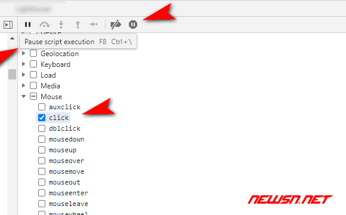
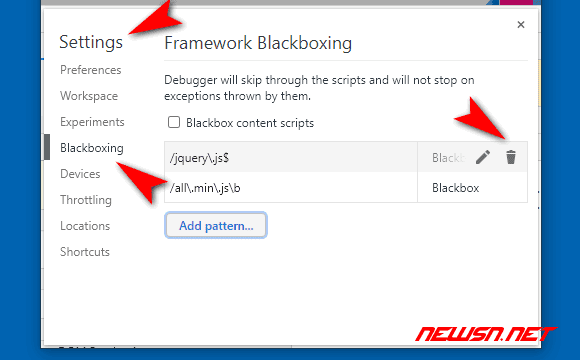
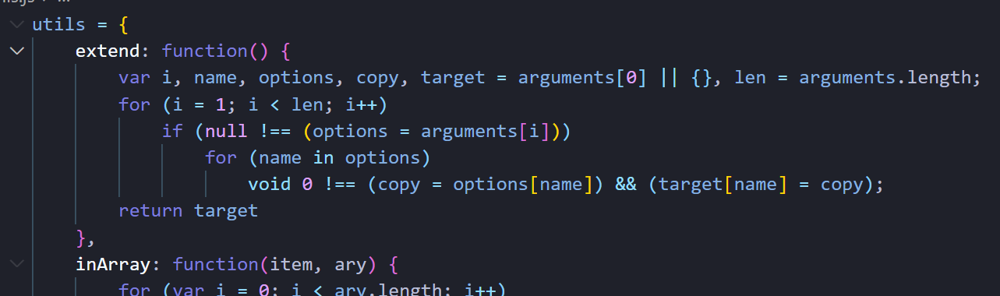

# 引言


# 快速定位未知网页js代码中的函数

假设可以看到函数名称是：`execute_javascript()`。

```html
<button type="button" onclick="execute_javascript('online-run-code-1', this)">run</button>
```

那么，就可以在`js`代码中，查找`execute_javascript`关键词来定位，但是`.js`代码众多，很难查找。


## 利用`console`输出

通过查看`dom`节点，一般来说，可以看到你的目标函数名称。但是，却无法通过点击等方式，快速跳转到函数定义。这个时候，可以在当前页面的开发者工具里面，输入如下代码（`execute_javascript`是目标函数名）：

```js
console.log(execute_javascript)
```


双击快速定位到函数定义


## 利用事件断点

如果所分析的代码，并没有明显地表述出函数名称。也就是说，通过`js`文件，动态绑定事件或者匿名函数的情况。可以选取合适的事件进行拦截。比如`click`事件。切换到`sources`标签，定义要拦截的事件吧。

如下图所示：


或者利用`xhr`的地址，设置断点。如下图所示：


定义好断点事件后，比如最常见的点击事件是`mouse > click`，再去手工触发你要观察的页面事件，然后就可以断点到对应的函数。当然，可能您看到的并不是您想要的，那么请使用步进等调试功能，进行代码查看。

[]()

同时，您还可以利用代码格式化功能，使得代码更加容易查看。

[]()

### 步进功能

主要有以下几个功能

- `f8` 恢复/暂停
- `f9` 单步执行
- `f10` 单步执行，遇到子函数并不进去，将子函数执行完并将其作为一个单步
- `f11` 单步执行，遇到子函数就进去继续单步执行
- `shift+f11` 直接跳出当前的函数，返回父级函数



## 利用`blackbox`排除代码

在步进的过程中， 您可能会发现进入一些没有啥意义的代码中，扰乱视线。这里，可以利用这个`blackbox`功能，可以排除特定的`js`文件，注意：这里的屏蔽单位是某个具体的`js`文件。


比如：大多数情况下，`jquery`就是个应该被`blackbox`的文件。否则，会强烈干扰视线。

## 解除已定义的`blackbox`

如果切换到被拦截的`.js`文件的时候，在界面顶部，有解除的按钮。右键菜单，也有`stop blackbox`的菜单。


当然，也可以在设置菜单里面，查看到所有的`blackbox`信息，并删除对应的设置。




# Python中调用和执行js

在Python中调用JavaScript代码的一种常见方法是使用`PyExecJS`库。`PyExecJS`库提供了一个统一的API，可以在Python中调用多种JavaScript运行时引擎。下面是使用`PyExecJS`库调用JavaScript的基本步骤


## 基本使用

1. 安装`PyExecJS`库：

   ```bash
   pip install PyExecJS
   1
   ```

2. 导入`PyExecJS`库：

   ```python
   import execjs
   
   # 从文件中读取JavaScript代码
   with open('jscode.js', 'r', encoding='utf-8') as f:
       js = f.read()
       
   # 使用execjs编译JavaScript代码
   ctx = execjs.compile(js)
   
   # 使用JavaScript代码
   resqult = ctx.call('函数名', 参数1 参数2 ...)
   resqult = ctx.call("变量")
   ```

## 使用js库和框架

在Python中调用和执行JavaScript不仅限于原生的JavaScript代码，还可以使用常见的JavaScript库和框架，如jQuery、React等。`PyExecJS`库支持加载和使用这些库和框架。下面是一个使用jQuery的示例代码：

```python
npm install jquery
```

```js
import execjs

ctx = execjs.compile('''
    var jQuery = require('jquery');
    var result = jQuery.trim('  Hello, JavaScript!  ');
    result;
''')

print(ctx.eval('result'))  # 输出：Hello, JavaScript!
```

##  Python和js之间传递数据(了解)

在Python和JavaScript之间传递数据是非常常见的需求。`PyExecJS`库提供了多种方法来实现数据的传递。下面是一些示例代码：

1. 通过参数传递数据：

   ```python
   import execjs
   
   ctx = execjs.compile('''
       function add(a, b) {
           return a + b;
       }
   ''')
   
   result = ctx.call('add', 2, 3)
   print(result)  # 输出：5
   ```

2. 通过全局变量传递数据：

   ```python
   import execjs
   
   ctx = execjs.compile('''
       function add() {
           return x + y;
       }
   ''')
   
   ctx['x'] = 2
   ctx['y'] = 3
   
   result = ctx.call('add')
   print(result)  # 输出：5
   ```

3. 通过JSON格式传递数据：

   ```python
   import execjs
   import json
   
   ctx = execjs.compile('''
       function add(data) {
           var obj = JSON.parse(data);
           return obj.x + obj.y;
       }
   ''')
   
   data = {'x': 2, 'y': 3}
   json_data = json.dumps(data)
   
   result = ctx.call('add', json_data)
   print(result)  # 输出：5
   ```

## 使用JavaScript进行Web自动化

除了在Python中调用和执行JavaScript，我们还可以使用Python和JavaScript进行Web自动化。通过结合Python的强大库和JavaScript的灵活性，我们可以编写自动化脚本来模拟用户在浏览器中的操作。下面是一个使用Python和JavaScript进行Web自动化的示例代码：

```python
import execjs
from selenium import webdriver

# 创建一个Selenium WebDriver实例
driver = webdriver.Chrome()

# 打开网页
driver.get('https://www.example.com')

# 使用JavaScript执行一些操作
ctx = execjs.compile('''
    var element = document.getElementById('myElement');
    element.innerText = 'Hello, JavaScript!';
''')

ctx.call('element.click')

# 关闭浏览器
driver.quit()
```

# 跟值技巧&常见加密

 **网页代码运行时间轴**

加载html -- 加载js --运行js初始化  --用户触发某个事件 --调用某段js -- 明文数据 -- 调用了某段js -- 明文数据 -- 加密函数  -- 加密后的数据 --给服务器发送信息(XHR-send) --接收到服务器数据 -- 解密函数  --刷新页面渲染

 **简单的网站的js测试**

- 能修改js运行当中的一些变量值,能输出
- 能下断点
- 智能的监听一些值

 **断点分类**

1. DOM断点
2. DOM事件断点
3. xhr断点
4. 代码行断点
5. 代码断点(debugger)
6. 全局事件断点
7. 异常断点

**xhr断点特性:断点永远会断在send处,send里面大概率会有data数据,如果没有则去寻找调用send方法的对象原型里面寻找**

## 跟值技巧1

在调用堆栈中,依次分析寻找明文数据与加密后的数据所在的位置,则加密函数的调用必然在这两位置之间.(注意当在某个栈进行断点分析完成后,往上一个方法栈分析时应该将之前的断点清掉,然后在目前方法重新下断再重新刷新开始调试,避免因为作用域导致的变量污染)


## 跟值技巧2

​     寻找当前断点最近的方法,按下ctrl会出现变量的智能提示,当 上下翻到没有智能提示的时候就是这个方法的开始


## 常见数据加密

数据加密分类

- 取盐校验(哈希)     不可逆

- - MD系列(MD2 ,MD4,MD5 带密码的MD5)

- - - 原生md5 默认key  0123456789abcdef

    - md5 16位  32位  40位   

      + 123456 -->  49ba59abbe56e057   (16位)    

      + 123456--> e10adc3949ba59abbe56e057f20f883e  (32位)    

- - sha系列(sha1 (密文为40位)   sha256(密文为64位)  sha512(密文为128位) )

- - - 123456-->7c4a8d09ca3762af61e59520943dc26494f8941b    (sha1 )
    - 123456-->8d969eef6ecad3c29a3a629280e686cf0c3f5d5a86aff3ca12020c923adc6c92 (sha256)
    - 123456--ba3253876aed6bc22d4a6ff53d8406c6ad864195ed144ab5c87621b6c233b548baeae6956df346ec8c17f5ea10f35ee3cbc514797ed7ddd3145464e2a0bab413    (sha512)

- 对称加密

- - AES     长度为8的倍数
  - DES     长度为8的倍数
  - 3DES 

- 非对称加密(同一个明文可以生成不同的密文,不同的密文可以还原同一个明文)

- - RSA  (私钥  公钥)  服务器两个都有,客户端只有公钥

​              rsa长度不固定


16进制 :发现最大的字母为f说明很有可能是16进制加密

base64:由A-Z  a-z 0-9 + _  /  =组成(其中末尾大概率是=符号)

### 某hu网案例(扣取js练习)

通过抓包登陆数据包,观察password加密(md5加密),ctrl+f全局搜索关键词password,这里如果找不到password也可以去找userid,appid之类的,一般同一个数据包的参数不会相隔太远


**方式1**

跟值找到明文数据与加密后数据直接可以定位到这里下断,继续跟进utils.md5进入password.js

(真实js文件名不是这个)


这里将password.js全部复制进notepad++,选择语言为javascript,选择视图-->折叠所有层次(方便扣全js),然后搜索加密函数特征函数来找到加密函数位置


扣取出来放到浏览器的源代码下的代码段改写(扣js改的越少越好最好不改,要注意js的体积大小)


调试输出


**方式2**

就是将this的指向也扣下来(扣js直到this为window),

回到案例里面,md5方法的this是utils,将utils对象完整搬下来





